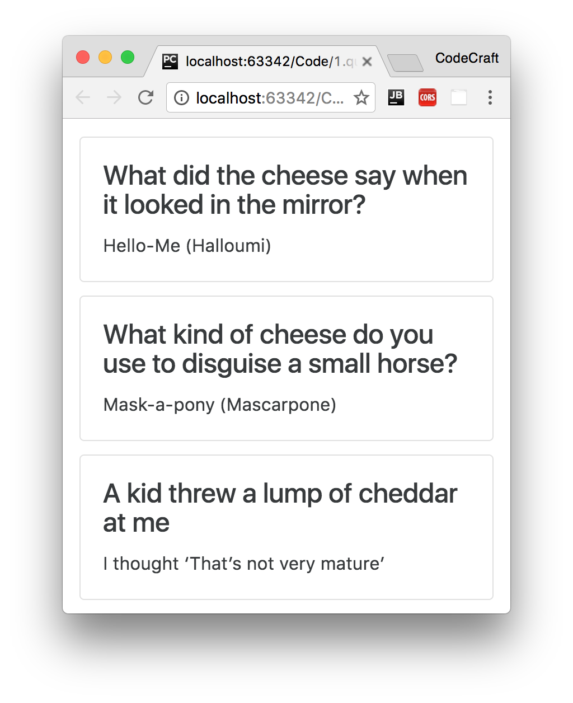

:sourcedir: {docdir}/content/{filedir}/code
:toc:
= Looping

Our goal in this lecture is to display a _list_ of jokes instead of just one.

NOTE: To add some visual jazz to our application we are going to be using the twitter bootstrap ui framework and specifically the _card_ style for our `JokeComponent`.

== Learning Outcomes

* Using Arrays in TypeScript.
* Using the `NgFor` directive to repeat an element.

== JokeListComponent

We will create a new component called `JokeListComponent` with the following listing:

[source,typescript]
----
@Component({
  selector: 'joke-list',
  template: `

  <h4 class="card-title">{{joke.setup}}</h4>
  
{{joke.punchline}}

 
  `
})
class JokeListComponent {
  jokes: Object[];

  constructor() {
    this.jokes = [
      {
        setup: "What did the cheese say when it looked in the mirror?",
        punchline: "Hello-Me (Halloumi)"
      },
      {
        setup: "What kind of cheese do you use to disguise a small horse?",
        punchline: "Mask-a-pony (Mascarpone)"
      },
      {
        setup: "A kid threw a lump of cheddar at me",
        punchline: "I thought ‘That’s not very mature’"
      },
    ];
  }
}
----

=== Arrays

The first change you'll notice is that we have a property called `jokes` and the type is `Object[]`.

The `[]` syntax in the type means _list of_ or _Array_, so the jokes property holds a list of `Objects`.

TIP: Another perfectly legal way to write this would be `Array&lt;Object&gt;` but I prefer `Object[]` since for me it's easier to see the `[]` characters at a glance.

In the constructor we initialise this array with some hilarious cheese jokes.

=== Card Element

You might notice in the template we are using some classes called `card`, `card-block` etc… this is from twitter bootstrap and it's a style called a _card_ which displays a rectangle with a border.

The basic HTML structure for a twitter bootstrap _card element_ is like so:

[source,html]
----
 

  <h4 class="card-title"></h4>
  

 

----

=== NgFor

We want to repeat this card element for each joke in our array of jokes.

So we add a special syntax called an `NgFor` on the card element, like so:

[source,html]
----

  <h4 class="card-title"></h4>
  

----

`*ngFor=&quot;let joke of jokes&quot;` will create a new HTML element, using the div element it's attached to as a template, for every joke in the jokes array.

It will also make available to the element a variable called `joke` which is the item in the joke array it's currently looping over.

The syntax translates to `let &lt;name-i-want-to-call-each-item&gt; of &lt;array-property-on-component&gt;`

NOTE: This is what we call in Angular a _Directive_. Specifically it's a _structural directive_ since it changes the structure of the DOM. We'll be going through more built-in directives later on and also you'll learn how to create your own.

So now we can display properties of this `joke` object in the HTML using `{{joke.setup}}` and `{{joke.punchline}}`, like so:

[source,html]
----

  <h4 class="card-title">{{joke.setup}}</h4>
  
{{joke.punchline}}

----

TIP: If you’ve worked with Angular 1 before, you probably used the `ng-repeat` directive. NgFor is the analogous directive In Angular. Its syntax is slightly different but they have the same purpose.

== Configuring

In order to use our `JokeListComponent` we need to add it to the declarations on our `NgModule` and also mark it as the component we want to bootstrap the page with.

[source,typescript,linenums,highlight='']
----
@NgModule({
  imports:[BrowserModule],
  declarations: [JokeComponent, JokeListComponent],
  bootstrap: [JokeListComponent]
})
----

NOTE: In the above example we are still declaring `JokeComponent` however we are not *using it* in our app. That's fine you can still declare a component and not use it. If you deleted `JokeComponent` however then you would also need to delete it from the declarations array.

Since we are now bootstrapping `JokeListComponent` and it's selector is `joke-list` we also need to change the root tag in our `index.html`, like so:

[source,html,linenums,highlight='']
----
<body class="container m-t-1">
  <joke-list></joke-list>
</body>
----

TIP: The classes `container` and `m-t-1` are from twitter bootstrap and add some nice visual padding to the page.

Now if we run the application we see multiple jokes printed to the screen, like so:

== Summary

When we declare an array in TypeScript we also tell it what _Type_ of thing the array holds using `Type[]` or the `Array&lt;Type&gt;` syntax.

We can repeat the same element multiple times in Angular using the `NgFor` directive

== Listing

NOTE: Since we are now using the JokeListComponent as our root component, our root components tag has changed from `<joke></joke>` to `<joke-list></joke-list>`

.src/main.ts
[source,typescript]
----
include::{sourcedir}/src/main.ts[]
----
