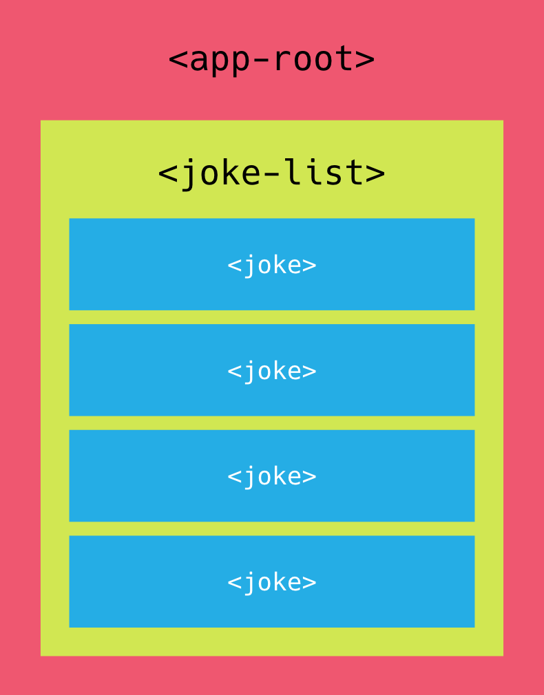

:sourcedir: {docdir}/content/{filedir}/code
:toc:
= Nesting Components &amp; Inputs

An application in Angular is a set of custom components glued together in HTML via inputs and outputs.

So far we've only built applications with a single component, our goal now is to start building applications that are _composed_ of multiple components working together. 

Breaking up an application into multiple logical components makes it easier to:

* Architect an application as it grows in complexity.
* Re-use common components in multiple places.

The goal of this lecture is to break up our small application into three components and start _gluing_ them together.

== Learning Outcomes

* How to create and configure multiple components in one application.
* How to enable Input Property Binding on a custom component so components can communicate with each other.

== Create & Configure Multiple Components

If you think of a typical webpage we can normally break it down into a set of logical components each with its own view, for example most webpages can be broken up into a header, footer and perhaps a sidebar.

We are going to break up our application into a root `AppComponent`, this component won't have any functionality and will just contain other components.

This component will hold our `JokeListComponent` and our `JokeListComponent` will hold a list of `JokeComponents`.

NOTE: Most Angular apps will have a root component called _AppRoot_ or _AppComponent_, this typically just acts as a container to hold other components.

Our components will therefore nest something like the below image:

NOTE: For the _convenience_ of learning we are going to keep everything in one file. When building Angular apps the recommended approach is to have one component per file.

=== JokeComponent

This looks similar to our previous `JokeListComponent` we just removed the `NgFor` since this component will now render a single joke.

[source,typescript]
----
@Component({
  selector: 'joke',
  template: `

  <h4 class="card-title">{{joke.setup}}</h4>
  
{{joke.punchline}}

  <a (click)="joke.toggle()"
     class="btn btn-warning">Tell Me
  </a>

  `
})
class JokeComponent {
  joke: Joke;
}
----

=== JokeListComponent

We've broken out a joke into its own `JokeComponent` so now we change the `JokeListComponent` template to contain multiple `JokeComponent` components instead. 

[source,typescript]
----
@Component({
  selector: 'joke-list',
  template: `
<joke *ngFor="let j of jokes"></joke>
  `
})
class JokeListComponent {
  jokes: Joke[];

  constructor() {
    this.jokes = [
      new Joke("What did the cheese say when it looked in the mirror?", "Hello-me (Halloumi)"),
      new Joke("What kind of cheese do you use to disguise a small horse?", "Mask-a-pony (Mascarpone)"),
      new Joke("A kid threw a lump of cheddar at me", "I thought ‘That’s not very mature’"),
    ];
  }
}
----

=== AppComponent

Our final component is our new top-level `AppComponent`, this just holds an instance of the `JokeListComponent`.

[source,typescript]
----
@Component({
  selector: 'app',
  template: `
<joke-list></joke-list>
  `
})
class AppComponent {
}
----

=== Configuring Multiple Components

In order to use our new components we need to add them to the declarations on our `NgModule`.

And since we've changed our top-level component we need to set that in the bootstrap property as well as change our `index.html` to use the `&lt;app&gt;&lt;/app&gt;` root component instead.

[source,typescript ]
----
@NgModule({
  imports: [BrowserModule],
  declarations: [
    AppComponent,
    JokeComponent,
    JokeListComponent
  ],
  bootstrap: [AppComponent]
})
export class AppModule {
}
----

[source,html]
----
<body class="container m-t-1">
  <app></app>
</body>
----

In Angular we need to be explicit regarding what components &amp; directives are going to use in our Angular Module by either adding them to the `imports` or `declarations` property.

In Angular 1 each directive when added via a script tag was globally available, which made it convenient for smaller projects but a problem for larger ones. Issues like name clashes came up often as different third-party libraries often used the same names. 

With Angular two third-party libraries can export the same name for components but only the version we explicitly include into our Angular Module will be used.

TIP: The built-in directives we are using such as `NgFor` are all defined in `CommonModule` which is again included in `BrowserModule` which we have already added to our `NgModule` imports.

== Input Property Binding on a Custom Component

If we ran the application now we would see just some empty boxes with some errors in the console, like so:

image::./images/input-error.png[Binding Error]

The errors should read something like:

[source]
----
class JokeComponent - inline template:2:25 caused by: Cannot read property 'setup' of undefined
----

The above should give you a hint about what's going on

. It's something to do with the `JokeComponent`
. It's something to do with the template.
. It's something to do with the `setup` property.

So if we look at the offending part of our `JokeComponent` template:

[source,html]
----
<h4 class="card-title">{{joke.setup}}</h4>
----

Essentially `Cannot read property 'setup' of undefined` in the context of `joke.setup` means that `joke` is undefined, it's blank

If you remember from our `JokeComponent` class we do have a property called `joke`: 

[source,typescript]
----
class JokeComponent {
  joke: Joke;
}
----

And we are looping and creating `JokeComponents` in our `JokeListComponent`, like so:

[source,html]
----
<joke *ngFor="let j of jokes"></joke>
----

But we are not setting the property `joke` of our `JokeComponent` to anything, which is why it's `undefined`.

Ideally we want to write something like this:

[source,html]
----
<joke *ngFor="let j of jokes" [joke]="j"></joke>
----

In just the same way as we bound to the `hidden` property of the `p` tag in the element above we want to bind to the `joke` property of our `JokeComponent`.

Even though our `JokeComponent` has a `joke` property we can't bind to it using the `[]` syntax, we need to explicitly mark it as an _Input_ property on our `JokeComponent`.

We do this by pre-pending the `joke` property in the component with a new annotation called `@Input`, like so:

[source,typescript]
----
import { Input } from '@angular/core';
.
.
.
class JokeComponent {
  @Input() joke: Joke;
}
----

This tells Angular that the `joke` property is an _input_ property and therefore in HTML we can bind to it using the `[]` input property binding syntax.

This `@Input` now becomes part of the _public interface_ of our component.

Let's say at some future point we decided to change the `joke` property of our JokeComponent to perhaps just `data`, like so:

[source,typescript]
----
class JokeComponent {
  @Input() data: Joke;
}
----

Because this input is part of the public interface for our component we would also need to change all the input property bindings every where our component is used, like so:

[source,html]
----
<joke *ngFor="let j of jokes" [data]="j"></joke>
----

Not a great thing to ask the consumers of your component to have to do.

This is a common problem so to avoid expensive refactors the `@Input` annotation takes a parameter which is the name of the input property to the outside world, so if we changed our component like so:

[source,typescript]
----
class JokeComponent {
  @Input('joke') data: Joke;
}
----

To the outside world the input property name is still joke and we could keep the `JokeListComponent` template the same as before:

[source,html]
----
<joke *ngFor="let j of jokes" [joke]="j"></joke>
----

== Summary

An Angular application should be broken down into small logical components which are glued together in HTML.

Its normal to have one root component called `AppComponent` which acts as the root node in the component tree.

We need to explicitly declare all components in the applications root `NgModule`.

We can make properties of our custom components input bindable with the `[]` syntax by pre-pending them with the `@Input` annotation.

== Listing

.src/main.ts
[source,typescript]
----
include::{sourcedir}/src/main.ts[]
----
