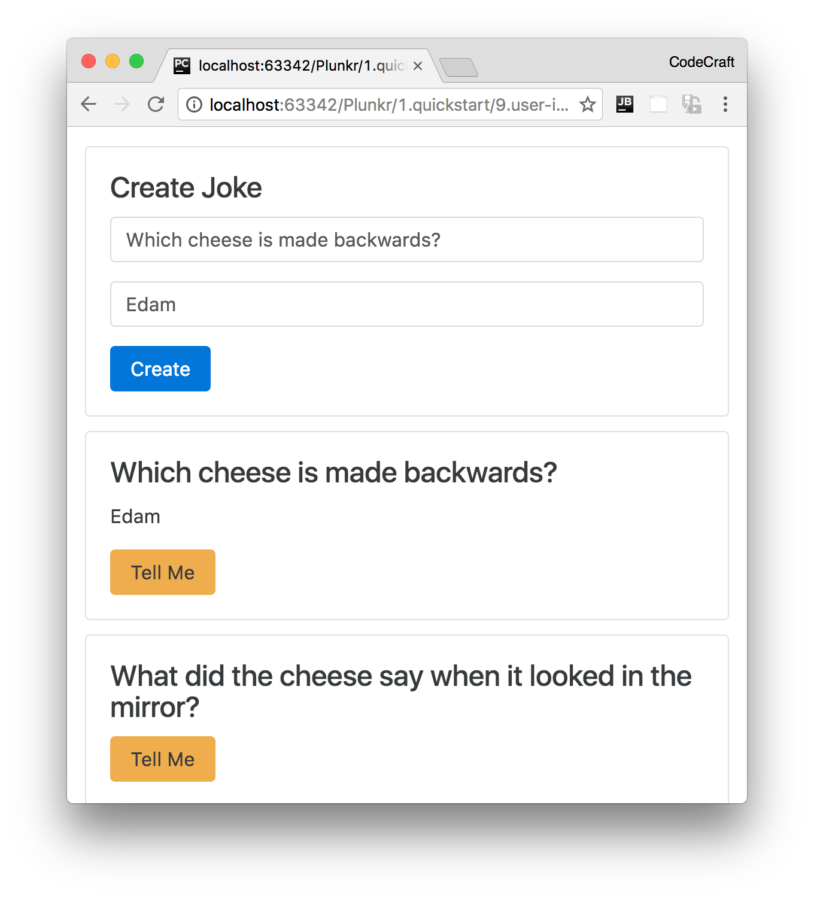

:sourcedir: {docdir}/content/{filedir}/code
:toc:
= User Interaction &amp; Outputs

In this lecture we are going to add an input form to our joke application so the user can add their own jokes to the list.

== Learning Outcomes

* How to emit custom output events from components.
* How to create local variables in the templates.

== The Joke Form

We _could_ add a form in our `JokeListComponent` it would definitely be easier to setup since all the code would be contained in one component.

However we are going create a new component to support the form, perhaps we want to re-use this form in other places in our application or perhaps we want this functionality in one component so it's easier to test in isolation later on.

This component renders a Bootstrap form on the page with two fields, setup and punchline, and a Create button.

When architecting an Angular application I often find it helps to first think about _how_ your component is going to be used.

I believe our form component is best placed in the `JokeListComponent` template, like so:

[source,html]
----
<joke-form # <1>
  (jokeCreated)="addJoke($event)"> # <2>
</joke-form>
<joke *ngFor="let j of jokes" [joke]="j"></joke>
----
<1> The component's tag, its selector, is going to be `joke-form`.
<2> The component is going to emit an event called `jokeCreated` whenever a user clicks the Create button.

NOTE: We treat the component as a black-box, we don't care _how_ the component is implemented or how the user interacts with it. The parent component just wants to know _when_ the user has created a new joke.

When the `jokeCreated` event is emitted I want to call the `addJoke` function.

NOTE: We'll go through what `$event` means a bit later on in this chapter.

The above syntax describes the behaviour we expect from our `JokeFormComponent`, let's now go and create it.

== The JokeFormComponent

The component renders a Twitter Bootstrap formatted form with two fields and a submit button, like so: 

[source,typescript]
----
@Component({
  selector: 'joke-form',
  template: `

  <h4 class="card-title">Create Joke</h4>
  

    <input type="text"
           class="form-control"
           placeholder="Enter the setup">
  

  

    <input type="text"
           class="form-control"
           placeholder="Enter the punchline">
  

  <button type="button"
          class="btn btn-primary">Create
  </button>

  `
})
class JokeFormComponent {
}
----

IMPORTANT: Remember to add `JokeFormComponent` to the declarations on the `NgModule`.

The component above just renders a form on the page, nothing happens when you click submit.

From the outside, all we care about this component is that it makes available an output event binding called `jokeCreated`.

To create a custom output event on our component we need to do two things:

. Create an `EventEmitter` property on the `JokeFormComponent` class.
. Similar to when we created a custom input property binding, we need to annotate that property with the `@Output` decorator.

TIP: An `EventEmitter` is a helper class which we can use to emit events when something happens, other components can then bind and react to these events.

[source,typescript]
----
import {Output, EventEmitter} from '@angular/core';
.
.
.
class JokeFormComponent {
  @Output() jokeCreated = new EventEmitter<Joke>();
}
----

We have now created an output event property on the component.

NOTE: The name between the `<>` on the EventEmitter is the type of thing that will be output by this property. The syntax above is called `generics` and we'll cover them in more detail on the section on TypeScript.

When the `jokeCreated` event fires we are going to pass out an instance of a `Joke`.

NOTE: We are initialising the property when it's defined, in one line. Previously we just declared the properties and initialised them in a constructor.
The method you choose is up to you, with situations like this when the property will never need to change over time I like to initialise and declare on one line.

Let's now create a function called `createJoke()` and have it actually output an event, like so:

[source,typescript]
----
class JokeFormComponent {
  @Output() jokeCreated = new EventEmitter<Joke>();

  createJoke() {
    this.jokeCreated.emit(new Joke("A setup", "A punchline"));
  }
}
----

We output an event by calling the `emit` function on our `jokeCreated` property. Whatever we pass to the `emit` function is what will be output by the property. We are outputting an instance of a Joke with some dummy data.

=== Gluing It All Together

We need to call the `createJoke` function when the user clicks the Create button, like so:

[source,html]
----
<button type="button"
      class="btn btn-primary"
      (click)="createJoke()">Create
</button>
----

We also need to _bind_ to the output event property on our parent `JokeListComponent` so we can add the joke that gets output to the list of jokes, like so:

[source,typescript]
----
@Component({
  selector: 'joke-list',
  template: `
<joke-form (jokeCreated)="addJoke($event)"></joke-form>
<joke *ngFor="let j of jokes" [joke]="j"></joke>
  `
})
class JokeListComponent {
  jokes: Joke[];

  constructor() {
    this.jokes = [
      new Joke("What did the cheese say when it looked in the mirror?", "Hello-me (Halloumi)"),
      new Joke("What kind of cheese do you use to disguise a small horse?", "Mask-a-pony (Mascarpone)"),
      new Joke("A kid threw a lump of cheddar at me", "I thought ‘That’s not very mature’"),
    ];
  }

  addJoke(joke) {
    this.jokes.unshift(joke);
  }
}
----

Breaking this down, in the template we bind to the jokeCreated property like so:

[source,html]
----
<joke-form (jokeCreated)="addJoke($event)"></joke-form>
----

This calls the `addJoke` function when the `jokeCreated` property outputs an event.

NOTE: `$event` is a special variable and holds whatever was emitted by the jokeCreated EventEmitter, in our case it's an instance of a Joke.

[source,typescript]
----
addJoke(joke) {
  this.jokes.unshift(joke);
}
----

All the addJoke function does is add the joke that got output to the front of the jokes array.

Angular automatically detects that the jokes array changed and then updated the view so it shows the new joke.

Now when we click the Create button we add the joke to the list, but it's just showing the dummy fixed joke.

== Template Reference Variables

So we've got the mechanism we are going to use to send events, how do we actually get the values from the input fields?

We want to actually get the value of the setup and punchline input fields and pass them to the `createJoke` function when the user clicks the Create button.

One way we can solve this problem in Angular is to use something called a template reference variable.

We add the string `#setup` to our setup input control, like so:

[source,html]
----
<input type="text"
       class="form-control"
       placeholder="Enter the setup"
       #setup>
----

This tells Angular to bind this `&lt;input&gt;` control to the variable `setup`. 

We can then use this variable `setup` in other places in the template.

NOTE: `setup` is only available as a variable in the template, we don't automatically see the variable `setup` inside the JavaScript code of our `JokeFormComponent` class.

`setup` now points to the DOM element that represents an `&lt;input&gt;` control, which is an instance of the type `HTMLInputElement`.

Therefore to get the value of the setup input control we call `setup.value`.

We do the same to the other punchline input control, then we can pass both the setup and punchline values to the `createJoke` function, like so:

[source,html]
----
<button type="button"
      class="btn btn-primary"
      (click)="createJoke(setup.value, punchline.value)">Create
</button>
----

Finally, we change the `createJoke` function so it accepts these new arguments and uses them to construct an instance of a Joke, like so:

[source,typescript]
----
createJoke(setup: string, punchline: string) {
  this.jokeCreated.emit(new Joke(setup, punchline));
}
----

Now when we run the application the user can add a new joke via the form and have it appear in the list below.

== Summary

Similar to input properties, we can also create output properties on our custom components using the `@Output` annotation.

These output properties are always instances of the `EventEmitter` class and we output events by calling the `emit` function. Whatever we pass in to the `emit` function is output as the `$event` template variable.

We can create local template variables by adding variables starting with the `#` character on any element in our template.

By default that variable is only visible in the template that it's declared in and points to the DOM element it's attached to.

== Listing

.src/main.ts
[source,typescript]
----
include::{sourcedir}/src/main.ts[]
----
