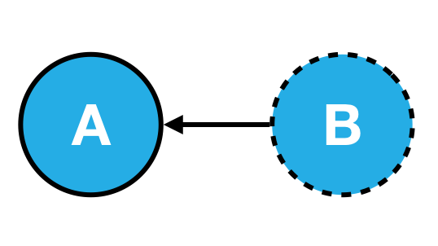

= Overview

As our application grows beyond one module then we need to deal with the issue of dependencies.

[TIP]
====

*What is a dependency?*

When module `A` in an application needs module `B` to run, then module `B` is a _dependency_ of module `A`.

====

Realistically when writing applications we can't get away from building numerous dependencies between parts of our code.

For example let's imagine we have a class of `EmailSender`, like so:

[source,typescript]
----
class MailChimpService extends EmailService { }

class EmailSender {
  emailService: EmailService;

  constructor() {
    this.emailService = new MailChimpService("APIKEY12345678910");
  }

  sendEmail(mail: Mail) {
    this.emailService.sendEmail(mail);
  }
}
emailSender = new EmailSender();
emailSender.sendEmail(mail);
----

Whats wrong with the above code?

Inflexible:: Hard to re-use in other configurations.
 +
 +
It hardcodes `MailChimpService` as the email service that _actually_ sends the email.
 +
 +
How would you use this class if you wanted to use another email provider?

Hard to test:: How can you test the above code?
 +
 +
Calling `sendEmail(mail)` sends a real email to a real email address using an external service we have no control over.
 +
 +
How do we test that calling `sendEmail` really sends an email?

Brittle:: Hard to maintain.
 +
 +
If we changed our API key we need to make sure it's changed in _every_ instance we've use the `MailChimpService`.
 +
 +
Even if we put the API key in a global config variable what if the `MailChimpService` changed _how_ authentication happens and now it uses a _username/password_ combination.

The above is described as _tight coupling_. The `EmailSender` class is said to be _tightly coupled_ with the `MailChimpService` class. This makes the code _inflexible_, _hard to test_ and _brittle_.

Now we can't get away from the fact that the `EmailSender` class needs the `MailChimpService` class to function. `MailChimpService` is a _dependency_ of `EmailSender`.

But we can change the above code so that it's _easy to reuse_, _easy to test_ and _easier to maintain_.

[source,typescript]
----
class MailChimpService extends EmailService { }

class EmailSender {
  emailService: EmailService;

  constructor(emailService: EmailService) { # <1>
    this.emailService = emailService;
  }

  sendEmail(mail: Mail) {
    this.emailService.sendEmail(mail);
  }
}
emailSender = new EmailSender(new MailChimpService());
emailSender.sendEmail(mail);
----
<1> The `emailService` is now passed _into_ our class via the constructor.

Previously the `EmailSender` constructor was responsible for creating an _instance_ of its dependency the `MailChimpService`.

Now _something else_ is responsible for creating the _instance_ of `MailChimpService` and then passing it into the `EmailSender` via its constructor.

So if we wanted to create an instance of the `EmailSender` class we now need to pass in all the required dependencies in the constructor.

////
This is called _Inversion of Control_ or _IoC_.
////

The dependencies are now said to be _decoupled_ from our `EmailSender` class, how does this help us with our 3 points:

Easier to re-use::
+
We can _re-use_ the `EmailSender` class but with a different email service.
+
For example if we wanted to use `SendGridService` instead of `MailChimpService`. As long as `SendGridService` still has a function with the signature `sendEmai(mail)` we can pass into the `EmailSender` constructor an instance of `SendGridService` instead of `MailChimpService`, like so:
+
[source,typescript]
----
emailSender = new EmailSender(new SendGridService());
----

Easier to test::
+
Following on from the above we can now _test_ our `EmailSender` class much easier.
+
We can pass in a _dummy_ class which doesn't actually send emails however _does_ let us check to see if the `sendEmail` function was called, like so:
+
[source,typescript]
----
MockedEmailService extends EmailService {
  mailSent: boolean = false;

  sendEmail(mail: Mail) {
    this.mailSent = true;
  }
}
let mockService = MockedEmailService()
emailSender = new EmailSender(mockService);
if (mockService.mailSent === true) { ... }
----

Easier to maintain::
+
Since the `EmailSender` class is not responsible for creating concrete instances of the email service if, for instance, the `MailChimpService` required some new configuration then the `EmailSender` class isn't affected.
+
As long as the `MailChimpService` implements the `sendEmail` function, _how_ it's constructed and functions internally is of no concern to the `EmailSender` class.

This idea of moving the responsibility of creating concrete instances of dependencies to something else is called _Inversion of Control_, or _IoC_.

The specific design pattern for implementing IoC above is called _Dependency Injection_, we injected the dependencies of `EmailSender` in the constructor.

TIP: Dependency injection is an important application design pattern it's used not only in Angular but throughout software development as a whole.

Angular has its own dependency injection framework, and we really can't build an Angular application without it. It's used so widely that almost everyone just calls it _DI_.

== Components

The DI framework in Angular consists of 4 concepts working together:

Token:: This uniquely identifies something that we want injected. A _dependency_ of our code.
Dependency:: The actual code we want injected.
Provider:: This is a map between a _token_ and a list of _dependencies_.
Injector:: This is a function which when passed a _token_ returns a _dependency_ (or list of dependencies).

== Summary

In this section you will learn:

* How the Angular DI framework works under the covers.
* What are injectors & child injectors.
* What function do the `@Inject` and `@Injectable` decorators play in the DI framework.
* What are the different types of dependencies we can inject in Angular.
* How to configure DI in Angular with Angular module providers, component providers and component view providers.
