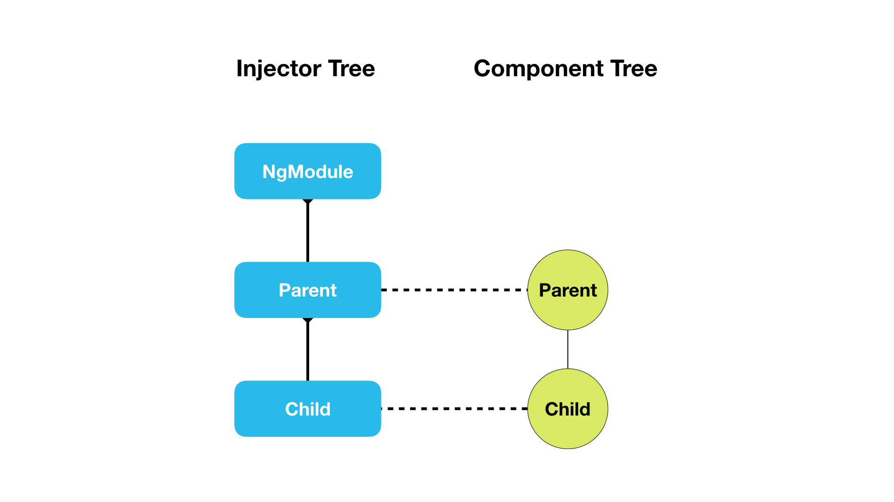

:sourcedir: {docdir}/content/{filedir}/code
:toc:
= Configuring Dependency Injection in Angular

So far in this section we've only covered how to use the low-level Dependency Injection API.

With Angular however we'll never need to create injectors ourselves, Angular does this for us automatically when our application is bootstrapped.

All we need to do is to _configure_ Angular with our providers and also tell it when we want something _injected_ into a class constructor.

== Learning Objectives

* What is the injector tree and how it maps to the component tree.
* How and where to configure injectors.
* Know when to use the `@Inject` and `@Injectable` decorators.
* Know when we _don't_ need to use the `@Inject` and `@Injectable` decorators.

== The Injector Tree

An Angular application will have a tree of injectors mirroring the component tree.

We have a top-level parent injector which is attached to our `NgModule`.

Then we have _child_ injectors descending in a hierarchy matching the component tree.

So a _parent_ component will have a child injector stemming from `NgModule`.

A _child_ component of parent component will have a child injector stemming from _Parent_.

=== Configuring Injectors

The `NgModule` decorator has a property called `providers` which accepts a list of providers exactly the same as we would pass to the `ReflectiveInjector` via the `resolveAndCreate` function we looked at previously, like so:

[source,typescript]
----
@NgModule({
  providers: [EmailService, JobService]
})
class AppModule { }
----

This creates a top-level _parent_ injector and configures it with two class providers, `EmailService` and `JobService`.

We can also configure our _Components_ and _Directives_ the same way using a property called `providers` on the `Component` and `Directive` decorators, like so:

[source,typescript]
----
@Component({
  selector: 'my-comp',
  template: `...`,
  providers: [EmailService]
})
----

This creates a _child injector_ who's parent injector is the injector on the parent component. If there is no parent component then the parent injector is the top-level `NgModule` injector.

With components we have another property called `viewProviders` which creates a special injector that resolves dependencies only for _this_ component's view children and doesn't act as a parent injector for any content children, like so:

[source,typescript]
----
@Component({
  selector: 'my-comp',
  template: `...`,
  viewProviders: [EmailService]
})
----

NOTE: We'll be going through specific examples of each in the next lecture.

== Using Dependency Injection in Angular

The above is how we _configure_ DI in Angular so it creates injectors and configures them to resolve dependencies.

When Angular creates a component it uses the DI framework to figure out _what_ to pass to the component class constructor as parameters.

However we may need to give Angular some hints by using either the `@Inject` or `@Injectable` decorators.

Let's explain with an example, we have a class called `SimpleService` and another class called `OtherService`.

[source,typescript]
----
class OtherService {
    constructor() { };
}

class SimpleService {
    constructor() { };
}
----

We configure NgModule with these classes as providers.

[source,typescript]
----
@NgModule({
    ...
    providers: [OtherService, SimpleService]
})
export class AppModule {
}
----

Then to make Angular resolve and create a `SimpleService` we add a component which requests an instance of `SimpleService` via its constructor, like so:

[source,typescript]
----
@Component({
    selector: 'simple',
    template: `
Simple is as simple does
`,
})
class SimpleComponent {
    constructor(private simpleService:SimpleService) { }
}
----

=== @Inject decorator

The above works fine but, let's try and inject into `SimpleService` an instance of `OtherService`, like so:

[source,typescript]
----
class SimpleService {
  otherService: OtherService;

  constructor(otherService: OtherService) {
    this.otherService = otherService;
  };
}
----

This doesn't work and in fact gives us the error:

----
Can't resolve all parameters for SimpleService: (?).
----

We need to _explicitly_ tell Angular _what_ we want injected for the `otherService` parameter so we use the `@Inject` decorator like so:

[source,typescript]
----
import { Inject } from '@angular/core';
.
.
.
class SimpleService {
  otherService: OtherService;

  constructor(@Inject(OtherService) otherService: OtherService) {
      this.otherService = otherService;
  };
}
----

The first param to `@Inject` is the token we want to resolve this dependency with.

The above now works, when Angular tries to construct the class it gets the instance of `OtherService` passed in from the DI framework.

=== @Injectable decorator

Decorating all our constructor arguments with `@Inject` can be tiresome however so instead we can decorate our _entire_ class wth `@Injectable`, like so:

[source,typescript]
----
@Injectable()
class SimpleService {
  otherService: OtherService;

  constructor(otherService: OtherService) {
      this.otherService = otherService;
  };
}
----

I find the term `@Injectable` confusing, it implies that you need to decorate a class with `@Injectable` to _inject_ it into other classes.

`@Injectable` is actually a shortcut for having to decorate every parameter in your constructor with `@Inject`.

It does this for you behind the scenes by looking at the _types of each parameter_, so if we _don't_ supply a type `@Injectable` _doesn't_ work, like so:

[source,typescript]
----
@Injectable()
class SimpleService {
  otherSimple: OtherSimpleService;

  constructor(otherSimple: any) { # <1>
      this.otherSimple = otherSimple;
  };
}
----
<1> We don't provide a type for `otherService` so the DI framework doesn't know what to inject and therefore `Can't resolve all parameters for SimpleService: (?).` is printed to the console.

[TIP]
====
Personally I believe `@Injectable` should be renamed `@AutoInject` to reduce confusion.
====

=== @Injectable versus @Component versus @Directive

You might ask then why did we not use the `@Injectable` decorator on the component we inject `SimpleService` into, like so:

[source,typescript]
----
@Component({
  selector: 'simple',
  templateUrl: `
Simple is as simple does
`,
})
class SimpleComponent {
  constructor(private simpleService:SimpleService) { }
}
----

That's because the other decorators in Angular, such as `@Component` and `@Directive`, already perform the same function as `@Injectable`.

TIP: We _only_ need to use `@Injectable` on classes which don't already use one of the other Angular decorators.

== Summary

There is one top-level injector created for each `NgModule` and then for each component in our app, from the root component down, there is a tree of injectors created which map to the component tree.

We configure these injectors with providers by adding the configuration to either the `providers` property on the `NgModule`, `Component` and `Directive` decorators or to the `viewProviders` property on the `Component` decorator.

We use the `@Inject` parameter decorator to instruct Angular we want to resolve a token and inject a dependency into a constructor.

We use the `@Injectable` class decorators to automatically resolve and inject all the parameters of class constructor.

This only works if each parameter has a TypeScript type associated with it, which the DI framework uses as the token.

We don't need to use the `@Injectable` class decorator on classes which are already decorated with one of the other Angular decorators, such as `@Component`.

Now we know _where_ we can configure providers in the DI framework in Angular.

In the next lecture we will cover the differences between configuring providers on `NgModule`, `Component.providers` and `Component.viewProviders`.

== Listing

.main.ts
[source,typescript]
----
include::{sourcedir}/src/main.ts[]
----
