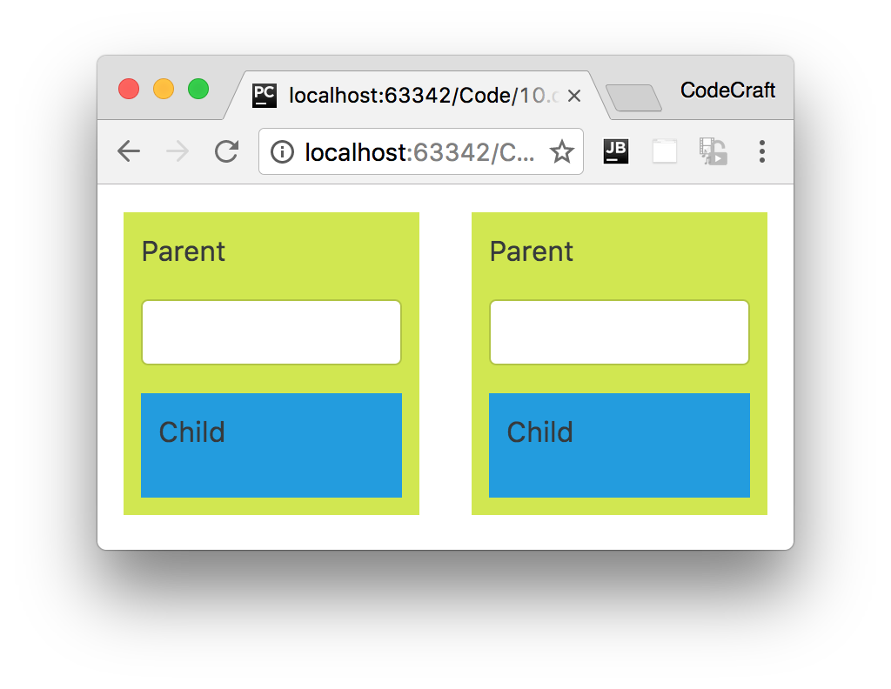
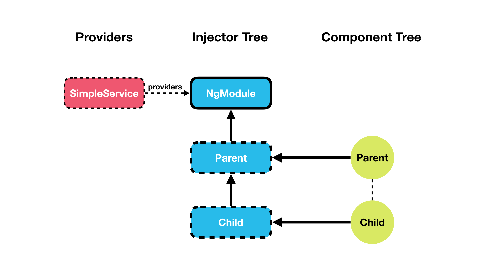
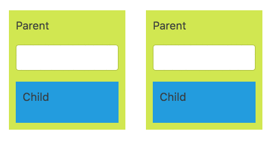
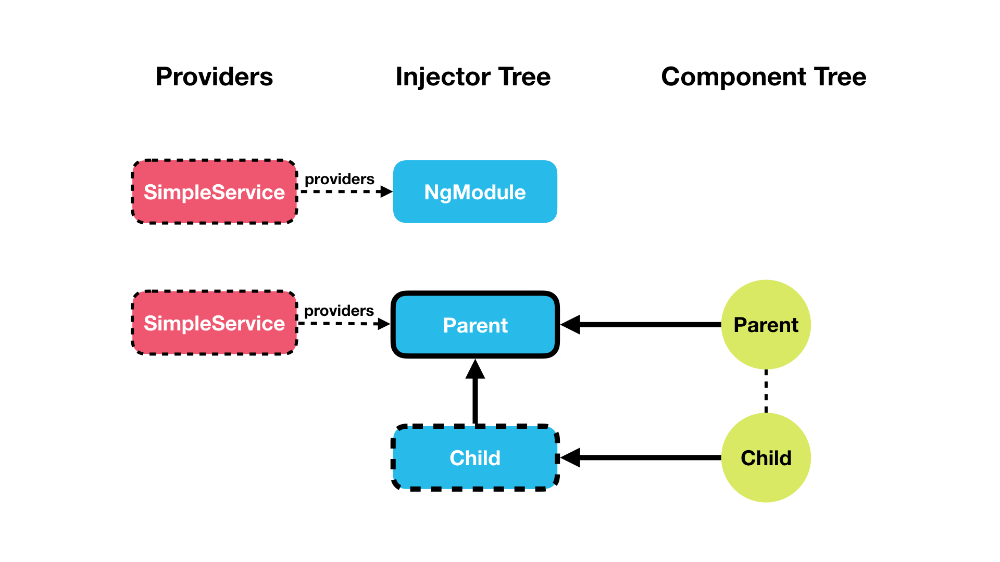
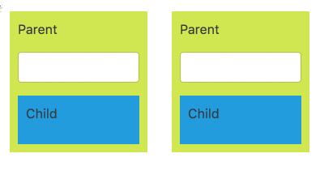
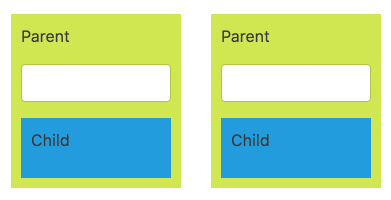
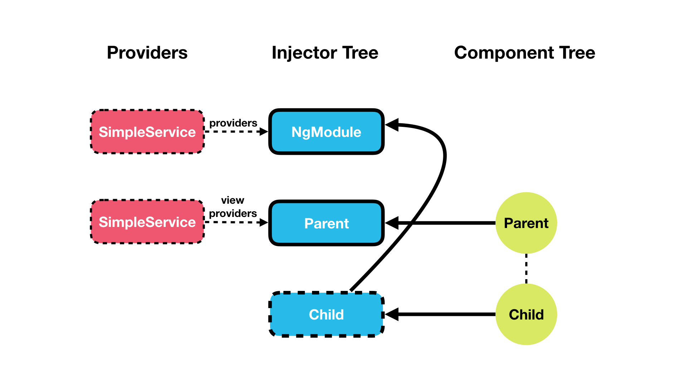

:sourcedir: {docdir}/content/{filedir}/code
:toc:
= NgModule.providers vs Component.providers vs Component.viewProviders

We can configure injectors in Angular by:

1. `providers` on _NgModule_.
2. `providers` on _Components_ and _Directives_.
3. `viewProviders` on _Components_.

So the question is where do you configure your provider?

Understanding _where_ to configure your provider is a key piece of understanding _how_ to architect your application, so we are going to explain this via a real practical example.

== Learning Objectives

* Know the difference between configuring a provider on an `NgModule`, a component's or directive's `providers` property, and a component's `viewProviders` property.

== Setup

We create a class called `SimpleService` which has one property called `value` which holds a `string`.

[source,typescript]
----
class SimpleService {
  value: string;
}
----

We also have a component called `ParentComponent` which has a child component called `ChildComponent`.

[source,typescript]
----
@Component({
 selector: 'child',
 template: `

   
Child

   {{ service.value }} # <1>

`
})
class ChildComponent {
  constructor(private service: SimpleService) { } # <2>
}
----
<1> We use _string interpolation_ to bind to the `value` property of `SimpleService`.
<2> We _inject_ an instance of `SimpleService` into the constructor.

[source,typescript]
----
@Component({
 selector: 'parent',
 template: `

   
Parent

   <form novalidate>
        

        <input type="text"
               class="form-control"
               name="value"
               [(ngModel)]="service.value"> # <1>
      

  </form>
  <child></child> # <2>

`
})
class ParentComponent {
  constructor(private service: SimpleService) { } # <3>
}
----
<1> We use _two-way data binding_ to bind to the `value` property of `SimpleService`.
<2> We render the `ChildComponent` inside this `ParentComponent`.
<3> We _inject_ an instance of `SimpleService` into the constructor.

The `ParentComponent` has just one input box which reads and writes to the `SimpleService` `value` property using two-way `ngModel` binding, the `ChildComponent` just renders the `value` to the screen with `{{ }}`.

We render two _side by side_ `<parent>` tags in our root `AppComponent` module, like so:

[source,typescript]
----
@Component({
 selector: 'app',
 template: `
 

  

    <parent></parent>
  

  

    <parent></parent>
  

 `
})
class AppComponent {
}
----

We set up our `NgModule` and bootstrap it, like so:

[source,typescript]
----
@NgModule({
  imports:  [ BrowserModule, FormsModule ],
  declarations:  [ AppComponent, ParentComponent, ChildComponent ],
  bootstrap:  [ AppComponent ]
})
class AppModule { }

platformBrowserDynamic().bootstrapModule(AppModule);
----

In the end when we run our application we should end up with something that looks like this:

NOTE: We have also added some CSS styles on our component which has been removed from the above code, the full code can be found in the listing at the end of this lecture.

== NgModule.providers

We'll first configure our `SimpleService` on the root `NgModule`, like so:

[source,typescript]
----
@NgModule({
  imports:  [ BrowserModule, FormsModule ],
  declarations:  [ AppComponent, ParentComponent, ChildComponent ],
  bootstrap:  [ AppComponent ],
  providers: [ SimpleService ] # <1>
})
class AppModule { }
----
<1> We've configured our NgModule with a class provider of `SimpleService`.

In this configuration the service has been injected onto our applications root `NgModule` and therefore is in our root `injector`.

So every request to resolve and inject the token `SimpleService` is going to be forwarded to our single root injector.

Therefore since we only have one injector which is resolving the dependency, every time we request an instance of `SimpleService` to be injected into one of our components it's _always_ going to inject the _same_ instance.

IMPORTANT: Remember if we request the _same_ token from the _same_ injector we get the _same_ instance.

Since we've bound the input field directly to the simple service's `value` field *and* it's the same instance of simple service used everywhere, then when we type into one input control it automatically updates the other input control and also the child components.

TIP: If we want to share _one_ instance of a service across the _entirety_ of our application we configure it on our `NgModule`.

== Component.providers

Let's now see what happens when we configure our `SimpleService` _additionally_ on the `ParentComponent` via the `providers` property.

[source,typescript]
----
@Component({
 selector: 'parent',
 template: `...`,
 providers: [ SimpleService ]
})
class ParentComponent {
  constructor(private service: SimpleService) { }
}
----

Now _each_ `ParentComponent` has its _own_ child injector with `SimpleService` configured, like so:

We can see from the running the code above that if we type into one parent component only _that_ parent component and its child component automatically updates, like so:

Each instance of `ParentComponent` now has its _own_ instance of `SimpleService`, so state is not shared globally but only between a `ParentComponent` and its child components.

That's because each instance of `ParentComponent` has its own child injector with `SimpleService` configured as a provider.

IMPORTANT: Remember when we request the _same_ token from _different_ injectors we get the _different_ instances.

When we configured the `SimpleService` on the parent component it created a child injector, and when we tried to inject `SimpleService` into the parent component constructor it resolved and created an instance of `SimpleService` from its own injector.

TIP: If we want to have _one_ instance of a service _per_ component, and shared with all the component's children, we configure it on the `providers` property on our component decorator.

== Component.viewProviders

If we now configure the `SimpleService` provider on the `viewProviders` property on the `ParentComponent` nothing changes, we still get the functionality we had before.

But let's use content projection and the `ng-content` component to change the child component from being a _view child_ of parent to to being a _content child_ of parent. i.e. let's pass in `<child></child>` to the parent component like so:

[source,html]
----
<parent><child></child></parent>
----

So we change the `AppComponent` template to pass in child to the parent component, like so:

[source,html]
----
 

  

    <parent><child></child></parent>
  

  

    <parent><child></child></parent>
  

----

Change the `ParentComponent` template to _project_ the passed in content to the same place the child component used to be, like so:

[source,html]
----

   
Parent

   <form novalidate>
        

        <input type="text"
               class="form-control"
               name="value"
               [(ngModel)]="service.value">
      

  </form>
  <ng-content></ng-content> # <1>

----
<1> We use content projection to _insert_ the `ChildComponent` where it used to be hard coded.

Now even though child is still rendered under parent, it's considered a _content child_ and not a _view child_.

Let's now change the configuration of `ParentComponent` to use `viewProviders` instead.

[source,typescript]
----
@Component({
 selector: 'parent',
 template: `...`,
 viewProviders: [ SimpleService ]
})
class ParentComponent {
  constructor(private service: SimpleService) { }
}
----

Now when we type into the `ParentComponent` the child component doesn't update automatically.

That's because when using `viewProviders` the component creates an injector which is *only* used by the _current component_ and any _view children_.

If you are a _content child_, as our child component now is, then it uses the injector in `NgModule` to resolve the dependency.

TIP: If we want to have _one_ instance of a service _per_ component, and shared with _only_ the component's view children and _not_ the component's content children, we configure it on the `viewProviders` property of our component decorator.

== Summary

We can configure the DI framework in Angular in three main ways.

We can configure a provider on the NgModule, on a component's or directive's `providers` property, and on a component's `viewProviders` property.

Deciding where to configure your provider and understanding the differences is key to understanding how to architect an Angular application.

If we want an instance of a dependency to be shared globally and share _state_ across the application we configure it on the `NgModule`.

If we want a separate instance of a dependency to be shared across each instance of a component and its children, we configure it on the component's `providers` property.

If we want a separate instance of a dependency to be shared across each instance of a component and only its view children, we configure it on the component's `viewProviders` property.

== Listing

.main.ts
[source,typescript]
----
include::{sourcedir}/src/main.ts[]
----
