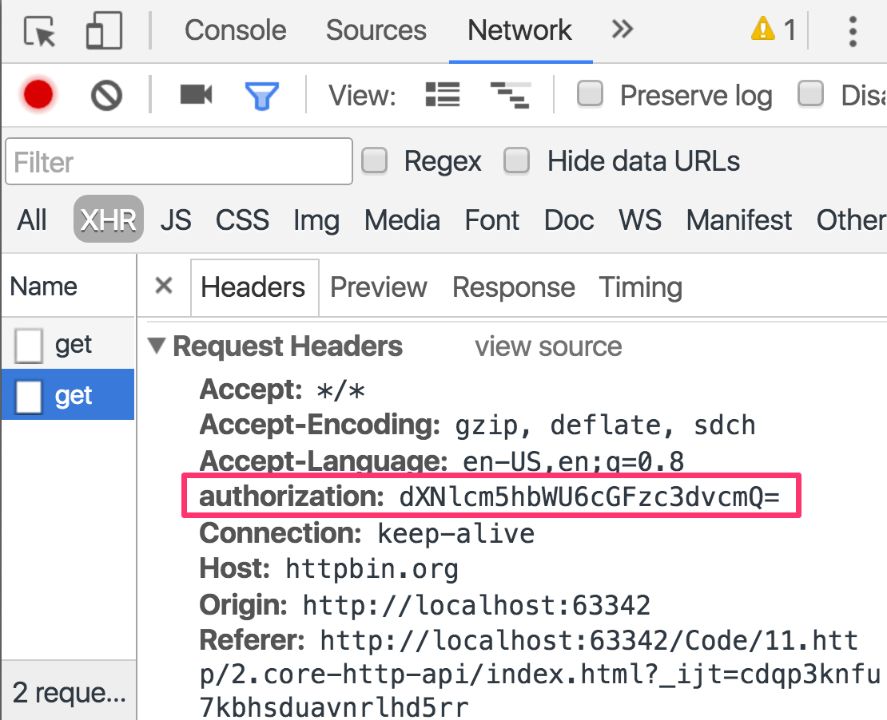

:sourcedir: {docdir}/content/{filedir}/code
:toc:
= Core HTTP API

== Learning Objectives

* How to setup our application so we can inject and use the Http client library.
* How to send the various types of HTTP requests.
* How to send custom headers with our requests.
* How to handle errors.

== Providing the Http Dependencies

The _Http client_ is a service that you can _inject_ into your classes in Angular, like so:

[source,typescript]
----
class MyClass {
  constructor(private http: Http) {
  }
}
----

It lives in the `@angular/http` module along side a number of other classes which are helpful when working with HTTP.

[source,typescript]
----
import { Http, Response, RequestOptions, Headers } from '@angular/http';
----

Importing these classes isn't enough though. Like all things you can _inject_, these are dependencies and therefore must be configured via a provider on the DI framework.

We want it configured into our root `NgModule` since we want to use the Http client potentially everywhere.

The immediate thought might be to add it to the `providers` parameter on our NgModule like so:

[source,typescript]
----
@NgModule({
	providers: [Http]
})
----

However the provider configuration for Http isn't so straight forward, so the Angular team have given us a handy way to configure our `NgModule` with all the required providers for Http.

We simply import something called the `HttpModule` and add it to the `imports` list in our `NgModule`, like so:

[source,typescript]
----
import { HttpModule } from '@angular/http';
.
.
.
@NgModule({
	imports: [
		HttpModule
	]
})
----

Importing `HttpModule` into our `NgModule` configures our `NgModules` injector with all the providers needed to use Http in our app.

== Demo API & Sample App

To demonstrate the Http client lib we will need a test API we can use, one such API is http://httpbin.org this has a number of API end points where we can test different HTTP actions.

For this lecture we'll be fleshing out this simple component. It is a series of buttons which call functions on the component with each function performing a different action using the Http client lib.

[source,typescript]
----
@Component({
 selector: 'app',
 template: `
 

  

  	<button class="btn btn-primary" (click)="doGET()">GET</button>
  	<button class="btn btn-primary" (click)="doPOST()">POST</button>
  	<button class="btn btn-primary" (click)="doPUT()">PUT</button>
  	<button class="btn btn-primary" (click)="doDELETE()">DELETE</button>
	

  

  	<button class="btn btn-secondary" (click)="doGETAsPromise()">As Promise</button>
  	<button class="btn btn-secondary" (click)="doGETAsPromiseError()">Error as Promise</button>
  	<button class="btn btn-secondary" (click)="doGETAsObservableError()">Error as Observable</button>
	

  

  	<button class="btn btn-danger" (click)="doGETWithHeaders()">With Headers</button>
	

 `
})
class AppComponent {
  apiRoot: string = "http://httpbin.org"; # <1>

  constructor(private http: Http) { }  # <2>

  doGET() {
    console.log("GET");
  }

  doPOST() {
    console.log("POST");
  }

  doPUT() {
    console.log("PUT");
  }

  doDELETE() {
    console.log("DELETE");
  }

  doGETAsPromise() {
    console.log("GET AS PROMISE");
  }

  doGETAsPromiseError() {
    console.log("GET AS PROMISE ERROR");
  }

  doGETAsObservableError() {
    console.log("GET AS OBSERVABLE ERROR");
  }

  doGETWithHeaders() {
    console.log("GET WITH HEADERS");
  }
}
----
<1> We store the root of our API in a variable so we can easily refer to it in our functions.
<2> We've injected the `Http` service onto our component and stored it as a private property.

Running the above we will see an application like so:

image::./images/application-demo.png[]

== HTTP Verbs

Now that we have Http setup we can inject it into a class and start making HTTP calls.

The HTTP protocol describes a set of _verbs_ for each URL. For a given URL we can perform a `GET`, `PUT`, `POST`, `DELETE`, `HEAD` and `OPTIONS` request.

Let's flesh out the functions in our component to demonstrate the various features.

=== GET

To perform a `GET` request we simply call the `get` function on our Http client. This returns an observable which for now we are just going to subscribe to and print the response to the console, like so:

[source,typescript]
----
doGET() {
  console.log("GET");
  let url = `${this.apiRoot}/get`;
  this.http.get(url).subscribe(res => console.log(res.text())); # <1>
}
----
<1> `res.text()` is whatever was returned in the body of the HTTP response from the server.

If we now press the `GET` button we see the below printed to the console

[source,json]
----
GET
{
  "args": {},
  "headers": {
    "Accept": "*/*",
    "Accept-Encoding": "gzip, deflate, sdch",
    "Accept-Language": "en-US,en;q=0.8",
    "Cache-Control": "no-cache",
    "Host": "httpbin.org",
    "Origin": "http://evil.com/",
    "Pragma": "no-cache",
    "Referer": "http://run.plnkr.co/ODORtE0cj708R2eO/",
    "User-Agent": "Mozilla/5.0 (Macintosh; Intel Mac OS X 10_11_5) AppleWebKit/537.36 (KHTML, like Gecko) Chrome/53.0.2785.80 Safari/537.36"
  },
  "origin": "2.139.81.90",
  "url": "http://httpbin.org/get"
}
----

Our server returns _JSON_ and although it might look like we are printing out an object we are in fact printing out a JSON formatted string.

To convert the JSON formatted string into an object we just call `res.json()` instead of `res.text()`, like so:

[source,typescript]
----
this.http.get(url).subscribe(res => console.log(res.json()));
----

This parses the JSON string into an object and so we print and an object out to the console instead, like so:

[source,json]
----
GET
Object {args: Object, headers: Object, origin: "2.139.81.90", url: "http://httpbin.org/get"}
----

=== GET with Query Parameters

We can pass to the `get` function a set of optional query parameters as the second argument.

This is in the format of an object like structure but to help in creating our query params object we can use the helper  `URLSearchParams` class like so:

[source,typescript]
----
import {URLSearchParams} from '@angular/http';
.
.
.
doGET() {
  console.log("GET");
  let url = `${this.apiRoot}/get`;
  let search = new URLSearchParams();
  search.set('foo', 'moo');
  search.set('limit', 25);
  this.http.get(url, {search: search}).subscribe(res => console.log(res.json())); # <1>
}
----
<1> We pass the query params as a second argument to the `get` function.

We can take advantage of _destructuring_ in ES6. If you remember if the key and value of an object are the _same_ name then you can shorten `{search: search}` into just `{ search }`, like so:

[source,typescript]
----
doGET() {
  console.log("GET");
  let url = `${this.apiRoot}/get`;
  let search = new URLSearchParams();
  search.set('foo', 'moo');
  search.set('limit', 25);
  this.http.get(url, {search}).subscribe(res => console.log(res.json()));
}
----

=== DELETE

To perform a _DELETE_ request we just call the `delete` function. The format of the function is exactly the same as the `get` function above, we can even pass in query params like so:

[source,typescript]
----
doDELETE() {
  console.log("DELETE");
  let url = `${this.apiRoot}/delete`;
  let search = new URLSearchParams();
  search.set('foo', 'moo');
  search.set('limit', 25);
  this.http.delete(url, {search}).subscribe(res => console.log(res.json()));
}
----

=== POST with Data

To perform a _POST_ request we call the `post` function.

The format of the `post` function is similar to `get` but when we do a _POST_ request we usually want to pass in data as well.

So the second parameter to `post` is not a set of query parameters but instead an object which will be passed as the _payload_ for the request, like so:

[source,typescript]
----
doPOST() {
  console.log("POST");
  let url = `${this.apiRoot}/post`;
  this.http.post(url, {moo:"foo",goo:"loo"}).subscribe(res => console.log(res.json()));
}
----

this prints out:

[source,json]
----
POST
Object {args: Object, data: "{↵  "moo": "foo",↵  "goo": "loo"↵}", files: Object, form: Object, headers: Object…}
----

If we wanted to post to the URL but add query params we can do the same as we did with `get` but we pass the query params in the third param instead, like so:

[source,typescript]
----
doPOST() {
  console.log("POST");
  let url = `${this.apiRoot}/post`;
  let search = new URLSearchParams();
  search.set('foo', 'moo');
  search.set('limit', 25);
  this.http.post(url, {moo:"foo",goo:"loo"}, {search}).subscribe(res => console.log(res.json()));
}
----

=== PUT with Data

To perform a PUT request we just call the `put` function. It works in exactly the same was as the `post` function above:

[source,typescript]
----
doPUT() {
  console.log("PUT");
  let url = `${this.apiRoot}/put`;
  let search = new URLSearchParams();
  search.set('foo', 'moo');
  search.set('limit', 25);
  this.http.put(url, {moo:"foo",goo:"loo"}, {search}).subscribe(res => console.log(res.json()));
}
----

== Promises

If you prefer to work with promises over observables it's easy to convert between the two.

We just call `.toPromise()` on the observable that gets returned and this will convert it into a promise instead, like so:

[source,typescript]
----
doGETAsPromise() {
  console.log("GET AS PROMISE");
  let url = `${this.apiRoot}/get`;
  this.http.get(url)
    .toPromise()
    .then(res => console.log(res.json()));
}
----

If you just ran the above as is you would get this error:

----
this.http.get(...).toPromise is not a function
----

That's because the `toPromise()` function is an observable operator and to reduce the size of your application the Angular team opted not to include all the observable operators by default, instead we need to explicitly import each operator ourselves, like so:

[source,typescript]
----
import 'rxjs/add/operator/toPromise';
----

[TIP]
====
If we wanted to import _all_ RxJS operators we can import:
 +
 +
[source,typescript]
----
import 'rxjs/RX';
----
 +
 +
But the above will _unnecessarily_ bloat the application so isn't recommended for production.
====

Running the above promise based application results in the same information being printed to the console as the previous observable based function.

== Handling Errors

We can simulate errors from our test server just by performing a `GET` on a `POST` endpoint, like so:

[source,typescript]
----
doGETAsPromiseError() {
  console.log("GET AS PROMISE ERROR");
  let url = `${this.apiRoot}/post`; # <1>
  this.http.get(url)
    .toPromise()
    .then(res => console.log(res.json()));
}
----
<1> The API is for a POST request but we are performing a GET.

Whether we are handling the response as an Observable or as a Promise we can add error handling function as the second param, so in the case of a promise it looks like so:

[source,typescript]
----
doGETAsPromiseError() {
  console.log("GET AS PROMISE ERROR");
  let url = `${this.apiRoot}/post`;
  this.http.get(url)
    .toPromise()
    .then(
      res => console.log(res.json()),
      msg => console.error(`Error: ${msg.status} ${msg.statusText}`) # <1>
    );
}
----
<1> Error handler is the second argument to `then`

TIP: With _Promises_ we can also use the `.catch()` handler to handle errors, see the section on ES6 & TypeScript for more information.

The above prints out

----
Error: 405 METHOD NOT ALLOWED
----

And in the case of an observable it looks like so:

[source,typescript]
----
doGETAsObservableError() {
  console.log("GET AS OBSERVABLE ERROR");
  let url = `${this.apiRoot}/post`;
  this.http.get(url).subscribe(
    res => console.log(res.json()),
    msg => console.error(`Error: ${msg.status} ${msg.statusText}`)
  );
}
----

=== Status Codes

If you are looking for a refresher on what each HTTP status codes mean this site is a good reference: https://httpstatuses.com/

== Headers

HTTP headers are bits of meta-data which the browser attaches to your HTTP requests when it sends them to the server. Things like your IP address, the type of browser you are using and so on are added to your headers.

In fact the test API we are using echoes the headers our browser sends in the response it sends back - so we can see what was sent.

Some APIs require that we send some _custom_ headers with our requests and we can do that easily with the Angular Http client.

To send headers with our requests we first need to import two helper classes from the HTTP module.

[source,typescript]
----
import { Headers, RequestOptions } from '@angular/http';
----

For our sample let's send a basic _Authorization_ header. This is just a header called `Authorization` with a value that is a username and password converted to base64, no need to worry too much about the specifics just understand that the built in JavaScript function `btoa` converts a `string` to `base64`.

NOTE: This is a really poor way to authenticate with your server, we are just using it as an example. We covert `username:password` to a base64 string and pass that to the server via a header called `Authorization`

The full listing for sending a HTTP request with header is like so:

[source,typescript]
----
doGETWithHeaders() {
  console.log("GET WITH HEADERS");
  let headers = new Headers();
  headers.append('Authorization', btoa('username:password'));
  let opts = new RequestOptions();
  opts.headers = headers;
  let url = `${this.apiRoot}/get`;
  this.http.get(url, opts).subscribe(
    res => console.log(res.json()),
    msg => console.error(`Error: ${msg.status} ${msg.statusText}`)
  );
}
----

We first create an instance of headers and add our specific header to the mix, like so:

[source,typescript]
----
let headers = new Headers();
headers.append('Authorization', btoa('username:password'));
----

We then create a request options and add our headers as a property of those options.

[source,typescript]
----
let opts = new RequestOptions();
opts.headers = headers;
----

And finally we pass the options to the appropriate Http function, in this example we are using `get` and for `get` the options are passed as the _second_ parameter, for `put` and `post` however it's the _third_ parameter

And now when we press the `GET WITH HEADERS` button and look at the network panel we can see that the authorisation header was sent along with our request.

== Summary

We inject the Http client library into our classes, it's a dependency that needs to be configured in Angulars DI framework.

Rather than separately setup each provider for all the different parts of the Http client library we can instead import the `HttpModule` and add to our `NgModule` imports list. This sets up the injector on our `NgModule` with all the necessary providers.

We make requests for all the HTTP verbs by calling matching functions in our Http client library.

By default these requests return observables which we can subscribe to, we can also convert these observables into promises and handle the asynchronous responses that way.

We handle errors using the typical observable or promise error handlers.

We send custom headers alongside our requests by passing in an appropriately configured `RequestOptions` object to our HTTP functions.

This lecture covered the basics of using the Http client library, in the next lecture we'll go through a specific example using promises.

== Listing

.main.ts
[source,typescript]
----
include::{sourcedir}/src/main.ts[]
----
