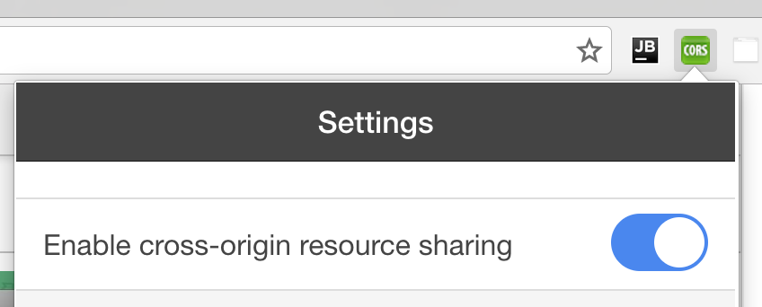
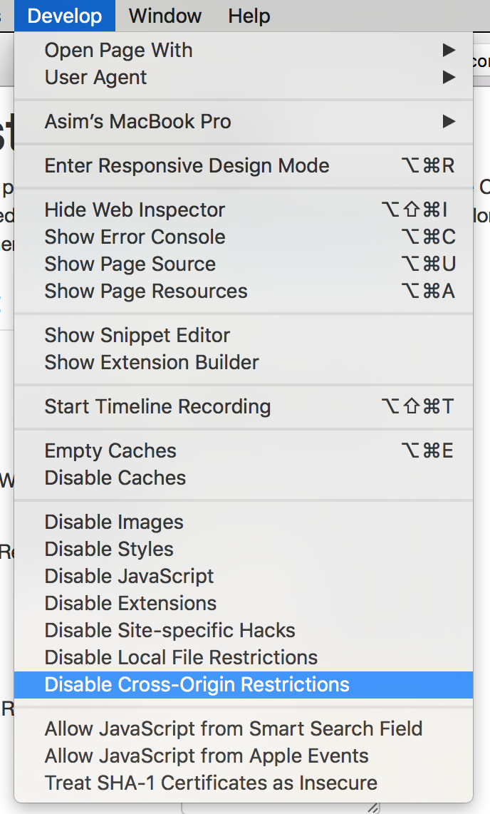
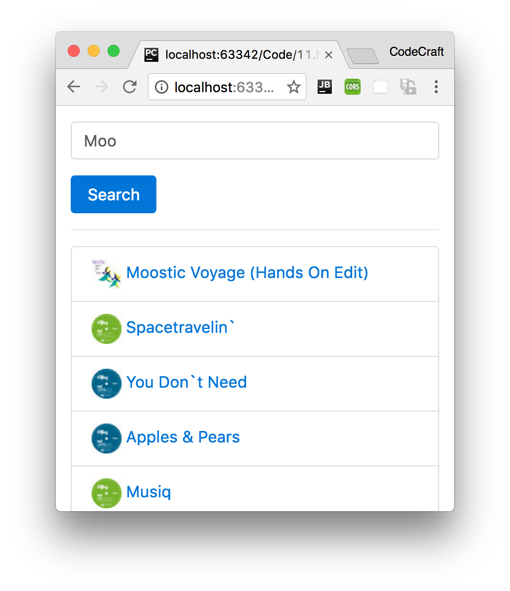

:sourcedir: {docdir}/content/{filedir}/code
:toc:
= HTTP Example with Promises

In this lecture we are going to create a mini application which lets us search iTunes for music.

We'll be using the freely available iTunes API to perform the search: https://affiliate.itunes.apple.com/resources/documentation/itunes-store-web-service-search-api/

== Learning Objectives

* What is CORS and how to temporarily bypass this security feature in your browser.
* How to create an intermediate service to handle our HTTP requests to an API endpoint.
* How to provide the service and consume it in components.
* How to convert the responses into instances of a domain model.
* How to handle asynchronous work by using promises.

== Cross-Origin Resource Sharing

To use this API we need to deal with a thorny issue called _CORS_, Cross-Origin Resource Sharing.

This is a security measure implemented in all browsers that stops you from using an API in a potentially unsolicited way and most APIs, including the iTunes API, are protected by it.

Because of CORS if we tried to make a request to the iTunes API URL with the Http client library the browser would issue a _CORS_ error.

=== Chrome Workaround
For chrome I prefer to use a chrome plugin which lets us switch CORS on and off with the click of a button, install the plugin from this link: https://chrome.google.com/webstore/detail/allow-control-allow-origi/nlfbmbojpeacfghkpbjhddihlkkiljbi

This adds a button to your chrome toolbar, make sure it is enabled and green like so:

=== Firefox Workaround
If you are using FireFox you can try this plugin: https://addons.mozilla.org/en-Gb/firefox/addon/cors-everywhere/

=== Safari Workaround
If you are using Safari start by enabling the _Develop_ menu from Preferences -> Advanced.  When this is done you may need to restart Safari.  In the _Develop_ menu make sure that _Disable Cross-Origin Restrictions_ is checked, you will need to refresh the page for the changes to take effect.

== Creating the App Component

First let's create a simple app component with our search field:

[source,typescript]
----
@Component({
  selector: 'app',
  template: `
<form class="form-inline">
  

    <input type="search"
           class="form-control"
           placeholder="Enter search string"
           #search> # <1>
  

  <button class="btn btn-primary"
          (click)="doSearch(search.value)"> # <2>
          Search
  </button>
</form>
 `
})
class AppComponent {
  constructor() { }

  doSearch(term:string) {
  }
}
----
<1> This input control has a template reference variable called `search`.
<2> Pressing the _Search_ button calls the doSearch() function and passes it the search term.

We have a form input control with a search button. When someone presses the search button it calls the `doSearch` function with the _search term_ we want to search the iTunes database with.

== Creating a Search Service

So far in this section we've used the Http client library directly from a component by injecting it into the component's constructor.

However the recommended method is to create an _intermediate_ service which uses the Http client library to make the requests. Instead of returning _raw_ json data the service converts the response into one or more concrete instances of classes, into something called a domain model.

This makes it easier to test our component later on. We don't have to _mock_ raw HTTP calls but instead, we can define test data as instances of our domain model, more on that later in our lecture on testing.

So we are going to create our own _intermediate_ service which I am going to call `SearchService`.

[source,typescript]
----
@Injectable() # <1>
class SearchService {
  apiRoot:string = 'https://itunes.apple.com/search';
  results:Object[];
  loading:boolean;

  constructor(private http:Http) { # <2>
    this.results = [];
    this.loading = false;
  }

  search(term:string) {
  }
}
----
<1> We decorate the class with `@Injectable` so Angular knows it should inject the Http service into the constructor.
<2> The Http client is injected into our `SearchService` in the constructor.

NOTE: We also _provide_ our `SearchService` and make it available globally via the `NgModule` providers list.

== Using Promises

The `search` function is going to make an _asynchronous_ call using the Http client lib to the iTunes API.

There are two ways we like to handle asynchronous functions in Angular one is via _Promises_ and the other via _Observables_.

In this lecture we will use _Promises_ and in the next we'll solve the same problem using _Observables_.

Since we are using promises we need the `search` function to return a `promise`, like so:

[source,typescript]
----
search(term:string) {
  let promise = new Promise((resolve, reject) => {
    //TODO
  });
  return promise;
}
----

NOTE: If you remember from the section on ES6 and TypeScript we can use promises by returning an instance of a `Promise` class.

We put the code for our search function where the `TODO` comment lives.

When the HTTP response arrives from the iTunes API, we finish our processing and call the `resolve()` function. This let's any interested parties know the asynchronous task is complete and let them perform any follow on tasks.

If the HTTP response returned an error we call the `reject()` function which again let's any interested parties know there was an error.

So now let's flesh out this function with our HTTP `get` request, like so:

[source,typescript]
----
search(term:string) {
  let promise = new Promise((resolve, reject) => {
    let apiURL = `${this.apiRoot}?term=${term}&media=music&limit=20`;
    this.http.get(apiURL)
      .toPromise()
      .then(
        res => { // Success
          console.log(res.json());
          resolve();
        }
      );
  });
  return promise;
}
----

First we construct a URL which will instruct iTunes to perform a search for us, like so:

[source,typescript]
----
let apiURL = `${this.apiRoot}?term=${term}&media=music&limit=20`;
----

Then we make a _GET_ request to that URL with:

[source,typescript]
----
this.http.get(apiURL)
----

It return an _Observable_, we are working with _Promises_ in this example so let's convert it to a _Promise_ with:

[source,typescript]
----
.toPromise()
----

TIP: Remember to add this import to the top of the file `import 'rxjs/add/operator/toPromise';`

When the API responds it calls the function we pass to `then` with a `Response` object and we are just printing out the JSON for now.

[source,typescript]
----
.then(
  res => { // Success
  console.log(res.json());
  }
);
----

== Consuming Our Search Service

To use the `SearchService` we need to configure it as a provider on our `NgModule`

[source,typescript]
----
@NgModule({
  imports: [
    BrowserModule,
    HttpModule,
  ],
  declarations: [AppComponent],
  bootstrap: [AppComponent],
  providers: [SearchService]
})
class AppModule { }
----

We also need to inject it into our `AppComponent` and call the `itunes.search()` function when the user presses the Search button

[source,typescript]
----
class AppComponent {
  constructor(private itunes:SearchService) { }

  doSearch(term:string) {
    this.itunes.search(term)
  }
}
----

Now when we type in _Moo_ into the input control and press _Search_ this calls the API with https://itunes.apple.com/search?term=moo&media=music&limit=20 and prints the results to the console, like so:

[source,json]
----
Object {resultCount: 20, results: Array[20]}
----

We are interested only in the `results` property, this is the list of search results.

Rather than return the search results to the component, let's instead _store_ the results on the `SearchService` to make it easier to share the results between components and at the same time let's add an error handler, like so:

[source,typescript]
----
search(term:string) {
  let promise = new Promise((resolve, reject) => {
    let apiURL = `${this.apiRoot}?term=${term}&media=music&limit=20`;
    this.http.get(apiURL)
      .toPromise()
      .then(
        res => { // Success
        this.results = res.json().results;
        resolve();
        },
        msg => { // Error
        reject(msg);
        }
      );
  });
  return promise;
}
}
----

We also call the `resolve()` and `reject()` functions above after we have finished processing the callback from iTunes so the calling function gets notified and can perform any post processing.

Let's now render these results in our app component.

We are keeping the data on the iTunes service and to loop over them we use an `NgFor` directive like so:

[source,html]
----
<ul>
  <li *ngFor="let track of itunes.results">
    {{track.trackName}}
  </li>
</ul>
----

Now when we run the app and type in _Moo_ we get a set of track returned and for each one we print out the track name.

That's great but we can do better, let's use the Twitter Bootstrap list UI style and also show the track image and link to the track on iTunes.

NOTE: The HTML below might look complex but it's just standard Twitter Bootstrap layout.

[source,html]
----
<ul class="list-group">
  <li class="list-group-item"
      *ngFor="let track of itunes.results">
    
    <a target="_blank"
       href="{{track.trackViewUrl}}">{{ track.trackName }}
    </a>
  </li>
</ul>
----

That's it now when we run the application and search for _Moo_ we get something that looks like this:

.iTunes Track Search App

== Adding a Loading Indicator

So now it's all working but there is one feature which is important when doing any asynchronous work and that's to show a loading indicator to the end user, so they know the application is working and not _broken_.

Let's show the text `"Loading..."` when we are still waiting for iTunes to return a response.

We create a boolean called `loading` on our `AppComponent` and then conditionally show a `p` tag if `loading` is `true`, like so:

[source,html]
----

  
Loading...

----

We initialise loading to `false` so it doesn't show when we first load the page, then we set it to `true` when we call the `doSearch()` function so it does show.

[source,typescript]
----
class AppComponent {
  private loading: boolean = false;

  constructor(private itunes:SearchService) { }

  doSearch(term:string) {
    this.loading = true;
    this.itunes.search(term)
  }
}
----

The above logic would show the `"Loading..."` message but we have _no_ way of setting the `loading` boolean to `false` again, we have no way to _remove_ the `"Loading..."` message.

We need to call some code when all the data has been returned by the iTunes API.

The `SearchService` already returns a promise and calls resolve on that promise when this happens. To hook into that we add a `then` handler onto the returned promise and set the `loading` boolean to `false` there, like so:

[source,typescript]
----
doSearch(term:string) {
  this.loading = true;
  this.itunes.search(term).then( () => this.loading = false)
}
----

Now when the `itunes.search()` function completes we set `loading` to `false` and the `"Loading..."` message disappears.

== Using a Domain Model

We now have a functioning app.

However the format we are storing data in is just a plain JSON object, it's far better to parse our raw JSON data into instances of classes, a domain model.

First let's create a class called `SearchItem` which can encapsulate the fields we are interested in.

[source,typescript]
----
class SearchItem {
  constructor(public name: string,
              public artist: string,
              public link: string,
              public thumbnail: string,
              public artistId: string) {
  }
}
----

And then in our `SearchService` let's parse the JSON and store instances of `SearchItems` instead.

A good method of achieving this is to use the `map` array function, this transforms each element in the array by passing it through a function like so:

[source,typescript]
----
this.results = res.json().results.map(item => { # <1>
  return new SearchItem(
      item.trackName,
      item.artistName,
      item.trackViewUrl,
      item.artworkUrl30,
      item.artistId
  );
});
----
<1> We loop through the `results` array, calling the function passed into map on each item. This function converts the raw JSON item into an instance of a `SearchItem` instead.

At the same time let's be explicit and set the type of the results property on our `SearchService` to `SearchItem[]`.

The full listing for our `SearchService` now looks like:

[source,typescript]
----
@Injectable()
export class SearchService {
  apiRoot: string = 'https://itunes.apple.com/search';
  results: SearchItem[];
  loading: boolean;

  constructor(private http: Http) {
    this.results = [];
    this.loading = false;
  }

  search(term: string) {
    let promise = new Promise((resolve, reject) => {
      let apiURL = `${this.apiRoot}?term=${term}&media=music&limit=20`;
      this.http.get(apiURL)
          .toPromise()
          .then(
              res => { // Success
                this.results = res.json().results.map(item => {
                  return new SearchItem(
                      item.trackName,
                      item.artistName,
                      item.trackViewUrl,
                      item.artworkUrl30,
                      item.artistId
                  );
                });
                // this.results = res.json().results;
                resolve();
              },
              msg => { // Error
                reject(msg);
              }
          );
    });
    return promise;
  }
}
----

The results property is now an array of `SearchItems`.

The names of the properties on our model have also changed, for instance `trackName` in the raw JSON returned from iTunes is now `track` on our `SearchItem` so we need to change our template bindings to match, like so:

[source,html]
----
<ul class="list-group">
  <li class="list-group-item"
      *ngFor="let track of itunes.results">
    
    <a target="_blank"
       href="{{track.link}}">{{ track.name }}
    </a>
  </li>
</ul>
----

== Summary

The recommended method to interact via a Http service is by creating an intermediate service which has the responsibly of communicating with the API and converting the raw data into one or more domain models.

In this lecture we handled asynchronous code by using promises. By converting the observable returned from the Http client lib into a promise and also by returning and resolving our _own_ promise from `SearchService`.

In the next lecture we'll look at how we can implement the same solution by using observables.

== Listing

.main.ts
[source,typescript]
----
include::{sourcedir}/src/main.ts[]
----
