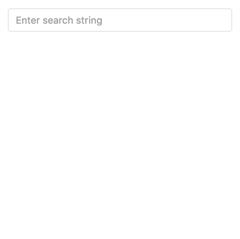

:sourcedir: {docdir}/content/{filedir}/code
:toc:
= HTTP Example with Observables

//SEARCH STORES OBS: http://plnkr.co/edit/uyIKBeGgvNsOhvZ3Bhu6?p=preview
//SEARCH RETURNS OBS: http://plnkr.co/edit/US6ZBotd7n4ZR0zmbFgD?p=preview
//LINK OBS: http://plnkr.co/edit/OohgLjCEgDOqx5iEl7pw?p=preview

// In the previous lecture we architected an application which made HTTP calls by:

////
* Creating a domain model which represented an individual search result.
* Creating an intermediate service which performs the HTTP request, parses the response and returns instances of our domain model instead.
* Consumed the service in our `AppComponent`, triggered searches on the API and rendered the results.
////

In the previous lecture we architected an application which made HTTP calls and handled all asynchronous work by using _Promises_.

In this lecture we are going to implement exactly the same application but using _Observables_ instead.

IMPORTANT: Please note we still need to use the CORS plugin, or one of the other workarounds, that we discussed in the previous lecture.

== Learning Objectives

Our goal in this lecture is not to just replace _Promises_ with _Observables_ but instead to go a deeper and implement most of our functionality with an _Observable Chain_.

Working with Observables does require a different way of thinking about programming, It's my hope that after this lecture you will have a much better idea of how to solve similar problems with RxJS and observables.

== Returning an Observable from the Service

In the promise example we stored the returned results on the service itself in the `results` property.

In this observable example we are instead going to make the `search` function _return_ an observable which the AppComponent is going to subscribe to, like so:

[source,typescript]
----
import {Observable} from 'rxjs';
.
.
.
search(term:string): Observable<SearchItem[]> { .. }
----

The return type is `Observable<SearchItem[]>`, it's going to return an observable where each item in the observable is `SearchItem[]`, each item in the observable is going to be an _array_ of `SearchItems`.

That's our intention at least but we need to adjust our search function to make it a reality, a first step would look like so:

[source,typescript]
----
search(term:string): Observable<SearchItem[]> {
  let apiURL = `${this.apiRoot}?term=${term}&media=music&limit=20`;
  return this.http.get(apiURL)
}
----

We've removed the Promise code and since `http.get(...)` returns an `Observable`, specifically an `Observable` of `Response` types so the type would be `Observable<Response>`,  we just return that instead.

However the above has two problems:

. The return type of `http.get(...)` is `Observable<Response>` and not `Observable<SearchItem[]>`
. It's missing the code to convert the raw JSON to our `SearchItem` domain model.

Basically we still need to convert the `Response` to an array of `SearchItems`.

We can do that with our Observable by running a `map` operation where we convert each `Response` to an array of `SearchItems`, like so:

[source,typescript]
----
search(term: string): Observable<SearchItem[]> {
  let apiURL = `${this.apiRoot}?term=${term}&media=music&limit=20&callback=JSONP_CALLBACK`;
  return this.http.get(apiURL) # <1>
      .map(res => { # <2>
        return res.json().results.map(item => { # <3>
          return new SearchItem( # <4>
              item.trackName,
              item.artistName,
              item.trackViewUrl,
              item.artworkUrl30,
              item.artistId
          );
        });
      });
}
----
<1> `this.http.get(apiURL)` returns an `Observable`.
<2> `map` is an observable operator which calls a function for each item on its input stream and pushes the result of the function to its output stream. In this case each input item is a `Response` object.
<3> We loop over each item in the `results` property of the `Response` object and transform the item via a function.
<4> We convert the raw data returned from the iTunes API into an instance of `SearchItem`

[IMPORTANT]
====
`map` in this instance is an operator from RxJS so to use it we need to explicitly import it via:

[source,typescript]
----
import 'rxjs/add/operator/map';
----
====

The end result is that the code above converts the `Observable<Response>` that gets returned from `this.http.get(...)` to an `Observable<SearchItem[]>` which it then returns to the caller.

The caller in our case is the `AppComponent` so we need to change that to work with `Observables` as well.

One way to use this `Observable` in our `AppComponent` would be just to subscribe to it and store the results locally, like so:

[source,typescript]
----
class AppComponent {
  private loading: boolean = false;
  private results: SearchItem[];

  constructor(private itunes:SearchService) { }

  doSearch(term:string) {
    this.loading = true;
    this.itunes.search(term).subscribe( data => {
      this.loading = false;
      this.results = data # <1>
    });
  }
}
----
<1> We subscribe to the `Observable<SearchItem[]>` returned from the service and store each `SearchItem[]` to our local `results` property.

We also need to change our template to loop over the local `results` property and not the old `itunes.results` property.

[source,html]
----

 ... 

----

Running the above application works, we can congratulate ourselves for using Observables with HTTP request, but we can go deeper.

== Using the `async` Pipe

The above is a good start but we are not really using `Observables` to their full extent, for one thing we are subscribing to the observable and storing the results locally on the component, we can skip that by just using the `async` pipe in our template like so:

[source,typescript]
----
class AppComponent {
  private loading: boolean = false;
  private results: Observable<SearchItem[]>;

  constructor(private itunes:SearchService) { }

  doSearch(term:string) {
    this.loading = true;
    this.results = this.itunes.search(term); # <1>
  }
}
----
<1>  `results` now stores the `Observable` itself and not an array of `SearchItems`. We don't need to subscribe but simply store the result of calling `itunes.search`.

To make the above work we need to use the `async` pipe in our template, like so:

[source,typescript]
----

 ... 

----

== Observables All the Way Down

Pressing a _Search_ button every time we want to make a search is so _2012_, let's change our application so it uses a _reactive_ form and performs a search as we type. We've covered reactive forms before so we just need to change our `AppComponent` to add a search field, like so:

[source,html]
----
<form class="form-inline">
  

    <input type="search"
           class="form-control"
           placeholder="Enter search string"
           [formControl]="searchField">
  

</form>
----

We also change our component to setup a form model, like so:

[source,typescript]
----
class AppComponent {
  private loading: boolean = false;
  private results: Observable<SearchItem[]>;
  private searchField: FormControl;

  constructor(private itunes:SearchService) { }

  ngOnInit() {
    this.searchField = new FormControl();
    this.searchField.valueChanges
      .debounceTime(400)
      .distinctUntilChanged()
      .subscribe(); // Need to call subscribe to make it hot!
  }

  doSearch(term:string) {
    this.itunes.search(term)
  }
}
----

To summarise the changes:

1. We've added a `searchField` `FormControl` to our `AppComponent` properties

[source,typescript]
----
private searchField: FormControl;
----

[start=2]
1. We've linked our `searchField` to our template form element with a `[formControl]` directive

[source,html]
----
[formControl]="searchField"
----

[start=3]
1. To support the above we've imported code from the form module and added them to our `NgModules` imports.

[source,typescript]
----
import {ReactiveFormsModule, FormControl, FormsModule} from '@angular/forms';

@NgModule({
  imports: [
    BrowserModule,
    ReactiveFormsModule,
    FormsModule,
    HttpModule,
  ],
  declarations: [AppComponent],
  bootstrap: [AppComponent],
  providers: [SearchService]
})
----

[start=4]
1. We've implemented the `ngOnInit` function so we can work with our search control once it's been linked to the form element.

[source,typescript]
----
ngOnInit() { ... }
----

[start=5]
1. We now `subscribe` to the observable our `searchField` exposes via the `valuesChanged` property, we use `debounceTime` and `distintUntilChanged` so we only get notified when the user _really_ wants us to make a query.

[source,typescript]
----
this.searchField.valueChanges
  .debounceTime(400)
  .distinctUntilChanged()
  .subscribe(); // Need to call subscribe to make it hot!
----

[start=6]
1. To enable the use of these operators we've explicitly included them from RxJS

[source,typescript]
----
import 'rxjs/add/operator/debounceTime';
import 'rxjs/add/operator/distinctUntilChanged';
----

=== Linking Two Observables Together

We now have an `Observable` on the `AppComponent` which emits a search term every time we want to perform a search.

We also have the `SearchService` returning an `Observable` via the search function with the results of performing a search.

How do we link these two together?

The `valueChanges` observable on our `searchField` is of type `Observable<string>`

Through a chain of operators we want to convert that `Observable<string>` into an `Observable<SearchItem[]>`.

To start with let's use the `map` operator, like so:

[source,typescript]
----
ngOnInit() {
  this.searchField = new FormControl();
  this.searchField.valueChanges
    .debounceTime(400)
    .distinctUntilChanged()
    .map( term => this.itunes.search(term)) # <1>
    // Need to call subscribe to make it hot!
    .subscribe( value => console.log(value));
}
----
<1>  We call the search service for every emit of a search term on the input stream.

If we ran the above and looked at the logs, instead of seeing see an array of `SearchItems` printing out we see something that looks like an `Observable`, like so:

[source,json]
----
Observable {_isScalar: false, source: Observable, operator: MapOperator}
----

What's happening is that `itunes.search(term)` isn't returning `SearchItem[]` it's returning `Observable<SearchItem[]>`.

So the map operator _isn't_ converting a `string` to  `SearchItem[]` it's converting a `string` to `Observable<SearchItem[]>`.

So the subscribe function is receiving `Observable<SearchItem[]>` and not `SearchItem[]` as we want.

One workaround would then be to just try doing two subscribes, like so:

[source,typescript]
----
  ngOnInit() {
    this.searchField = new FormControl();
    this.searchField.valueChanges
      .debounceTime(400)
      .distinctUntilChanged()
      .map( term => this.itunes.search(term))
      .subscribe( value => { # <1>
        value.subscribe( other => console.log(other) ) # <2>
      });
  }
----
<1>  First `subscribe` receives `Observable<SearchItem[]>`.
<2>  We call subscribe again on each of these observables to get the `SearchItem[]`.

This is a common problem with `Observables` so there is a better way, we can use another operator called `switch`.

`switch` expects a stream of `Observables`, when it gets an `Observable` pushed onto its input stream it _unsubscribes_ from any previous `Observables` and _subscribes_ to the new one and then emits any values from that `Observable` onto its output stream.

To put it another way it converts `Observable<Observable<SearchItem[]>>` into `Observable<SearchItem[]>` which is exactly the problem we are solving with the two `subscribes` above.

image::./images/switch-animation.gif[]

Using `switch` with `map` is _such_ a common occurrence that there is a combined operator called `switchMap`, which we'll use

Our code now looks like this:

[source,typescript]
----
ngOnInit() {
  this.searchField = new FormControl();
  this.searchField.valueChanges
    .debounceTime(400)
    .distinctUntilChanged()
    .switchMap( term => this.itunes.search(term))
    .subscribe( value => console.log(value));
}
----

[IMPORTANT]
====
To use `switchMap` we need to import it from the RxJS library, like so:

[source,typescript]
----
import 'rxjs/add/operator/switchMap';
----
====

=== Rendering Results

Now that our observable chain returns `Observable<SearchItem[]>` we can just assign it to our local results property, like so:

[source,typescript]
----
ngOnInit() {
  this.searchField = new FormControl();
  this.results = this.searchField.valueChanges # <1>
    .debounceTime(400)
    .distinctUntilChanged()
    .switchMap( term => this.itunes.search(term));
}
----
<1>  Store `Observable<SearchItem[]>` on `results`.

NOTE: Remember in our template we are using the `async` pipe. This does a `subscribe` on our behalf so we also removed the `subscribe` from our chain.

=== Loading Indicator

The final thing we need to do is add our `loading` boolean to the chain, set it to `true` and `false` at the right times so our loading message shows correctly, we can do that by using the `do` operator.

[IMPORTANT]
====
We use `do` to create _side effects_ in our application, it lets us do things _outside_ of just manipulating items via streams. It should be used _infrequently_ but this is a perfect example, setting _state_ on our component depending on where we are in the processing chain
====

So now our function looks like so:

[source,typescript]
----
ngOnInit() {
  this.searchField = new FormControl();
  this.results = this.searchField.valueChanges
    .debounceTime(400)
    .distinctUntilChanged()
    .do( () => this.loading = true)
    .switchMap( term => this.itunes.search(term))
    .do( () => this.loading = false )
}
----

[IMPORTANT]
====
We need to import the `do` operator from RxJS

[source,typescript]
----
import 'rxjs/add/operator/do';
----
====

Finally, if we run our application we should see something like this:

== Summary

In this lecture we've covered, in depth, how to use observables when making HTTP requests.

The goal of this lecture was to show you how you can _evolve_ your application from one that uses just a little bit of observables to one that uses a lot more.

Hopefully you now have a much better idea of _how_ to architect your application using observables.

We could go even further, for instance the `loading` property could be its own observable, how far and how deep to go is up to you. Depending on how comfortable you feel with Observables and how well they match to your use case.

They can be really powerful but at other times they can be a big hindrance with little benefit. In Angular you can use as much or as little reactive programming as you want, it doesn't prescribe one way or the other.

So far we've _not_ dealt with the issue of _CORS_ and we cheated in creating these apps by installing a plugin to chrome which circumnavigates _CORS_ security issues.

In the next lecture we'll cover how to use _JSONP_ to solve _CORS_ issues, if the API supports JSONP, and how to implement JSONP requests in Angular.

== Listing

.main.ts
[source,typescript]
----
include::{sourcedir}/src/main.ts[]
----
