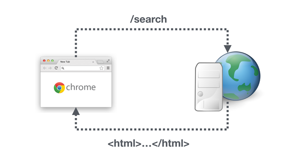
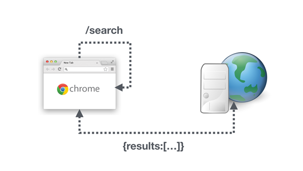

= Overview

The goal of this section is to build on the music search application we created in the previous section and also add pages for Artist, Track and Album listings.

We _could_ implement this app by hiding and showing components on the page either via the `NgIf` directive or binding to the `[hidden]` property. but then the URL in the address bar doesn't change and that has a few drawbacks:

1. Refreshing the page would reset the application back to the start, i.e. if we had performed a search refreshing the page would mean we lose the results.
2. We cannot bookmark our position in the application and come back to it later.
3. We cannot send links to other people and have exactly the view show up for them as it shows for us.

Another way to think about the URL in your address bar is that it defines the current *state* of your application.

[TIP]
====
https://en.wikipedia.org/wiki/State_(computer_science)[State] is a computer science term and means _"all the stored information, at a given instant in time, to which [a] program has access."_

So the state of an application is the current value of all the variables in the application.

An address in a URL can't store that much information but it can store enough so that perhaps we can re-fetch some and re-calculate the rest to get to the same _state_ as before.
====

Giving the a URL to someone else should enable them to bring up the same _state_ in their browser.

In traditional applications built with _Server-Side Routing_ when you change the URL in your browser, the browser makes a request to the server to return some HTML which it will display.

However we want to implement something called _Client Side Routing_. When the URL changes in the browser we want our local application that's running in the browser (the _client_) to handle the change, we don't want the request sent to the server.

When we first navigate to a new site the server returns the HTML, JavaScript and CSS needed to render that page. All further changes to the URL are handled locally by the client application. Typically the client application will make one or more API requests to get the information it needs to show the new page.

There is only ever a _single page_ returned from the server, all further modifications of the page are handled by the _client_ and that's why it's called a _Single Page Application_.

The advantages of an SPA are:

1. Can be faster. Instead of making a time-consuming request to a far away server every time the URL changes the client app updates the page much faster.
2. Less bandwidth required. We don't send over a big HTML page for every URL change, instead we might just call a smaller API which returns _just enough data_ to render the change in the page.
3. Convenience. Now a single developer can build most of the functionality of a site instead of splitting the effort between a front-end and server-side developer.

Angular has a couple of modules which let us implement our application as an SPA, the concept as a whole in Angular is called the _Component Router_ and in this section you will learn how to build an SPA in Angular using the component router.

In this section you will learn:

* How to define and configure the different URLs (routes) in your application.
* How to navigate between those routes on the client side so the browser doesn't send a request to the server.
* What path location strategies we can use in Angular and the advantages/disadvantages of each.
* How to use parametrised routes where part of the URL is a variable.
* How to implement nested routes.
* How to implement router guards to prevent certain people from accessing certain URLs.

