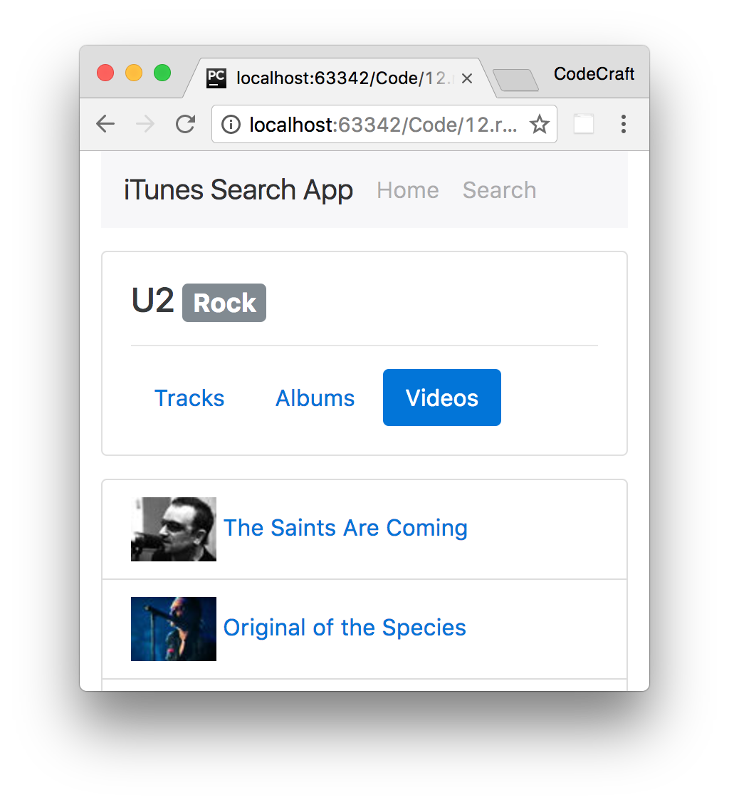

= Activity

Extend the application we created in this section.

Add another child route which shows a list of music videos for a given artist.

TIP: Use `entity=musicVideo` in the iTunes API to return a set of music videos.

== Steps

Fork this blitz:

https://stackblitz.com/github/codecraft-tv/angular-course/tree/current/{chapter_num}.{chapter_slug}/{lecture_num}.{lecture_slug}/code/@activity[https://stackblitz.com/github/codecraft-tv/angular-course/tree/current/{chapter_num}.{chapter_slug}/{lecture_num}.{lecture_slug}/code/@activity, window="_blank"]

Complete the `ArtistMusicVideoListComponent` component.

TIP: Remember you also need to make changes to the route configuration and `NgModule`!

Read any *TODO* comments in the blitz for hints.

== Solution

When you are ready compare your answer to the solution in this blitz:

https://stackblitz.com/github/codecraft-tv/angular-course/tree/current/{chapter_num}.{chapter_slug}/{lecture_num}.{lecture_slug}/code/@solution[https://stackblitz.com/github/codecraft-tv/angular-course/tree/current/{chapter_num}.{chapter_slug}/{lecture_num}.{lecture_slug}/code/@solution, window="_blank"]
