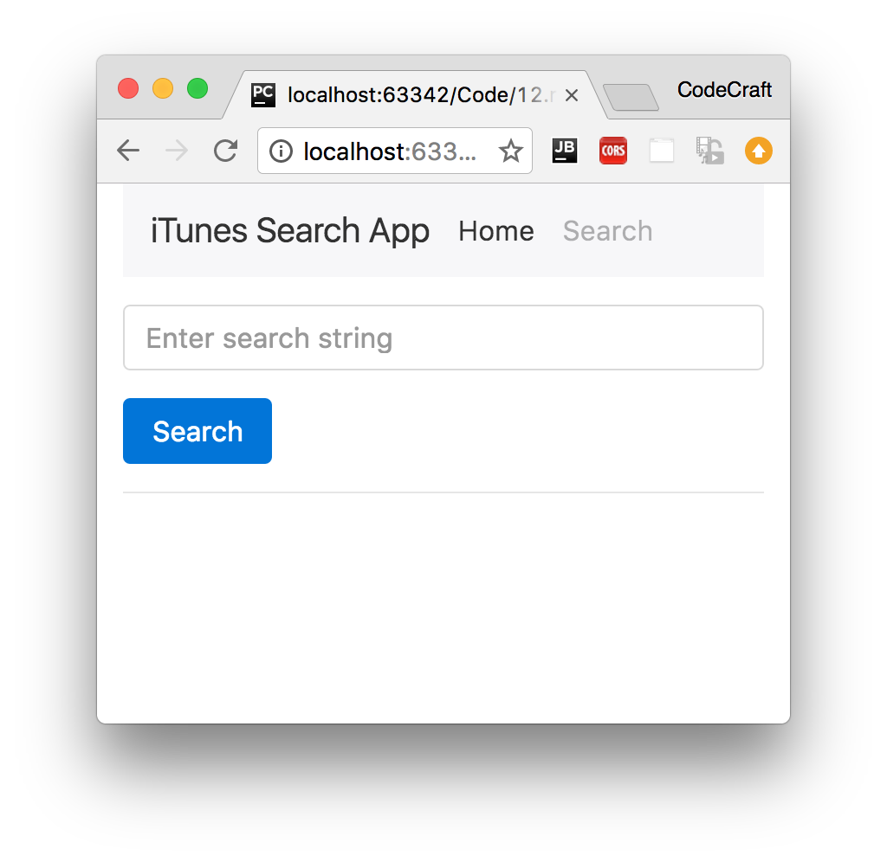
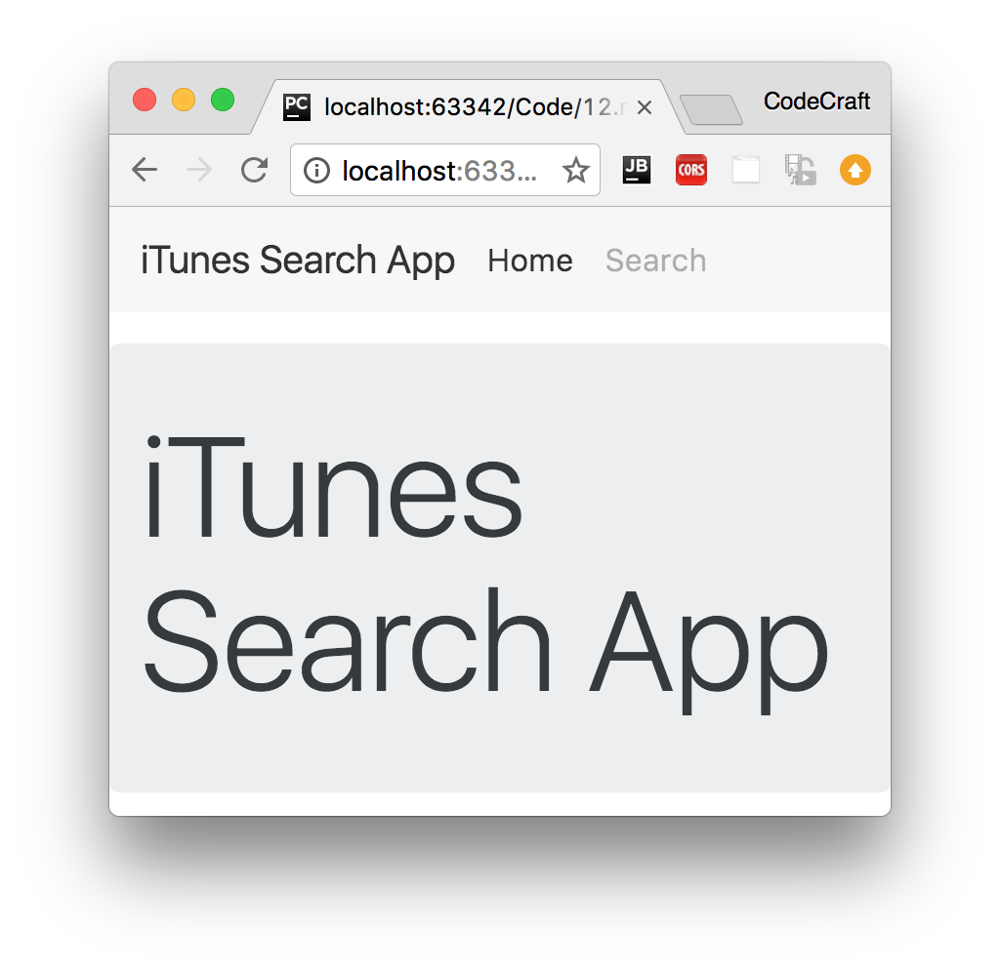

:sourcedir: {docdir}/content/{filedir}/code
:toc:
= Route Configuration

== Learning Objectives

* How to configure and setup the Angular router.
* How to handle _redirects_ and _catch-all_ routes in Angular.

== Components

////

So far in this course we've been using Plunker to edit and run files.

Plunker is perfect for simple demonstrations but doesn't work so well with routing, for that it's better to download the plunker files and run locally.

http://plnkr.co/edit/oGV8bOKHJWQofFiv9SjY?p=preview

This is the application we are going to build in this lecture.

To run this application we simply download the zip file, unzip it.

Then using the terminal `cd` into the folder where you downloaded the file and run a local webserver.

If you have Python installed you can just use

python -m SimpleHTTPServer

If you don't have Python then you can use a local node webserver called http-server.

npm install http-server -g

http-server

The application will tell you what host/port to visit, open a browser and visit that host/port.

Now you can run the code locally and view the results in the browser.

Since we are running locally I'm going to be using my favorite IDE (WebStorm) to edit the files.
////

To explain routing in Angular we start with an app very similar to the one we created in the section on Http.

We have a `SearchComponent` which lets us perform searches using the iTunes API, we are using JSONP to bypass CORS and _Promises_ instead of _Observables_ to keep things simple.

In addition we've also created a `HeaderComponent` with a selector of `app-header` and two menu items, _Home_ and _Search_. We also have a `HomeComponent` with selector `app-home` which just shows a simple welcome message.

In one configuration, the main `AppComponent` renders these two components like so:

[source,html]
----
<app-header></app-header>

  <app-search></app-search>

----

NOTE: `m-t-1` above is a class from Twitter Bootstrap which adds a top margin to the element so we can clearly distinguish the different elements.

The above is the structure we want when the user navigates to `/search`, this renders the page with the header and the search component.

If we changed the template to be:

[source,html]
----
<app-header></app-header>

  <app-home></app-home>

----

This renders the page with the header and the home component, we want this structure when the user navigates to the root `/` URL.

== Routes & RouterModule

Our goal with routing is to have the `HomeComponent` rendered when the URL is `/` and the `SearchComponent` shown when the URL is `/search`

First we need to setup some imports, like so:

[source,typescript]
----
import {Routes, RouterModule} from "@angular/router";
----

The mapping of URLs to _Components_ we want displayed on the page is done via something called a _Route Configuration_, at it's core it's just an array which we can define like so:

[source,typescript]
----
const routes: Routes = [
 { path: '', component: HomeComponent },
 { path: 'search', component: SearchComponent }
];
----
* The `path` property describes the URL this route will handle.
* The `component` property is the name of the component we want to display when the URL in the browser matches this path.

NOTE: `Routes` is a TypeScript type of `Route[]`, an array of individual `Route` instances.

We then _install_ these routes into our application by importing `RouterModule.forRoot(routes)` into our `NgModule`, like so:

[source,typescript]
----
@NgModule({
	imports: [
	  .
	  .
		RouterModule.forRoot(routes, {useHash: true})
	]
	.
	.
	.
})
class AppModule { }
----

IMPORTANT: We'll go through the meaning of the `{useHash: true}` argument when we cover _Path Location Strategies_ later on in this section. For now just know that this prepends `/&#35;` to all of our URLs, so our root URL would be `/&#35;/` and our search URL would be `/&#35;/search`.

== RouterOutlet Directive

We've configured our application so if the user navigates to `/&#35;/search` we want the `SearchComponent` shown or if they navigate to the root URL `/&#35;/` then we want the `HomeComponent` shown.

_But where exactly do we want the component shown?_

We need to add a directive called `router-outlet` somewhere in our template HTML. This directive tells Angular _where_ it should insert each of those components in the route, we'll add ours to the `AppComponent`, like so:

[source,html]
----
<app-header></app-header>

  <router-outlet></router-outlet> # <1>

----
<1>  We place `<router-outlet>` where we want the component inserted.

Now if we run the application and visit the root URL we are shown the `HomeComponent` and if we visit the `/search` URL we are shown the `SearchComponent`.

== Redirects

There are a few more ways to configure our routes, for example we might like to change our routes to add some redirects like so:

[source,typescript]
----
const routes:Routes = [
	{path: '', redirectTo: 'home', pathMatch: 'full'}, # <1>
	{path: 'find', redirectTo: 'search'}, # <1>
	{path: 'home', component: HomeComponent},
	{path: 'search', component: SearchComponent}
];
----
<1>  The `redirectTo` property describes the path we want to redirect this user to if they navigate to this URL.

Now if the user visits the root (empty) URL they are redirected to `/home` instead.

NOTE: For the special case of an _empty_ URL we also need to add the `pathMatch: 'full'` property so Angular knows it should be matching exactly the empty string and not _partially_ the empty string.

We've also added a redirect from `/find` to `/search`, since this isn't empty we don't need to add the `pathMatch` property.

== Catch-All Route

We can also add a _catch-all_ route by using the path `**`, if the URL doesn't match _any_ of the other routes it will match this route.

[source,typescript]
----
const routes:Routes = [
	{path: '', redirectTo: 'home', pathMatch: 'full'},
	{path: 'find', redirectTo: 'search'},
	{path: 'home', component: HomeComponent},
	{path: 'search', component: SearchComponent},
	{path: '**', component: HomeComponent} # <1>
];
----
<1>  If nothing matches we show the `HomeComponent`

Now if we navigate to `/foo` it will show us the welcome message.

In our example above we are just showing the `HomeComponent` but normally we might show an error 404 page.

== Summary

A route in our application is defined by a mapping of a URL to a component or a redirect to another URL.

We can create an array of `Routes` and then install them in our application by importing them into our `NgModule` using `RouterModule.forRoot(routes)`.

In this lecture we've shown how we can configure routes and manually type in the different URLs in the address bar to make the application render different components depending on which URL the user visits.

Next we'll show how you can navigate between these different routes in Angular without having to manually type the URL into the browser address bar.

== Listing

.main.ts
[source,typescript]
----
include::{sourcedir}/src/main.ts[]
----
