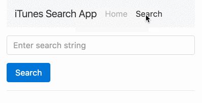
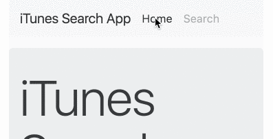

:sourcedir: {docdir}/content/{filedir}/code
:toc:
= Navigation

== Learning Objectives

How to navigate between the different routes in an Angular application.

== Navigating by Hardcoded URLs

We could simply _hardcode_ the URLs in the `href` anchor attributes on our navigation header, like so:

[source,html]
----
<nav class="navbar navbar-light bg-faded">
  <a class="navbar-brand" href="/#/">iTunes Search App</a>
  <ul class="nav navbar-nav">
    <li class="nav-item active">
      <a class="nav-link" href="/#/">Home</a> # <1>
    </li>
    <li class="nav-item">
      <a class="nav-link" href="/#/search">Search</a>
    </li>
  </ul>
</nav>
----
<1>  We simply add a standard `href` with a value of `/#/`

[IMPORTANT]
====
This works for our example because we are using something called a `HashLocationStrategy` (more on that later) but hardcoding like this doesn't work with the other location strategy available in Angular, `PathLocationStrategy`.
 +
 +
If we were using that strategy clicking one of those links would result in the browser trying to request the whole page again from the server which defeats the purpose of trying to create an SPA.
====

// ?? Hardcoding links also doesn't let us use variables in our URLs, for example imagine the URL "/artist/123456/tracks" which might return tracks for a given artist, the 123456 is a variable that would change for each artist.

== Navigating Programmatically via the Router

In Angular we can also programmatically navigate via a `Router` service we inject into our component, like so:

[source,typescript]
----
import {Router} from "@angular/router";
.
.
.
@Component({
  selector: 'app-header',
  template: `
<nav class="navbar navbar-light bg-faded">
  <a class="navbar-brand" (click)="goHome()">iTunes Search App</a> # <1>
  <ul class="nav navbar-nav">
    <li class="nav-item">
      <a class="nav-link" (click)="goHome()">Home</a> # <1>
    </li>
    <li class="nav-item">
      <a class="nav-link" (click)="goSearch()">Search</a> # <1>
    </li>
  </ul>
</nav>
 `
})
class HeaderComponent {
  constructor(private router: Router) {} # <2>

  goHome() {
    this.router.navigate(['']); # <3>
  }

  goSearch() {
    this.router.navigate(['search']); # <3>
  }
}
----
<1>  We added click handlers to each anchor tag to call functions on our `HeaderComponent`.
<2>  We inject and store a reference to the `Router` into our `HeaderComponent`.
<3>  We then call the `navigate` function on the `router` to navigate between the different URLs.

=== Link Parameters Array

The value we pass into the `navigate` function might look a bit strange, we call it a _link params array_ and it's equivalent to the URL split by the `/` character into an array.

IMPORTANT: We don't have to pass in the `&#35;` character in the parameters to the `navigate` function, it automatically adds them in if we are using the `HashLocationStrategy`.

We can demonstrate by changing our search route from

[source,json]
----
{path: 'search', component: SearchComponent},
----

to

[source,json]
----
{path: 'search/foo/moo', component: SearchComponent},
----

Then to navigate to our search page we pass into the navigate function a link params array like so:

[source,typescript]
----
this.router.navigate(['search', 'foo', 'moo']);
----

Navigating via a link params array has one big advantage in that parts of the URL can be _variables_, like so:

[source,typescript]
----
let part = "foo";
this.router.navigate(['search', part, 'moo']);
----

NOTE: This becomes a _lot_ more useful when we start dealing with parametrised routes later on in this section.

== Navigating via a `routerLink` Directive

We can also control navigation by using the `routerLink` directive in the template itself, like so:

[source,html]
----
<nav class="navbar navbar-light bg-faded">
  <a class="navbar-brand" [routerLink]="['home']">iTunes Search App</a>
  <ul class="nav navbar-nav">
    <li class="nav-item active">
      <a class="nav-link"  [routerLink]="['home']">Home</a>
    </li>
    <li class="nav-item">
      <a class="nav-link"  [routerLink]="['search']">Search</a>
    </li>
  </ul>
</nav>
----

The `routerLink` directive takes as input the same link params array format that the `router.navigate(...)` function takes.

=== `routerLinkActive`

An important feature of any navigation component is giving the user feedback about _which_ menu item they are currently viewing. Another way to describe this is giving the user feedback about which _route_ is currently _active_.

With the Twitter Bootstrap navigation styles we give this feedback by adding a class of `active` to the _parent_ element to the anchor tag, like so:

[source,typescript]
----
<li class="nav-item active"> # <1>
  <a class="nav-link" [routerLink]="['home']">Home</a>
</li>
----
<1>  Adding `active` to the parent element highlights the anchor tag.

To help in adding and removing classes depending on the currently active route Angular provides another directive called `routerLinkActive`.

A `routerLinkActive` directive is associated with a _route_ through a `routerLink` directive.

It takes as input an array of classes which it will add to the element it's attached to _if it's route is currently active_, like so:

[source,html]
----
<a class="nav-link"
   [routerLink]="['home']"
   [routerLinkActive]="['active']">
   Home
</a>
----

The above will add a class of `active` to the anchor tag if we are currently viewing the home route.

However this isn't so useful for us in Twitter Bootstrap since we need the `active` class set on the _parent_ `li` element.

But that's fine, the `routerLinkActive` directive can be set on a _parent_ element of the `routerLink` directive and it will still associate itself with the route, like so:

[source,html]
----
<nav class="navbar navbar-light bg-faded">
  <a class="navbar-brand"
     [routerLink]="['home']">iTunes Search App
  </a>
  <ul class="nav navbar-nav">
    <li class="nav-item"
        [routerLinkActive]="['active']">
      <a class="nav-link"
         [routerLink]="['home']">Home
      </a>
    </li>
    <li class="nav-item"
        [routerLinkActive]="['active']">
      <a class="nav-link"
         [routerLink]="['search']">Search
      </a>
    </li>
  </ul>
</nav>
----

ifndef::ebook[]
image::./images/active-menu-navigation.gif[]
endif::ebook[]

ifdef::ebook[]

endif::ebook[]

== Summary

In this lecture we've shown how we can navigate between routes in Angular programmatically via the `router` and via the template by using the `routerLink` directive.

We've also explained that both these methods require a _link params array+ to be passed in order to function.

And finally we've shown how to add some user feedback as to the currently active route by using the `routerLinkActive` directive.

In the next lecture we'll explain how to add _variable_ parameters to routes via parametrised routes.

== Listing

.main.ts
[source,typescript]
----
include::{sourcedir}/src/main.ts[]
----
