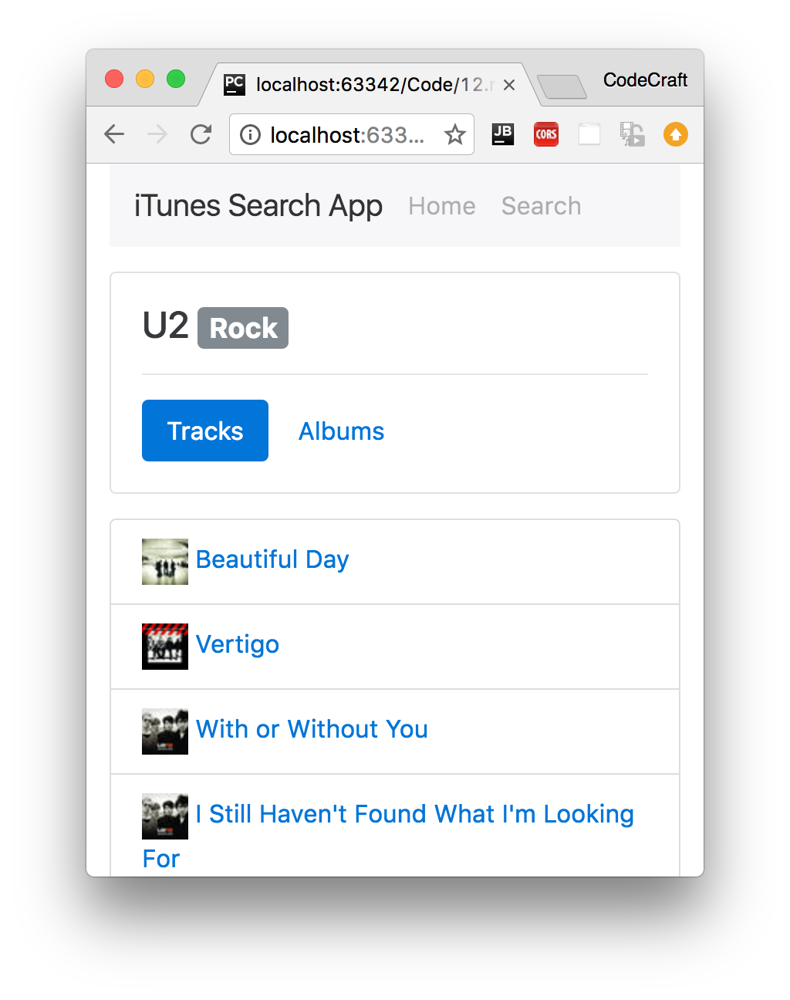
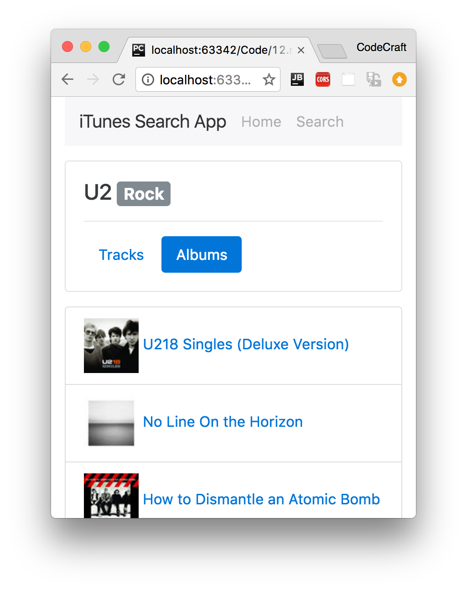
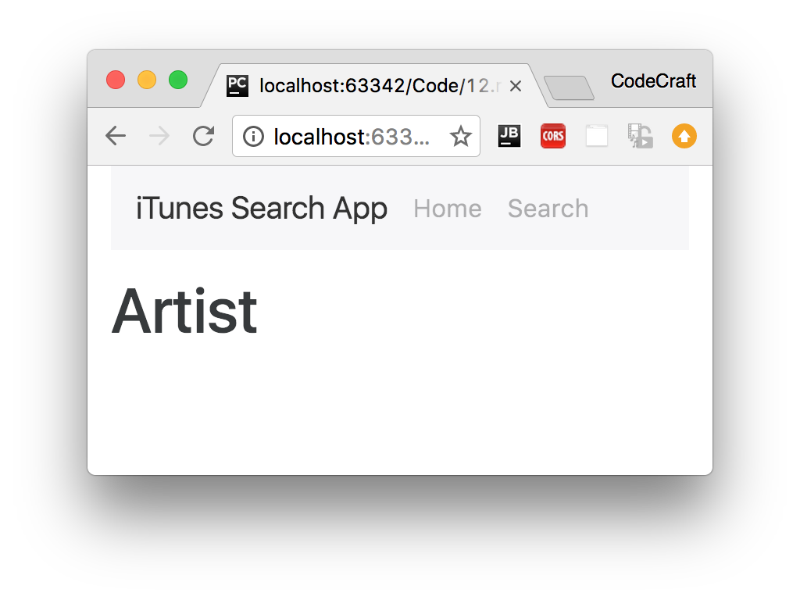
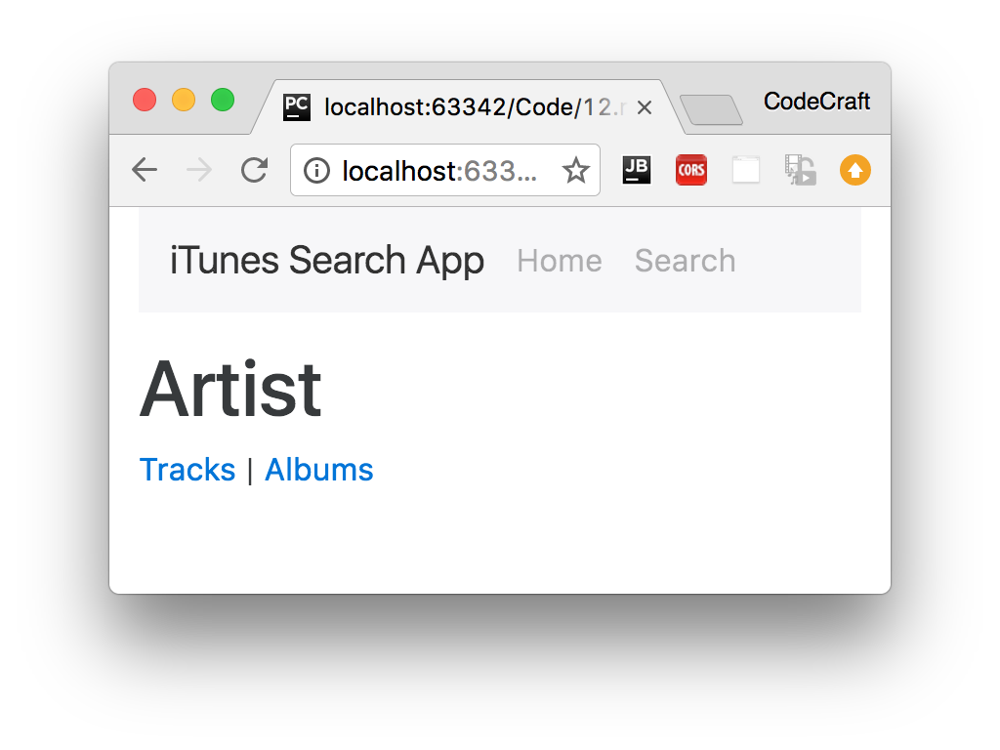

:sourcedir: {docdir}/content/{filedir}/code
:toc:
= Nested Routes

== Learning Objectives

* How to configure child routes.
* How to define paths relative to the current path or the root of the application.
* How to get access to parent parameterised route params.

== Goal

The goal for this lecture is to change our iTunes search app so that when we click on a search result we are taken to an _Artist_ page.

This _Artist_ page has two more menu items, _Tracks_ and _Albums_. If we click on _Tracks_ we want to show the list of tracks for this artist, if we click on _Albums_ we want to show the list of albums for this artist.

.Artist Track Listing Page

.Artist Album Listing Page

We can get information about an Artist using the iTunes API by passing in the id of an artist

`https://itunes.apple.com/lookup?id=16586443`

A list of tracks for that artist by additionally passing in `entity=song`:

`https://itunes.apple.com/lookup?id=16586443&entity=song`

A list of albums for that artist by additionally passing in `entity=album`:

`https://itunes.apple.com/lookup?id=16586443&entity=album`

The concept of having _two_ sets of menu items. A top level between _Home_, _Search_ and _Artist_ and a second level under _Artist_ between _Tracks_ and _Albums_ is called _Nested Routing_ and it's the topic of this lecture.

[SLIDE]

== Setup

We've added 3 more components to our sample project and included them in our `NgModule` declarations:

. `ArtistComponent` - This shows some details about an _Artist_ and contains either the `ArtistTrackListComponent` or `ArtistAlbumListComponent`.
. `ArtistTrackListComponent` - This will show a track listing for the current _Artist_.
. `ArtistAlbumListComponent` - This will show an Album listing for the current _Artist_.

For now each component's template just has a heading with the name of the component, like so:

[source,typescript]
----
@Component({
  selector: 'app-artist',
  template: `
<h1>Artist</h1>
 `
})
class ArtistComponent {
}
----

[source,typescript]
----
@Component({
  selector: 'app-artist-track-list',
  template: `
<h1>Artist Track Listing</h1>
 `
})
class ArtistTrackListComponent {
}
----

[source,typescript]
----
@Component({
  selector: 'app-artist-album-list',
  template: `
<h1>Artist Album Listing</h1>
 `
})
class ArtistAlbumListComponent {
}
----

== Route Configuration

We need another route for our `ArtistComponent`, we want to pass to this component an `artistId` so it needs to be a _parameterised route_, the `aritstId` is mandatory so we are _not_ using optional params.

[source,typescript]
----
const routes: Routes = [
  {path: '', redirectTo: 'home', pathMatch: 'full'},
  {path: 'find', redirectTo: 'search'},
  {path: 'home', component: HomeComponent},
  {path: 'search', component: SearchComponent},
  {path: 'artist/:artistId', component: ArtistComponent}, # <1>
  {path: '**', component: HomeComponent}
];
----
<1>  Add a path of `'artist/:artistId'` for `ArtistComponent`

In our search results listing we add a `routerLink` to the result item so it navigates to our `Artist` page.

[source,html]
----

  <a [routerLink]="['artist', track.artistId]" # <1>
     class="list-group-item list-group-item-action"
     *ngFor="let track of itunes.results">
    
    {{ track.name }} by {{ track.artist }}
  </a>

----
<1> Add `routerLink` directive.

== Relative Routes

If we ran the above code you'll notice that searching for U2 transforms the URL to:

----
/#/search;term=U2
----

and then if we click on a _U2_ song the URL _incorrectly_ becomes

----
/#/search;term=U2/artist/78500
----

And we don't get shown the Artist page.

The URL looks incorrect, it's a concatenation of the search URL with the artist URL. We should be expecting a URL like so:

----
/#/artist/78500
----

That's because when we navigated to

----
[routerLink]="['artist', item.artistId]"
----

we did so _relative_ to the current URL and the current URL at the time was the search URL.

What we want to do is to navigate relative to the _root _of our application, relative to `/` - we can do that simply by pre-pending `/` to our path, like so:

----
[routerLink]="['/artist', item.artistId]"
----

Now when we navigate we do so _relative_ to the _root_ URL and when we click the first U2 song the URL changes to `/#/artist/78500` and we are shown the artist page.

== Child Routes

When the Artist page is shown we want there to be two menu options, one called _Tracks_ and the other called _Albums_, like so:

When a user clicks on _Tracks_ underneath I would like to show a list of all the tracks this artist has released, if the user clicks on _Albums_ then I want to show a list of all the albums they have released.

Explained in terms that the _Router_ would understand:

====
_"Inside the `ArtistComponent` I want to *conditionally* show either the `AritstAlbumsListComponent` or the `ArtistTrackListComponent` depending on which menu item the user has selected"_.
====

Let me first define the route configuration, each route can have a property called `children` where you can define the child routes of this route. I'm going to add my routes for `AritstAlbumsListComponent` and `ArtistTrackListComponent`, like so:

[source,typescript]
----
const routes: Routes = [
  {path: '', redirectTo: 'home', pathMatch: 'full'},
  {path: 'find', redirectTo: 'search'},
  {path: 'home', component: HomeComponent},
  {path: 'search', component: SearchComponent},
  {
    path: 'artist/:artistId',
    component: ArtistComponent,
    children: [
      {path: '', redirectTo: 'tracks'}, # <1>
      {path: 'tracks', component: ArtistTrackListComponent}, # <2>
      {path: 'albums', component: ArtistAlbumListComponent}, # <3>
    ]
  },
  {path: '**', component: HomeComponent}
];
----
<1> If a user navigates to say `/artist/1234` it will redirect to `/artist/1234/tracks` (since we would _at least_ want one of either the track or album components to be shown).
<2> This route matches a URL like `/artist/1234/tracks`.
<3> This route matches a URL like `/artist/1234/albums`.

Now I can add the menu items to my artist template, like so:

[source,html]
----
<h1>Artist</h1>

  <a [routerLink]="['tracks']">Tracks</a> |
  <a [routerLink]="['albums']">Albums</a>

----

IMPORTANT: Notice that the paths in the `routerLink` directives above _don't_ start with `/` so they are _relative_ to the _current URL_ which is the `/artist/:artistId` route.

A more explicit way of saying you want to route relative to the current URL is to prepend it with `./` like so:

[source,html]
----
<h1>Artist</h1>

  <a [routerLink]="['./tracks']">Tracks</a> |
  <a [routerLink]="['./albums']">Albums</a>

----

NOTE: Pre-pending with `./` clearly expresses our intent that the path is relative so let's use this syntax instead.

The final thing we need to do is to tell Angular where we want the `ArtistTrackListComponent` and `ArtistAlbumListComponent` components to be injected into the page, we do that by adding in another `router-outlet` directive in our Artist template like so:

[source,html]
----
<h1>Artist</h1>

  <a [routerLink]="['./tracks']">Tracks</a> |
  <a [routerLink]="['./albums']">Albums</a>

<router-outlet></router-outlet>
----

// TODO: CREATE SLIDE

Now we have two `router-outlets` one nested inside another Angular figures out _which_ outlet to insert the component in by the _nesting level_ of the route and the router outlet.

== Parent Route Parameters

To query the list of tracks for an Artist from the iTunes API the `ArtistTrackListComponent` needs the `artistId`.

As a reminder the route configuration for our `ArtistTrackListComponent` is

[source,json]
----
{path: 'tracks', component: ArtistTrackListComponent}
----

and the route configuration for its parent is

[source,json]
----
{
    path: 'artist/:artistId',
    component: ArtistComponent,
    children: [
      {path: '', redirectTo: 'tracks'},
      {path: 'tracks', component: ArtistTrackListComponent},
      {path: 'albums', component: ArtistAlbumListComponent},
    ]
}
----

The _parent route_ has the `:artistId` as a route param, however if we injected `ActivatedRoute` into our child `ArtistTrackListComponent` and tried to print out the params surprisingly we just get an empty object printed out.

[source,typescript]
----
class ArtistTrackListComponent {
  constructor(private route: ActivatedRoute) {
    this.route.params.subscribe(params => console.log(params)); // Object {}
  }
}
----

The reason for this is that `ActivatedRoute` only passes you the parameters for the _current_ component's route and since the route for `ArtistTrackListComponent` doesn't have any route parameters it gets passed nothing, we want to get the params for the _parent_ route.

We can do this by calling `parent` on our `ActivatedRoute` like so:

[source,typescript]
----
class ArtistTrackListComponent {
  constructor(private route: ActivatedRoute) {
    this.route.parent.params.subscribe(params => console.log(params)); // Object {artistId: 12345}
  }
}
----

This returns the params for the parent route.

== Summary

We can nest routes, this means that for a given URL we can render a tree of components.

We do this by using multiple `router-outlet` directives and configuring child routes on our route configuration object.

Next up we will learn about protecting access to different routes via the use of _Router Guards_.

[NOTE]
====
The application above is complete in terms of child routing but still needs rounding out in terms of making the other API requests for tracks and albums and prettying up the template HTML.
 +
 +
You won't learn anything else about routing from going through the process of finishing off the app, but for your interest i've provided the full listing below.
 +
 +
As with all our examples they are for illustrative purposes only, to follow the official style guides we should be putting each component in a separate file and our HTTP request should all be wrapped in a separate service.
 +
 +
I will however leave that as an exercise for the reader if they so wish.
====

== Listing

.main.ts
[source,typescript]
----
include::{sourcedir}/src/main.ts[]
----
