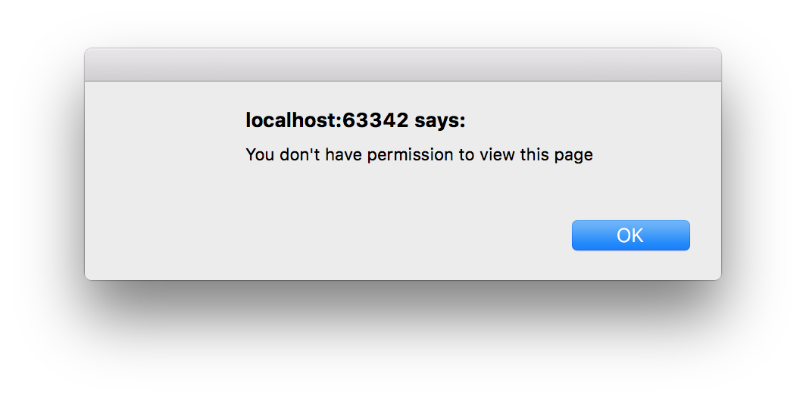
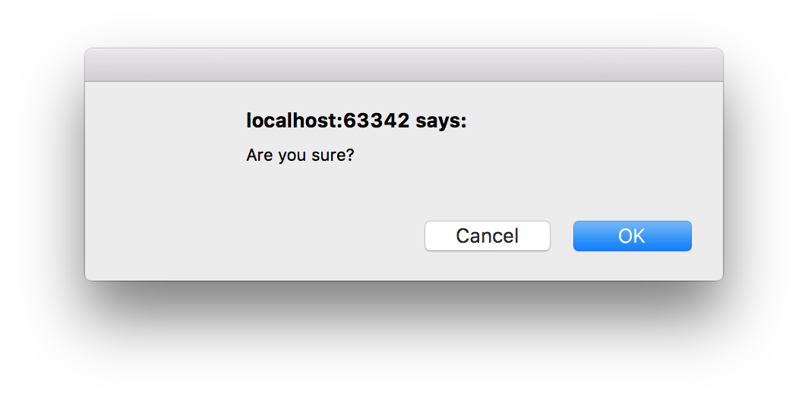

:sourcedir: {docdir}/content/{filedir}/code
:toc:
= Router Guards

In traditional server-side applications the application would check permissions on the server and return a `403` error page if the user didn't have permissions, or perhaps redirect them to a login/register page if they were not signed up.

NOTE: `403` is a HTTP error code. Specifically, this one means _Permission Denied_.

We want to have the same functionality in our client-side SPA, and with _Router Guards_ we can.

With _Router Guards_ we can prevent users from accessing areas that they’re not allowed to access, or, we can ask them for confirmation when leaving a certain area.

== Learning Objectives

In this lecture you will learn:

* The four different types of Router Guards
* Implementing Router Guards as classes
* How to implement a login guard for our iTunes app

== Guard Types

In this chapter, we take a look at a few of the different types of guards and how to implement them for specific use cases.

* Maybe the user must login (authenticate) first.
* Perhaps the user has logged in but is not authorized to navigate to the target component.
* We might ask the user if it's OK to discard pending changes rather than save them.

There are four different types of Guards:

CanActivate:: Checks to see if a user can visit a route.
CanActivateChild:: Checks to see if a user can visit a routes children.
CanDeactivate:: Checks to see if a user can exit a route.
Resolve:: Performs route data retrieval before route activation.
CanLoad:: Checks to see if a user can route to a module that lazy loaded.

For a given route we can implement zero or any number of _Guards_.

We'll go through the first three as the last two are very advanced use cases and need lazy loading modules which we we haven't covered.

== CanActivate

Guards are implemented as services that need to be provided so we typically create them as `@Injectable` classes.

Guards return either `true` if the user can access a route or `false` if they can't.

They can also return an `Observable` or `Promise` that later on resolves to a boolean in case the guard can't answer the question straight away, for example it might need to call an API. Angular will keep the user waiting until the guard returns `true` or `false`.

Let's create a simple `CanActivate` guard.

First we need to import the `CanActivate` interface, like so:

[source,typescript]
----
import {CanActivate} from "@angular/router";
----

Then let's create an Injectable class called `AlwaysAuthGuard` which implements the `canActivate` function, like so:

[source,typescript]
----
class AlwaysAuthGuard implements CanActivate {
  canActivate() {
    console.log("AlwaysAuthGuard");
    return true;
  }
}
----

This guard returns `true` _all the time_, so doesn't really guard anything. It lets all users through but at the same time our guard logs `"AlwaysAuthGuard"` to the console so we can at least see when it's being used.

We need to provide this guard, for this example let's configure it via our `NgModule`, like so:

[source,typescript]
----
@NgModule({
  .
  .
  providers: [
    .
    .
    AlwaysAuthGuard
  ]
})
----

Finally, we need to add this guard to one or more of our routes, let's add it to our `ArtistComponent` route like so:

[source,typescript]
----
const routes: Routes = [
  {path: '', redirectTo: 'home', pathMatch: 'full'},
  {path: 'find', redirectTo: 'search'},
  {path: 'home', component: HomeComponent},
  {path: 'search', component: SearchComponent},
  {
    path: 'artist/:artistId',
    component: ArtistComponent,
    canActivate: [AlwaysAuthGuard], # <1>
    children: [
      {path: '', redirectTo: 'tracks'},
      {path: 'tracks', component: ArtistTrackListComponent},
      {path: 'albums', component: ArtistAlbumListComponent},
    ]
  },
  {path: '**', component: HomeComponent}
];
----
<1> We added our `AlwaysAuthGuard` to the list of `canActivate` guards for this route.

NOTE: Since it holds an array we could have multiple guards for a single route.

NOTE: If this was a `canActivateChild` guard we would be adding it to the `canActivateChild` property and so on for the other guard types.

Now every time we navigate to the `ArtistComponent` route we get `"AlwaysAuthGuard"` printed to the console so we know that the `AlwaysAuthGuard` is working.

=== OnlyLoggedInUsersGuard

The most typical use case for the `CanActivate` guard is some form of checking to see if the user has permissions to view a page.

Normally in an Angular application we would have a service which held whether or not the current user is logged in or what permissions they have.

We will simulate this via a mock `UserService` like so:

[source,typescript]
----
class UserService {
  isLoggedIn(): boolean {
    return false;
  }
}
----

This service has one function `isLoggedIn()` which always returns `false`.

Let's create another guard called `OnlyLoggedInUsersGuard` which only allows logged in users to view a route.

[source,typescript]
----
@Injectable()
class OnlyLoggedInUsersGuard implements CanActivate { # <1>
  constructor(private userService: UserService) {}; # <2>

  canActivate() {
    console.log("OnlyLoggedInUsers");
    if (this.userService.isLoggedIn()) { # <3>
      return true;
    } else {
      window.alert("You don't have permission to view this page"); # <4>
      return false;
    }
  }
}
----
<1> We create a new `CanActivate` guard called `OnlyLoggedInUsersGuard`
<2> We inject and store `UserService` into the constructor for our class.
<3> If the user is logged in the guard passes and lets the user through.
<4> If the user is _not_ logged in the guard fails, we show the user an alert and the page doesn't navigate to the new URL.

Finally, we need to add this guard to the list of guards for our search route, like so:

[source,json]
----
{
  path: 'artist/:artistId',
  component: ArtistComponent,
  canActivate: [OnlyLoggedInUsersGuard, AlwaysAuthGuard], # <1>
  children: [
    {path: '', redirectTo: 'tracks'},
    {path: 'tracks', component: ArtistTrackListComponent},
    {path: 'albums', component: ArtistAlbumListComponent},
  ]
}
----
<1> We add `OnlyLoggedInUsersGuard` to the list of guards for our route.

Now when we try to navigate to the search view we are blocked from doing so and shown a window alert, like so:

TIP: If we want to redirect users to a login page we may inject `Router` into the constructor and then use the `navigate` function to redirect them to the appropriate login page.

NOTE: So the rest of the samples in this chapter work we will change the `isLoggedIn` function on our `UserService` to return `true` instead. If you want to play around with this functionality in the plunker remember to switch that back to returning `false`.

== CanActivateChild

As well as `CanActivate` we also have `CanActivateChild` which we implement in similar way.

Let's do the same as the `CanActivate` example and create a guard called `AlwaysAuthChildrenGuard`.

[source,typescript]
----
import {CanActivateChild} from "@angular/router";

class AlwaysAuthChildrenGuard implements CanActivateChild {
  canActivateChild() {
    console.log("AlwaysAuthChildrenGuard");
    return true;
  }
}
----

NOTE: Remember to provide it on our `NgModule`

We add the guard to the `canActivateChild` child property on our `ArtistComponent` route

[source,typescript]
----
{
  path: 'artist/:artistId',
  component: ArtistComponent,
  canActivate: [OnlyLoggedInUsersGuard, AlwaysAuthGuard],
  canActivateChild: [AlwaysAuthChildrenGuard],
  children: [
    {path: '', redirectTo: 'tracks'},
    {path: 'tracks', component: ArtistTrackListComponent},
    {path: 'albums', component: ArtistAlbumListComponent},
  ]
}
----

Now every time we try to activate either the `ArtistTrackListComponent` or `ArtistAlbumListComponent` child routes it checks the `AlwaysAuthChildrenGuard` to see if the user has permission.

== Guard Function Parameters

To help in determining whether or not a guard should accept or deny access the guard function can be passed certain arguments:

. `component: Component` is the component itself.
. `route: ActivatedRouteSnapshot` is the future route that will be activated if the guard passes. We can use its `params` property to extract the route parameters.
. `state: RouterStateSnapshot` is the future `RouterState` if the guard passes. We can find the URL we are trying to navigate to from the `url` property.

== CanDeactivate

A third type of guard we can add to our application is a `CanDeactivate` guard which is usually used to warn people if they are navigating away from a page where they have some unsaved changes.

Let's create a simple `CanDeactivate` guard which checks to see if the user navigates _away_ from the search page without actually performing a search.

Firstly let's create a function called `canDeactivate` on our `SearchComponent`, it should be the component that decides whether or not it has unsaved changes.

[source,typescript]
----
canDeactivate() {
  return this.itunes.results.length > 0;
}
----

As a proxy for unsaved changes we are just seeing if the user has performed a search, if so then the results array should be > 0.

Next let's create a `CanDeactivate` guard.

[source,typescript]
----
class UnsearchedTermGuard implements CanDeactivate<SearchComponent> { # <1>
  canDeactivate(component: SearchComponent, # <1>
                route: ActivatedRouteSnapshot,
                state: RouterStateSnapshot): boolean {
    console.log("UnsearchedTermGuard");
    console.log(route.params);
    console.log(state.url);
    return component.canDeactivate() || window.confirm("Are you sure?");
  }
}
----
<1> We implement from the `CanDeactivate` interface but this is a _generic_ interface so needs for us to _additionally_ provide it the type of our the component in-between some angle brackets `CanDeactivate<SearchComponent>`. This is so it knows the type of the component to pass into the `canDeactivate` function itself.

1. We setup our guard function to accept the guard function parameters, the component, future activated route and future router state.
2. If `component.canDeactivate()` returns false this will then show a confirmation alert window asking the user if they are sure.

Now if we navigate to the search page, we don't perform a search and then we try to navigate away we get a popup confirmation box. If we say yes we navigate away if we say no we stay on the page, like so:

[IMPORTANT]
====
There is a bug in Angular version 2.1.0 where the `canDeactivate` function is not passed the _future_ `ActivatedRouteSnapshot` or the future `RouterStateSnapshot`.
 +
 +
This is why our example use case is so woefully inadequate.
 +
 +
If you want to encourage the Angular team to fix this then please give a thumbs up to https://github.com/angular/angular/issues/9853[this issue on GitHub].
====

== Summary

With guards we can add checks to restrict access to a user to certain pages on our site.

Depending on the type of guard the guard function also has some arguments passed to it which we can take advantage of if we want, namely the future `ActivatedRoute` and the future `RouterState` and for `CanDeactivate` guards we also have the ability to get the component itself.

Guards themselves are just classes and as such can have any other dependencies injected into their constructor so can work in conjunction with other services to figure out if the guard passes or fails.

Guard functions can return either a `boolean` or an `Observable<boolean>` or `Promise<boolean>` which resolves to a `boolean` at some point in the future.

A route can be configured with multiple guards and the guards are checked in the order they were added to the route.

We are almost complete with this section on _Routing_, in the next lecture we will cover the concept of _Path Strategies_.

== Listing

.main.ts
[source,typescript]
----
include::{sourcedir}/src/main.ts[]
----
