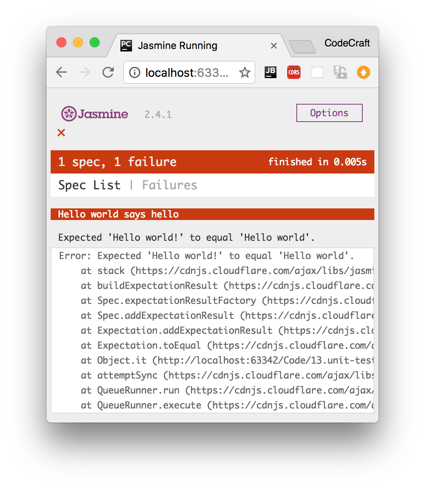
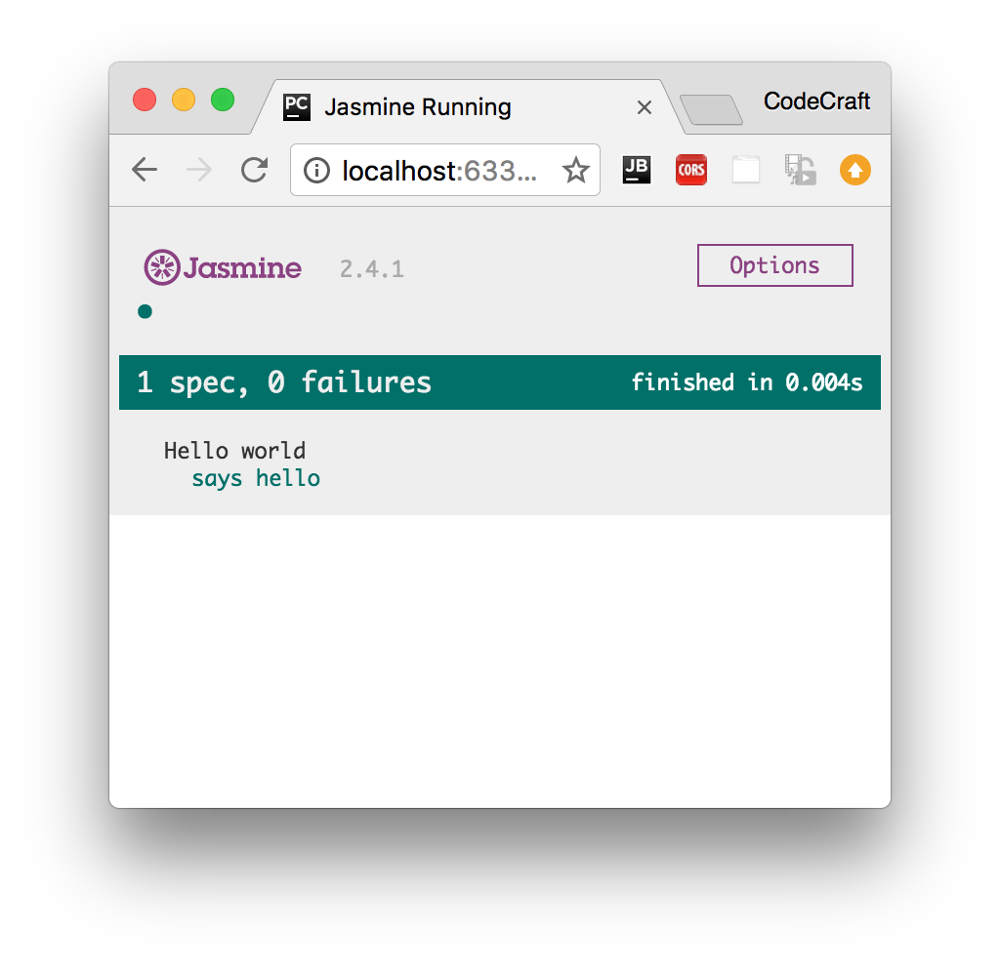

:sourcedir: {docdir}/content/{filedir}/code
:toc:
= Jasmine & Karma

We can test our Angular applications from scratch by writing and executing pure JavaScript functions. Creating instances of the relevant classes, calling functions and checking the actual versus expected result.

But since testing is such a common activity with JavaScript there are a number of testing libraries and frameworks we can use which reduce the amount of time it takes to write tests.

Two such tools and frameworks that are used when testing Angular is _Jasmine_ and _Karma_ and a discussion of those is the topic of this lecture.

== Learning Objectives

* What is the Jasmine test framework?
* How to write tests in Jasmine?
* What is the Karma test runner?
* How to create and run tests using the Angular CLI?
* How to create and run tests in Plunker?

== Jasmine

Jasmine is a JavaScript testing framework that supports a software development practice called https://en.wikipedia.org/wiki/Behavior-driven_development[Behaviour-Driven Development], or BDD for short. It's a specific flavour of https://en.wikipedia.org/wiki/Test-driven_development[Test-Driven Development] (TDD).

Jasmine, and BDD in general, attempts to describe tests in a human readable format so that non-technical people can understand what is being tested. However even if you _are_ technical reading tests in BDD format makes it a lot easier to understand what's going on.

For example if we wanted to test this function:

[source,typescript]
----
function helloWorld() {
  return 'Hello world!';
}
----

We would write a Jasmine test _spec_ like so:

[source,typescript]
----
describe('Hello world', () => { # <1>
  it('says hello', () => { # <2>
    expect(helloWorld()) # <3>
        .toEqual('Hello world!'); # <4>
  });
});
----
<1> The `describe(string, function)` function defines what we call a _Test Suite_, a collection of individual _Test Specs_.
<2> The `it(string, function)` function defines an individual _Test Spec_, this contains one or more _Test Expectations_.
<3> The `expect(actual)` expression is what we call an _Expectation_. In conjunction with a _Matcher_ it describes an _expected_ piece of behaviour in the application.
<4> The `matcher(expected)` expression is what we call a _Matcher_. It does a boolean comparison with the `expected` value passed in vs. the `actual` value passed to the `expect` function, if they are false the _spec_ fails.

=== Built-In Matchers

Jasmine comes with a few pre-built matchers like so:

[source,typescript]
----
expect(array).toContain(member);
expect(fn).toThrow(string);
expect(fn).toThrowError(string);
expect(instance).toBe(instance);
expect(mixed).toBeDefined();
expect(mixed).toBeFalsy();
expect(mixed).toBeNull();
expect(mixed).toBeTruthy();
expect(mixed).toBeUndefined();
expect(mixed).toEqual(mixed);
expect(mixed).toMatch(pattern);
expect(number).toBeCloseTo(number, decimalPlaces);
expect(number).toBeGreaterThan(number);
expect(number).toBeLessThan(number);
expect(number).toBeNaN();
expect(spy).toHaveBeenCalled();
expect(spy).toHaveBeenCalledTimes(number);
expect(spy).toHaveBeenCalledWith(...arguments);
----

You can see concrete examples of how these matchers are used by looking at the Jasmine docs here: http://jasmine.github.io/edge/introduction.html#section-Included_Matchers

=== Setup and Teardown

Sometimes in order to test a feature we need to perform some setup, perhaps it's creating some test objects. Also we may need to perform some cleanup activities after we have finished testing, perhaps we need to delete some files from the hard drive.

These activities are called _setup_ and _teardown_ (for cleaning up) and Jasmine has a few functions we can use to make this easier:

beforeAll:: This function is called *once*, _before_ all the specs in a test suite (`describe` function) are run.

afterAll:: This function is called *once* _after_ all the specs in a test suite are finished.

beforeEach:: This function is called _before_ *each* test specification (`it` function) is run.

afterEach:: This function is called _after_ *each* test specification is run.

We might use these functions like so:

[source,typescript]
----
describe('Hello world', () => {

  let expected = "";

  beforeEach(() => {
    expected = "Hello World";
  });

  afterEach(() => {
    expected = "";
  });

  it('says hello', () => {
    expect(helloWorld())
        .toEqual(expected);
  });
});
----

=== Running Jasmine Tests

To manually run Jasmine tests we would create a HTML file and include the required Jasmine JavaScript and CSS files like so:

[source,html]
----
<link rel="stylesheet" href="jasmine.css">

----

We then load in the parts of our application code that we want to test, for example if our _hello world_ function was in `main.js`:

[source,html]
----
<link rel="stylesheet" href="jasmine.css">

----

IMPORTANT: The order of script tags is important.

We then would load each individual test suite file, for example if we placed our test suite code above in a file called `test.js` we would load it in like so:

[source,html]
----
<link rel="stylesheet" href="jasmine.css">

----

To run the tests we simply open up the HTML file in a browser.

Once all the files requested via `script` and `link` are loaded by a browser the function `window.onload` is called, this is when Jasmine actually runs the tests.

The results are displayed in the browser window, a failing run looks like:

A passing run looks like:

If we wanted to test our code in different browsers we simply load up the HTML file in the browser we want to test in.

If we wanted to debug the code we would use the developer tools available to us in that browser.

== Karma

Manually running Jasmine tests by refreshing a browser tab repeatedly in different browsers every time we edit some code can become tiresome.

Karma is a tool which lets us spawn browsers and run Jasmine tests inside of them all from the command line. The results of the tests are also displayed on the command line.

Karma can also watch your development files for changes and re-run the tests automatically.

Karma lets us run Jasmine tests as part of a development tool chain which requires tests to be runnable and results inspectable via the command line.

It's not necessary to know the internals of how Karma works. When using the Angular CLI it handles the configuration for us and for the rest of this section we are going to run the tests using only Jasmine.

== Angular CLI

When creating Angular projects using the Angular CLI it defaults to creating and running unit tests using Jasmine and Karma.

Whenever we create files using the CLI, as well as creating the main code file it also creates a simple Jasmine spec file named the same as the main code file but ending in `.spec.ts`.

So if we create a Pipe using the CLI, like so:

----
ng generate pipe My
----

This would create two files:

* `my-pipe.ts` - This is the main code file where we put the code for the pipe.
* `my-pipe.spec.ts` - This is the Jasmine test suite for the pipe.

The spec file will have some code already bootstrapped, like so:

[source,typescript]
----
import { TestBed, async } from '@angular/core/testing';
import { MyPipe } from './my.pipe';

describe('Pipe: My', () => {
  it('should create an instance', () => {
    let pipe = new MyPipe();
    expect(pipe).toBeTruthy();
  });
});
----

NOTE: The code that gets bootstrapped depends on the item that we are creating.

To run all the tests in our application we simply type `ng test` in our project root.

This runs all the tests in our project in Jasmine via Karma.

It watches for changes to our development files, bundles all the developer files together and re-runs the tests automatically.

== Angular Plunker

When building real Angular applications I recommend sticking with the file and folder structure defined by the Angular CLI as well as using the built-in test runner.

However for this section, to give you an easy way to view and play with the code we are going to use _only_ Jasmine and execute tests by refreshing a browser.

This so we can easily share code via a Plunker like we have done for all the other sections in this course.

An Angular Jasmine Plunker looks very similar to a normal Jasmine Plunker apart from a few key differences:

1. We also include the required Angular libraries and some patches for Jasmine so it works better with Angular.

[source,html]
----

----

[start=2]
1. We then add the spec files we want to test into a special array called `__spec_files__`.

[source,html]
----
var __spec_files__ = [
  'app/auth.service.spec'
];
----

[start=3]
1. We then load a _shim_ JavaScript file which triggers running the test specs once we have finished transpiling and loading the transpiled files in the browser.

[source,html]
----

----

=== Disabled and Focused Tests

You can disable tests without commenting them out by just pre-pending `x` to the `describe` or `it` functions, like so:

[source,typescript]
----
xdescribe('Hello world', () => { # <1>
  xit('says hello', () => { # <1>
    expect(helloWorld())
        .toEqual('Hello world!');
  });
});
----
<1> These tests will not be run.

Conversely you can also focus on specific tests by pre-pending with `f`, like so:

[source,typescript]
----
fdescribe('Hello world', () => { # <1>
  fit('says hello', () => { # <1>
    expect(helloWorld())
        .toEqual('Hello world!');
  });
});
----
<1> Out of all the tests in all the tests suites and tests specs, these are the only ones that will be run.

== Summary

Jasmine is a testing framework that supports _Behavior-Driven Development_. We write tests in _Test Suites_ which are composed of one or more _Test Specs_ which themselves are composed of one or more _Test Expectations_.

We can run Jasmine tests in a browser ourselves by setting up and loading a HTML file, but more commonly we use a command-line tool called Karma. Karma handles the process of creating HTML files, opening browsers and running tests and returning the results of those tests to the command line.

If you use the Angular CLI to manage projects it automatically creates stub Jasmine spec files for you when generating code. It also handles the Karama configuration, transpilation and bundling of your files so all you need to do in order to run your tests is type the command `ng test`.

For the purposes of this section we will be using a simple browser based Jasmine test runner so we can share the code easily via Plunker.

== Listing

.main.ts
[source,typescript]
----
include::{sourcedir}/app/main.ts[]
----

.test.ts
[source,typescript]
----
include::{sourcedir}/app/test.ts[]
----
