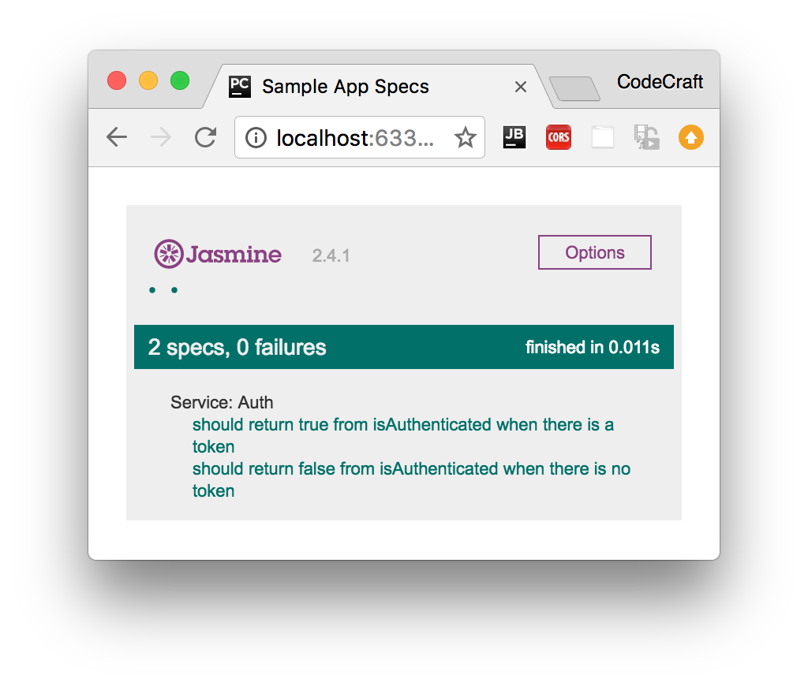

:sourcedir: {docdir}/content/{filedir}/code
:toc:
= Testing Classes & Pipes

== Learning Objectives

* How to unit test an instance of a class.

== Sample Class & Test Suite

We'll start our unit testing journey with all you will ever need to know, how to test a `class`.

TIP: Everything in Angular is an instance of a class, be it a Component, Directive, Pipe and so on. So once you know how to test a basic class you can test everything.

Let's imagine we have a simple class called `AuthService` it's something we want to provide to Angulars DI framework but that doesn't play a part in how we want to test it.

[source,typescript]
.app/auth.service.ts
----
export class AuthService {
  isAuthenticated(): boolean {
    return !!localStorage.getItem('token');
  }
}
----

It has one function called `isAuthenticated` which returns `true` if there is a token stored in the browsers `localStorage`.

To test this class we create a test file called `auth.service.spec.ts` that sits next to our `auth.service.ts` file, like so:

[source,typescript]
.app/auth.service.spec.ts
----
import {AuthService} from './auth.service'; # <1>

describe('Service: Auth', () => { # <2>
});
----
<1> We first import the `AuthService` class we want to run our tests against.
<2> We add a `describe` test suite function to hold all our individual test specs.

== Setup & Teardown

We want to run our test specs against _fresh_ instances of `AuthService` so we use the `beforeEach` and `afterEach` functions to setup and clean instances like so:

[source,typescript]
.app/auth.service.spec.ts
----
describe('Service: Auth', () => {
  let service: AuthService;

  beforeEach(() => { # <1>
    service = new AuthService();
  });

  afterEach(() => { # <2>
    service = null;
    localStorage.removeItem('token');
  });
});
----
<1> Before each test spec is run we create a new instance of `AuthService` and store on the `service` variable.
<2> After each test spec is finished we null out our `service` and also remove any tokens we stored in localStorage.

== Creating Test Specs

Now we create some test specs. The first spec I want to create should check if the `isAuthenticated` function returns `true` when there is a token.

[source,typescript]
----
it('should return true from isAuthenticated when there is a token', () => { # <1>
  localStorage.setItem('token', '1234'); # <2>
  expect(service.isAuthenticated()).toBeTruthy(); # <3>
});
----
<1> We pass to the `it` function a human readable description of what we are testing. This is shown in the test report and makes it easy to understand what feature isn't working.
<2> We setup some _spec only_ data in local storage which should trigger the effect we want.
<3> We test an expectation that the `service.isAuthenticated()` function returns something that resolves to `true`.

We also want to test the reverse case, when there is no token the function should return `false`:

[source,typescript]
----
it('should return false from isAuthenticated when there is no token', () => {
  expect(service.isAuthenticated()).toBeFalsy();
});
----

We _know_ that in this function the `token` isn't set since we make sure to clear out the token in the `afterEach` function.

We now test an expectation that the `service.isAuthenticated()` function returns something that resolves to `false`.

== Running the Tests

To run our tests we simply open up the HTML file in the browser, you can just click the plunker link and make sure to press run in the toolbar.

== Pipes

Pipes are by far the simplest part of Angular, they can be implemented as a class with one function and therefore can be tested with _just_ Jasmine and the knowledge we've gained so far.

In the section on pipes we built one called `DefaultPipe`, this pipe lets us provide default values for variables in templates like so:

----
{{ image | default:"http://example.com/default-image.png" }}
----

The code for this pipe looked like so:

[source,typescript]
----
import {Pipe, PipeTransform} from '@angular/core';

@Pipe({
  name: 'default'
})
export class DefaultPipe implements PipeTransform {

  transform(value: string, fallback: string, forceHttps: boolean = false): string {
    let image = "";
    if (value) {
      image = value;
    } else {
      image = fallback;
    }
    if (forceHttps) {
      if (image.indexOf("https") == -1) {
        image = image.replace("http", "https");
      }
    }
    return image;
  }
}
----

Our starting test suite file looks like so:

[source,typescript]
----
describe('Pipe: Default', () => {
  let pipe: DefaultPipe;

  beforeEach(() => {
    pipe = new DefaultPipe();
  });
});
----

In our setup function we create an instance of our pipe class.

Pipe classes have one function called `transform` so in order to test pipes we just need to test this one function, passing inputs and expecting outputs.

Our first test spec checks to see that if the pipe doesn't recieve an input it returns the default value, like so:

[source,typescript]
----
it('providing no value returns fallback', () => {
  expect(pipe.transform('', 'http://place-hold.it/300')).toBe('http://place-hold.it/300');
});
----

We pass in empty string as the input to the transform function and therefore it returns the second argument back to us.

For testing pipes there isn't much else to it, we simply check the various inputs and expected ouputs of our transform function.

NOTE: In order to run this test spec file in our test Plunker remember to add it to the list of test spec files in the `__spec_files__` array.

TIP: If your _Pipe_ requires dependencies to be injected into the constructor it might be better to use the _Angular Test Bed_ which we cover later on in this section.

== Summary

That's it really, we can test any _isolated_ class that doesn't require anything else with a simple Jasmine spec file, nothing more complex required.

Since everything in Angular is represented as classes, we could stop here - you have most of the tools already to write tests for directives, components, pipes and so on.

However our code often requires _other_ code to work, it has dependencies. So how we write _isolated_ tests for pieces of code which by nature are not isolated and need dependencies is the topic of the next lecture.

== Listing

.auth.service.ts
[source,typescript]
----
include::{sourcedir}/app/auth.service.ts[]
----

.auth.service.spec.ts
[source,typescript]
----
include::{sourcedir}/app/auth.service.spec.ts[]
----

.default.pipe.ts
[source,typescript]
----
include::{sourcedir}/app/default.pipe.ts[]
----

.default.pipe.spec.ts
[source,typescript]
----
include::{sourcedir}/app/default.pipe.spec.ts[]
----
