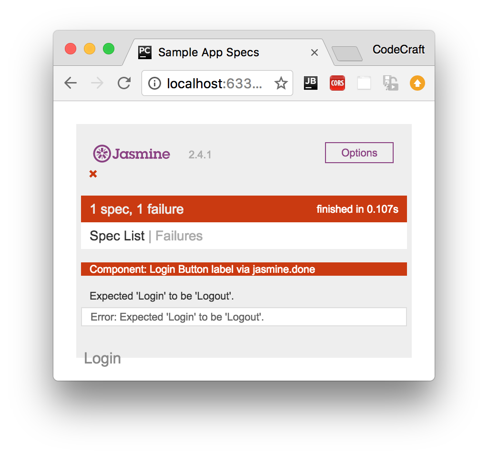

:sourcedir: {docdir}/content/{filedir}/code
:toc:
= Testing Asynchronous Code

== Learning Objectives

* Understand the issues faced when testing async code in Jasmine.
* Know how to use the Jasmine `done` function to handle async code.
* Know how to use the alternative Angular only solutions for testing async code.

== Test Setup

We want to see how we can test _asynchronous_ functions.

So we change our `AuthService.isAuthenticated()` function to an _asynchronous_ one that return a promise which resolves into a boolean at a later time.

[source,typescript]
----
export class AuthService {
  isAuthenticated(): Promise<boolean> {
    return Promise.resolve(!!localStorage.getItem('token'));
  }
}
----

We also then change our `LoginComponent`:

[source,typescript]
----
export class LoginComponent implements  OnInit {

  needsLogin: boolean = true;

  constructor(private auth: AuthService) {
  }

  ngOnInit()  {
    this.auth.isAuthenticated().then((authenticated) => {
      this.needsLogin = !authenticated;
    })
  }
}
----

We've changed `needsLogin` from a function into a property and we set the value of this property in the `then` callback from the promise returned from `AuthService`.

Importantly we've done the above in the `ngOnInit()` lifecycle function. Probably not the _best_ place to put this functionality given that the value might change over time but good for demonstration purposes.

== No Asynchronous Handling

Our first attempt might be to try to test our application without taking into account the asynchronous nature of our app, like so:

[source,typescript]
----
  it('Button label via jasmine.done', () => {
    fixture.detectChanges(); # <1>
    expect(el.nativeElement.textContent.trim()).toBe('Login'); # <2>
    spyOn(authService, 'isAuthenticated').and.returnValue(Promise.resolve(true)); # <3>
    component.ngOnInit(); # <4>
    fixture.detectChanges(); # <5>
    expect(el.nativeElement.textContent.trim()).toBe('Logout'); # <6>
  });
----
<1> We issue our first change detection run so the view does its initial update.
<2> We expect the button text to display _Login_
<3> We change our `AuthService` so it returns a promise resolved to `true`.
<4> We call `component.ngOnInit()`.
<5> We issue our second change detection run.
<6> We now expect the button text to read _Logout_.

IMPORTANT: When performing testing _we_ need to call component lifecycle hooks ourselves, like `ngOnInit()`. Angular won't do this for us in the test environment.

If we ran the above code we would see it doesn't pass:

It's failing on the last expectation. By the time we run the last expectation the `AuthService.isAuthenticated()` function hasn't _yet_ resolved to a value. Therefore the `needsLogin` property on the `LoginComponent` hasn't been updated.

There are a few ways we can handle asynchronous code in our tests, one is the Jasmine way and two are Angular specific, let's start with the Jasmine way.

== Jasmine's `done` Function

Jasmine has a built-in way to handle async code and that's by the passed in `done` function in the test specs.

So far we've been defining our test specs without any parameters but it can take a parameter, a done function which we call when all the async processing is complete, like so:

[source,typescript]
----
it('Button label via jasmine.done', (done) => { # <1>
  fixture.detectChanges();
  expect(el.nativeElement.textContent.trim()).toBe('Login');
  let spy = spyOn(authService, 'isAuthenticated').and.returnValue(Promise.resolve(true));
  component.ngOnInit();
  spy.calls.mostRecent().returnValue.then(() => { # <2>
    fixture.detectChanges();
    expect(el.nativeElement.textContent.trim()).toBe('Logout');
    done(); # <3>
  });
});
----
<1> The Jasmine test spec function is passed a function as the first param, we usually call this parameter `done`.
<2> We can add a callback function (using the spy) which is called when the promise returned from `isAuthenticated` function resolved. In this function we know that the component has the new value of `needsLogin` and we can add our additional expectation here.
<3> When we are done with our asynchronous tasks we tell Jasmine via the `done` function.

Jasmine lets us create asynchronous tests by giving us an explict `done` function which we call when the test is complete.

Although it works, trying to understand the code can be difficult as it jumps about and is not executed in the order it's written in.

== `async` and `whenStable`

Angular has another method for us to test asynchronous code via the `async` and `whenStable` functions.

Let's rewrite the above test to use these and then we will explain the differences.

[source,typescript]
----
it('Button label via async() and whenStable()', async(() => { # <1>
  fixture.detectChanges();
  expect(el.nativeElement.textContent.trim()).toBe('Login');
  spyOn(authService, 'isAuthenticated').and.returnValue(Promise.resolve(true));
  fixture.whenStable().then(() => { # <2>
    fixture.detectChanges();
    expect(el.nativeElement.textContent.trim()).toBe('Logout');
  });
  component.ngOnInit();
}));
----
<1> We wrap our test spec function in another function called `async`.
<2> We place the tests we need to run after the `isAuthenticated` promise resolves inside this function.

This `async` function executes the code inside its body in a special _async test zone_. This intercepts and _keeps track_ of all promises created in its body.

Only when all of those pending promises have been resolved does it then resolves the promise returned from `whenStable`.

So by using the `async` and `whenStable` functions we now _don't_ need to use the Jasmine spy mechanism of detecting when the `isAuthenticated` promise has been resolved, like the previous example.

This mechanism is slightly better than using the plain Jasmine solution but there is another version which gives us fine grained control and also allows us to lay out our test code as if it were synchronous.

== `fakeAsync` and `tick`

[source,typescript]
----
it('Button label via fakeAsync() and tick()', fakeAsync(() => { # <1>
  expect(el.nativeElement.textContent.trim()).toBe('');
  fixture.detectChanges();
  expect(el.nativeElement.textContent.trim()).toBe('Login');
  spyOn(authService, 'isAuthenticated').and.returnValue(Promise.resolve(true));
  component.ngOnInit();

  tick(); # <2>
  fixture.detectChanges();
  expect(el.nativeElement.textContent.trim()).toBe('Logout');
}));
----
<1> Like `async` we wrap the test spec function in a function called `fakeAsync`.
<2> We call `tick()` when there are pending asynchronous activities we want to complete.

Like the `async` function the `fakeAsync` function executes the code inside its body in a special _fake async test zone_. This intercepts and _keeps track_ of all promises created in its body.

The `tick()` function _blocks execution_ and simulates the passage of time until all pending asynchronous activities complete.

So when we call `tick()` the application sits and waits for the promise returned from `isAuthenticated` to be resolved and then lets execution move to the next line.

The code above is now layed our _linearly_, as if we were executing synchronous code, there are no callbacks to confuse the mind and everything is simpler to understand.

IMPORTANT: `fakeAsync` does have some drawbacks, it doesn't track XHR requests for instance.

== Summary

If the code we are testing is asynchronous then we need to take this into account when writing our tests.

There are three mechanisms we can use.

The Jasmine `done` function and spy callbacks. We attach specific callbacks to spies so we know when promises are resolves, we add our test code to those callbacks and then we call the `done` function. This works but means we need to know about all the promises in our application and be able to hook into them.

We can use the Angular `async` and `whenStable` functions, we don't need to track the promises ourselves but we still need to lay our code out via callback functions which can be hard to read.

We can use the Angular `fakeAsync` and `tick` functions, this additionally lets us lay out our async test code as if it were synchronous.

== Listing

.auth.service.ts
[source,typescript]
----
include::{sourcedir}/app/auth.service.ts[]
----

.login.component.ts
[source,typescript]
----
include::{sourcedir}/app/login.component.ts[]
----

.login.component.spec.ts
[source,typescript]
----
include::{sourcedir}/app/login.component.spec.ts[]
----
