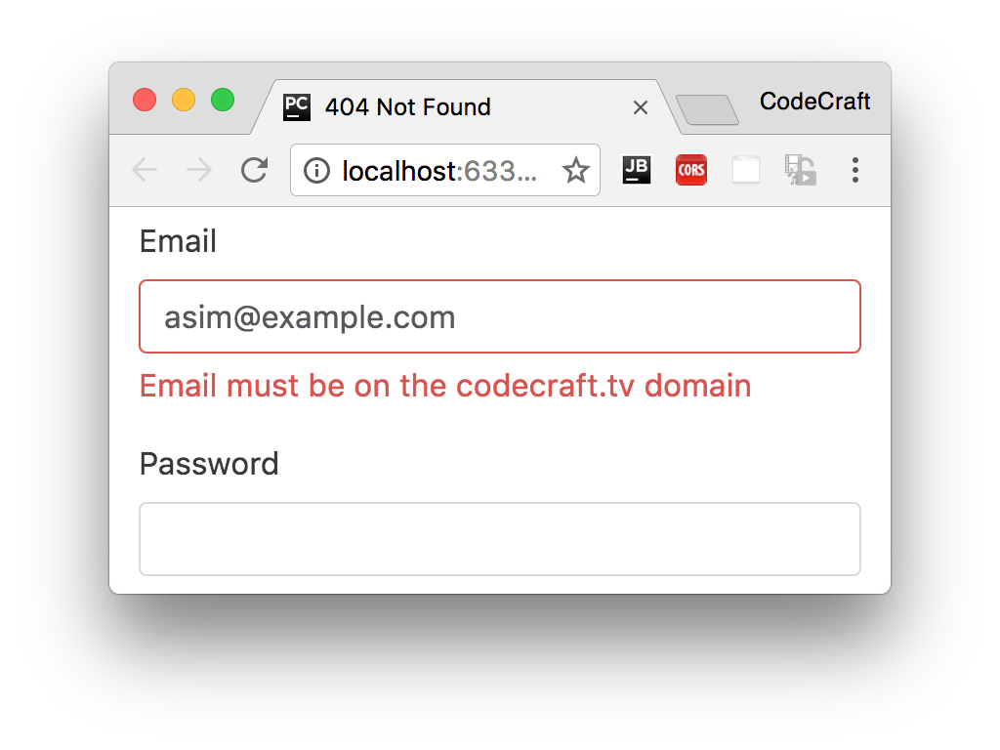
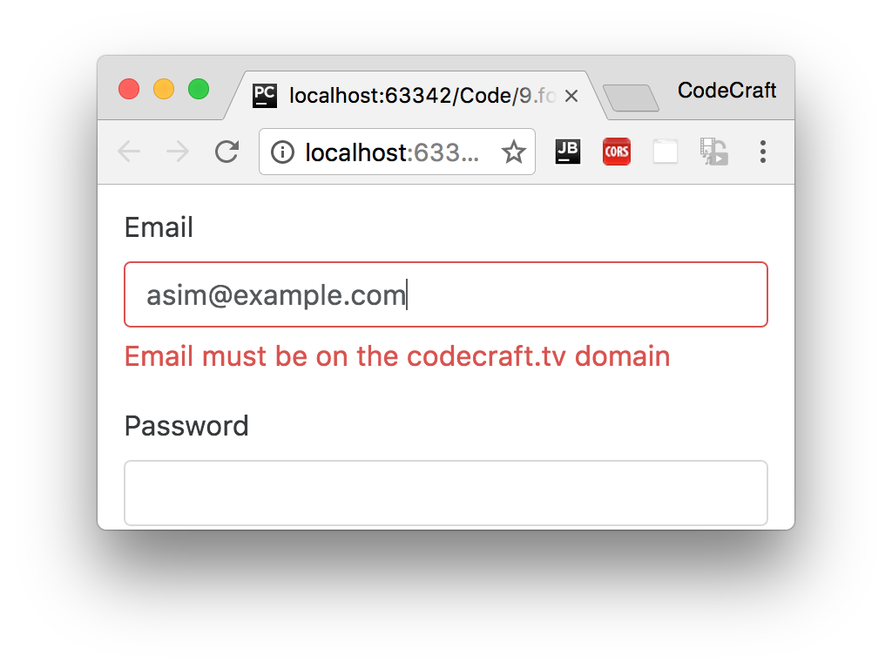

:sourcedir: {docdir}/content/{filedir}/code
:toc:

= Custom Form Validators

== Learning Objectives

* Know how the built-in validators work in both the model-driven and template-driven forms.
* Know how to create a basic _hardcoded_ custom validator for both model-driven and template-driven forms.

== Built-In Validators

We have a few _built in_ validators in Angular:

- required
- minlength
- maxlength
- pattern

We can use these in two ways:

1. As functions we can pass to the `FormControl` constructor in model-driven forms.

[source,typescript]
----
new FormControl('', Validators.required)
----

The above creates a _form control_ with a _required_ validator function attached

[start=2]
1. As directives in template-driven forms.

[source,typescript]
----
<input name="fullName" ngModel required>
----

These `required`, `minlength`, `maxlength` and `pattern` attributes are _already_ in the official HTML specification.

They are a core part of HTML and we don't actually need Angular in order to use them. If they are present in a form then the browser will perform some default validation itself.

However we do need a way for Angular to recognise their presence and support the same validation logic in our own Angular forms.

If you remember template-driven forms are just model-driven forms but with the _creation_ of the model _driven_ by the template, they still have an underlying model.

Therefore just like model-driven forms we need to attach a _validator function_ to the underlying model form control.

Angular does this by secretly creating special _validator_ directives which have selectors matching `required`, `minlength`, `maxlength` and `pattern`.

// DEMO CODE

So if you have imported `FormsModule` into your `NgModule` then anytime Angular sees a `required` tag in the HTML it will link it to an instance of a directive called `RequiredValidator`.

This directive validator applies the same `Validators.required` function as we use in model-driven forms.

That's how the built-in validators work, let's try to create our own custom validators that work with both model and template-driven forms.

== Custom Model-Driven Validators

Validators at their core are just functions, they take as input a `FormControl` instance and returns either `null` if it's `valid` or an error object if it's not.

We'll create a custom email validator function which only accepts emails on the domain `codecraft.tv`:

[source,typescript]
----
function emailDomainValidator(control: FormControl) { # <1>
  let email = control.value; # <2>
  if (email && email.indexOf("@") != -1) { # <3>
    let [_, domain] = email.split("@"); # <4>
    if (domain !== "codecraft.tv") { # <5>
      return {
        emailDomain: {
          parsedDomain: domain
        }
      }
    }
  }
  return null; # <6>
}
----
<1> Accepts an instance of a `FormControl` as the first param.
<2> We get the email value from the form control.
<3> Only bother checking if the email contains an "@" character.
<4> Extract the domain part from the email.
<5> If the domain is not `codecraft.tv` then return an error object with some perhaps helpful tips as to why it's failing.
<6> Return `null` because if we have reached here the validator is passing.

To use this validator in our model-driven form we pass it into the `FormControl` on construction, like so:

[source,typescript,linenums,highlight='4']
----
this.email = new FormControl('', [
  Validators.required,
  Validators.pattern("[^ @]*@[^ @]*"),
  emailDomainValidator
]);
----

Just like other validators let's add a helpful message to the user if the validator fails so they know how to fix it:

[source,html,linenums,highlight='6']
----

  
Email is required

  
The email address must contain at least the @ character

  
Email must be on the codecraft.tv domain
 # <1>

----
<1> The error object returned from the validator function is merged into to the `email.errors` object so is the key `emailDomain` is present then we know the `emailDomainValidator` is failing.

Now if we try to type in an email address that _doesn't_ end in `codecraft.tv` we see this validation message printed on screen:

Next up we'll look at how we can re-package our validator function for use in template-driven forms.

== Custom Template-Driven Validators

To use our validator function in a template-driven form we need to:

1. Create a directive and attach it to the template form control.
2. Provide the directive with the validator function on the token `NG_VALIDATORS`.

[source,typescript,linenums,highlight='']
----
import {NG_VALIDATORS} from '@angular/forms';
.
.
.
@Directive({
  selector: '[emailDomain][ngModel]', # <1>
  providers: [
    {
      provide: NG_VALIDATORS, # <2>
      useValue: emailDomainValidator, # <3>
      multi: true # <4>
    }
  ]
})
class EmailDomainValidator {
}
----
<1> Attached to all input controls which have both the `emailDomain` and `ngModel` attribute.
<2> We provide on the special token `NG_VALIDATORS`.
<3> The `emailDomainValidator` function we created for the model-driven form is the dependency.
<4> This provider is a special kind of provider called a multi provider.

NOTE: _Multi_ providers return _multiple_ dependencies as a list for a given token. So with our provider above we are just _adding_ to the list of dependencies that are returned when we request the `NG_VALIDATORS` token.

We declare this new directive on our `NgModule`:

[source,typescript,linenums,highlight='9']
----
@NgModule({
  imports: [
    BrowserModule,
    FormsModule
  ],
  declarations: [
    AppComponent,
    TemplateFormComponent,
    EmailDomainValidator
  ],
  bootstrap: [
    AppComponent
  ],
})
class AppModule {
}
----

Finally, we add this directive to our template form control like so:

[source,html,linenums,highlight='7']
----
<input type="email"
       class="form-control"
       name="email"
       [(ngModel)]="model.email"
       required
       pattern="[^ @]*@[^ @]*"
       emailDomain
       #email="ngModel">
----

Now just like the model-driven form when we type into the email field an email that doesn't end in codecraft.tv we see the same error:

== Summary

A validator in Angular is a function which returns null if a control is valid or an error object if it's invalid.

For model-driven forms we create custom validation functions and pass them into the `FormControl` constructor.

For template-driven forms we need to create validator directives and provide the validator function to the directive via DI.

Through careful planning we can share the same validation code between the model-driven and template-driven forms.

The validator we created in this lecture hardcodes the _domain_, in the next lecture we will look at how we can make our validators configurable with different domains.

== Model-Driven Listing

.main.ts
[source,typescript]
----
include::{sourcedir}/model-driven/src/main.ts[]
----

== Template-Driven Listing

.main.ts
[source,typescript]
----
include::{sourcedir}/template-driven/src/main.ts[]
----
