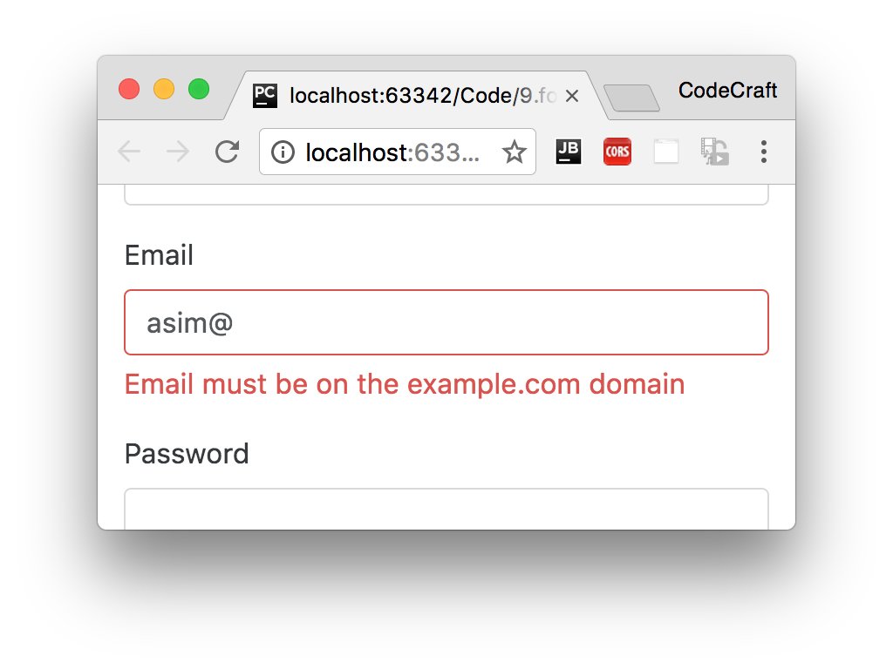

:sourcedir: {docdir}/content/{filedir}/code
:toc:
= Configurable Custom Form Validators

++++

Sample content replaced by JavaScript

++++

== Learning Objectives

* Know how to create advanced _configurable_ custom validators for both model-driven and template-driven forms.

== Configurable Model-Driven Validators

In the previous lecture we created a custom email validator which checked that emails ended in a certain domain, a domain which we hardcoded in the validator.

What if we wanted to make the domain name configurable, so the validator can work for other domains?

We solve this by turning our validator function into a _factory function_. The factory function returns a validator function configured as we want, like so:

[source,typescript,linenums,highlight='']
----
function emailDomainValidatorFactory(requiredDomain) { # <1>
  return function (control: FormControl) { # <2>
    let email = control.value;
    if (email && email.indexOf("@") != -1) {
      let [_, domain] = email.split("@");
      if (domain !== requiredDomain) { # <3>
        return {
          emailDomain: {
            valid: false,
            parsedDomain: domain
          }
        }
      }
    }
    return null;
  }
}
----
<1> We pass into our factory function the domain we want to limit emails to.
<2> We return from our factory function the _actual_ validator function.
<3> We use the passed in `requiredDomain` to check emails against instead of a hardcoded string.

We can then use this in our FormControl like so:

[source,typescript,linenums,highlight='4']
----
this.email = new FormControl('', [
  Validators.required,
  Validators.pattern("[^ @]*@[^ @]*"),
  emailDomainValidatorFactory('codecraft.tv')
]);
----

To match the built-in validators we can create our own Validators class and have the factory function as a static member function, like so:

[source,typescript,linenums,highlight='']
----
class CodeCraftValidators {
  static emailDomain(requiredDomain) {
    return function (control: FormControl) {
      let email = control.value;
      if (email && email.indexOf("@") != -1) {
        let [_, domain] = email.split("@");
        if (domain !== requiredDomain) {
          return {
            emailDomain: {
              valid: false,
              parsedDomain: domain
            }
          }
        }
      }
      return null;
    }
  }
}
----

Then we can use the validator in our form control like so:

[source,typescript,linenums,highlight='4']
----
this.email = new FormControl('', [
  Validators.required,
  Validators.pattern("[^ @]*@[^ @]*"),
  CodeCraftValidators.emailDomain('codecraft.tv')
]);
----

== Configurable Template-Driven Validators

To configure our directive validator we need to:

1. _Provide_ the required domain name to the DI framework.
2. _Inject_ the required domain name into our directive constructor.
3. Use the factory function to create a configured validator function.
4. Provide this configured validator function to the directives providers.

Numbers 1 & 2 are quite simple. For numbers 3 & 4 we need to take advantage of another fact. A validator as well as being a function can also be a class with a member function called `validate`. So we can actually turn our directives class into a validator class.

Firstly let's provide the configurable domain name in our `NgModule` like so:

[source,typescript,linenums,highlight='']
----
@NgModule({
  .
  .
  .
  providers: [
    {provide: 'RequiredDomain', useValue: 'codecraft.tv'}
  ]
})
----

Then let's update our directive so that it uses both the provided `RequiredDomain` and the `CodeCraftValidators.emailDomain` factory function.

[source,typescript,linenums,highlight='']
----
class EmailDomainValidator {

  private valFn = ValidatorFn;

  constructor(@Inject('RequiredDomain') requiredDomain: string) { # <1>
    this.valFn = CodeCraftValidators.emailDomain(requiredDomain) # <2>
  }

  validate(control: FormControl) { # <3>
    return this.valFn(control);
  }
}
----
<1> We inject into the constructor the `RequiredDomain` token that we configured on the `NgModule`.
<2> We use the `CodeCraftValidators.emailDomain` factory function to create a configured validator function and store that locally.
<3> Now whenever validate is called we simply call our configured validator function.

We also need to change the directives provider so it now points to using the class instead of the validator function we used previously:

[source,typescript,linenums,highlight='6']
----
@Directive({
  selector: '[emailDomain][ngModel]',
  providers: [
    {
      provide: NG_VALIDATORS,
      useClass: EmailDomainValidator, # <1>
      multi: true
    }
  ]
})
----
<1> This provider now provides an instance of the `EmailDomainValidator` class instead.

The validation error messages were also hardcoded to show `codecraft.tv` we need to make them show the required domain instead.

We can simply return the required domain in the error object and then use that in our error message, like so:

[source,typescript,linenums,highlight='12']
----
class CodeCraftValidators {
  static emailDomain(requiredDomain) {
    return function (control: FormControl) {
      console.log("here");
      let email = control.value;
      if (email && email.indexOf("@") != -1) {
        let [_, domain] = email.split("@");
        if (domain !== requiredDomain) {
          return {
            emailDomain: {
              parsedDomain: domain,
              requiredDomain: requiredDomain # <1>
            }
          }
        }
      }
      return null;
    }
  }
}
----
<1> Pass the `requiredDomain` back in the error object.

Then we just just the `requiredDomain` variable in our validation message:

[source,html,linenums,highlight='']
----

Email must be on the {{ email.errors.emailDomain.requiredDomain }} domain

----

Now if we change the domain name in the global provider like so:

[source,typescript,linenums,highlight='']
----
@NgModule({
  providers: [
    {provide: 'RequiredDomain', useValue: 'example.com'}
  ]
})
----

The email domain validator now check against this new domain instead:

== Bindable Template-Driven Validators

We can also configure out template validator directive via property binding in the template instead, like so:

[source,html,linenums,highlight='7']
----
<input type="email"
       class="form-control"
       name="email"
       [(ngModel)]="model.email"
       required
       pattern="[^ @]*@[^ @]*"
       [emailDomain]='codecraft.tv' # <1>
       #email="ngModel">
----
<1> We can configure the validator via template property binding.

Then we update our `EmailDomainValidator` class so it can take the required domain as an input:

[source,typescript,linenums,highlight='']
----
class EmailDomainValidator {
  @Input('emailDomain') emailDomain: string; # <1>
  private valFn = Validators.nullValidator;

  ngOnChanges(): void { # <2>
    if (this.emailDomain) {
      this.valFn = CodeCraftValidators.emailDomain(this.emailDomain)
    } else {
      this.valFn = Validators.nullValidator;
    }
  }

  validate(control: FormControl) {
    return this.valFn(control);
  }
}
----
<1> First we create an input property on our directive named the same as our selector.
<2> We know the `emailDomain` input property has been set when the ngOnChanges lifecycle function is called, this is where we now initialise our directive with the configured validator function.

Our directive needs one more change in order to function, we are providing this as a class, we need to provide as an alias so we get exactly the same `instance` provided to the validators.

[source,typescript,linenums,highlight='']
----
@Directive({
  selector: '[emailDomain][ngModel]',
  providers: [
    {
      provide: NG_VALIDATORS,
      useExisting: EmailDomainValidator,
      multi: true
    }
  ]
})
----

Now we have a template-driven form validator which can be configured via input property binding.

== Summary

For model-driven forms we use a factory function which returns a validator function configured as we want.

For template-driven forms we create a validator class, often re-using the same factory function as was used in model-driven forms.

== Model-Driven Listing

.main.ts
[source,typescript]
----
include::{sourcedir}/model-driven/src/main.ts[]
----

== Template-Driven Listing

.main.ts
[source,typescript]
----
include::{sourcedir}/template-driven/src/main.ts[]
----
