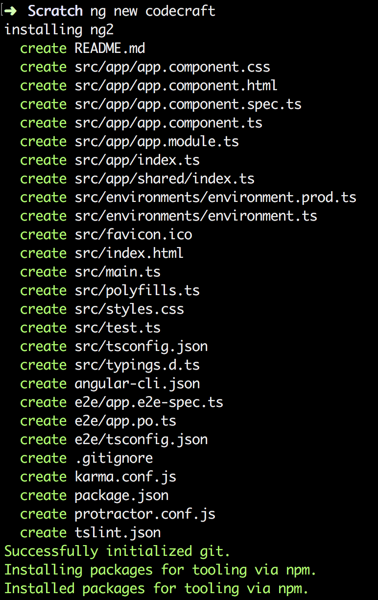
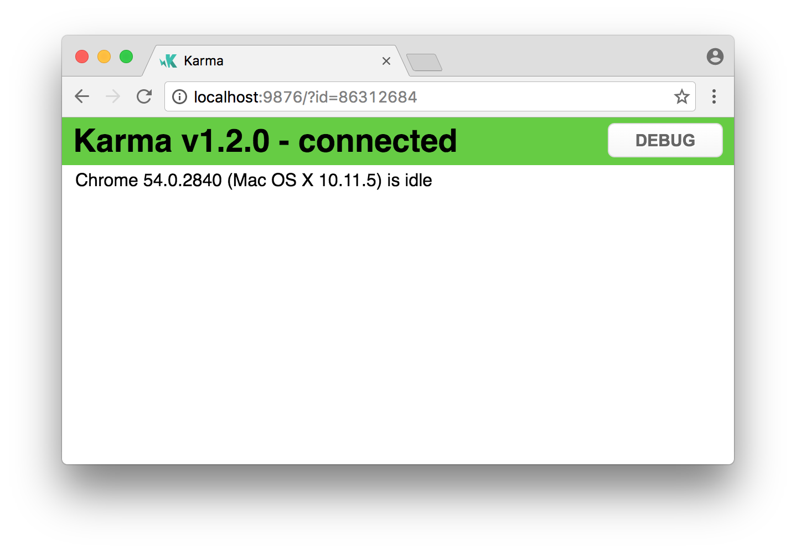

:toc:
:sourcedir: {docdir}/content/{filedir}/code
= Angular CLI

Angular now comes with a command-line interface (CLI) to make it easier and faster to build Angular applications.

////
We'll still be using Plunker for most of this course. That's because of Plunker's convenience in that I can give you a link with some source code and you can view it and run it straight away. And also so you easily ask for help by sharing a link to your plunker, we can't do that with an Angular CLI project.

However when you start building your own proper Angular projects I expect you to use the Angular CLI. I use it for my projects and it saves a lot of time and standardises the structure and layout of Angular projects meaning that other developers can hit the floor running on your projects.
////

== Features

The Angular CLI helps with:

Bootstrapping a project::

It creates the initial project structure with a root `NgModule` and a root component and bootstraps it using the `platformBootstrapDynamic` method.
+
The project is also configured to use the _webpack loader_ which handles things like module loading, bundling and minification of dependent code.
+
NOTE: In the course we've used SystemJS for this since webpack doesn't work with Plunker _yet_. We'll continue to use SystemJS for the code samples in Plunker and WebPack for any applications created with the Angular CLI.

Serving and live reloading::

The CLI starts a local web-server so we can view our application in the browser via localhost:4000.
+
The CLI also watches for any changes to our files and automatically reloads the webpage if there are any.

Code generation::

Using the CLI we can create components, directives, services, pipes, etc... all from the command line with all the necessary files, folders and boilerplate code included.
+
All the generated code adheres to the official Angular https://angular.io/styleguide[style guide].
+
NOTE: In Angular 1 the Angular team never supported an official style guide. This meant that most projects ended up looked pretty different to each other. A developer moving teams would have to figure out from scratch how _this_ team likes to write Angular 1 code.

Testing::

The generated code also comes with bootstrapped Jasmine test spec files, we can use the CLI to compile and run all the tests with a single command.
+
Whenever the CLI detects changes to any file it re-runs all the tests automatically in the background.

Packaging and releasing::

The CLI doesn't just stop with development, using it we can also package our application ready for release to a server.

== Installing the Angular CLI

To install the CLI we use Node and npm.

[source]
----
npm install -g @angular/cli
----
If the above ran successfully it will have made available to you a new application called `ng`, to test this installed correctly run this command:

[source]
----
ng -v
----

It _should_ output the version of the application that was installed, like so:

[source]
----
    _                      _                 ____ _     ___
   / \   _ __   __ _ _   _| | __ _ _ __     / ___| |   |_ _|
  / △ \ | '_ \ / _` | | | | |/ _` | '__|   | |   | |    | |
 / ___ \| | | | (_| | |_| | | (_| | |      | |___| |___ | |
/_/   \_\_| |_|\__, |\__,_|_|\__,_|_|       \____|_____|___|
               |___/
@angular/cli: 1.4.1
node: 8.1.3
os: darwin x64
----

== Start an Application with `ng new`

Let's create a new project called `codecraft`.

To bootstrap our new project with `ng` we run this command:

[source]
----
ng new codecraft
----

TIP: This command might take sometime to run, be patient.

This outputs something like the below:

The command generates a number of new files and folders for us:

----
codecraft

// Production or development builds of our application go here.
├── dist

// Main application code goes here.
├── src
│   ├── app
│   │   ├── app.component.css
│   │   ├── app.component.html
│   │   ├── app.component.spec.ts
│   │   ├── app.component.ts
│   │   └── app.module.ts

// Settings for the different environments, dev, qa, prod.
│   ├── environments
│   │   ├── environment.prod.ts
│   │   └── environment.ts

// Main HTML and TypeScript files
│   ├── index.html
│   ├── main.ts

│   ├── favicon.ico
│   ├── polyfills.ts
│   ├── styles.css

// Prepares test environment and runs all unit tests.
│   ├── test.ts

// TypeScript configuration file
│   ├── tsconfig.app.json
│   ├── tsconfig.spec.json

// TypeScript type definition file
│   └── typings.d.ts

// The E2E tests for our application go here.
├── e2e

├── angular-cli.json
├── karma.conf.js
├── package.json
├── protractor.conf.js
├── README.md
└── tslint.json
----

NOTE: The directory structure follows the *recommended* app structure and style guide.

As well as creating the files and folders for us; we can see from `package.json` that it installed the correct versions of all the required npm dependencies for us also.

[source,json]
----
include::{sourcedir}/package.json[]
----

So far in this course we have bundled all our code into one file on Plunker for convenience.

Let's see how the Angular CLI breaks up the code into multiple files and where those files are located.

src/app/app.component.ts::

The new project is bootstrapped with one component, our root component which it called `AppComponent` and has a selector of `app-root`.

.src/app/app.component.ts
[source,typescript]
--
include::{sourcedir}/src/app/app.component.ts[]
--

src/index.html::

`app-root` component has been added to our `index.html` file already.

There are no script tags present yet, that's fine the angular build process adds all the required script and link tags for us.

.src/index.html
[source,html]
--
include::{sourcedir}/src/index.html[]
--

src/app/app.module.ts::

Our top-level module configuration is stored in this file.

[source,typescript]
--
include::{sourcedir}/src/app/app.module.ts[]
--

src/main.ts::

The actual act of importing our main module and bootstrapping our Angular web application is left to the `main.ts` file.

[source,typescript]
--
include::{sourcedir}/src/main.ts[]
--

== Serve an Application with `ng serve`

With the CLI we can also easily serve our application using a local web-server.

We just run:

[source,console]
----
ng serve
----

This builds our application, bundles all our code using webpack and makes it all available through `localhost:4200`.

`ng serve` also watches for any changes to files in our project and auto-reloads the browser for us.

The command runs the application through a web-server that support HTML5 _push-state_ routing.

NOTE: The above will make sense once we cover Routing later on in this book.

== Generate Code with `ng generate`

The ability to generate stub code is one of the most useful features of the CLI.

The most exciting part of this is that it automatically generates code that adheres to the official style guide.

IMPORTANT: Projects built using the Angular CLI should look like each other. Developers who are used to the way Angular CLI generates files are going to find it easier to work on multiple different projects, as long as they all use the Angular CLI.

With the `generate` command we can create new components, directives, pipes, services, classes, interfaces and enums, amongst other things.

Each of the above _type of thing_ it can create is called a *scaffold*.

We can run this command using `ng generate <scaffold> <name>`

If we wanted to generate a component called `HeaderComponent` we would write:

----
ng generate component Header
----

This creates a number of files in a folder called `header` in `src/app`, like so:

----
app
├── header
│   ├── header.component.css // The CSS for this component
│   ├── header.component.html // The template for this component
│   ├── header.component.spec.ts // The unit test for this component
│   └── header.component.ts // The component TypeScript file
----

Taking a look at `header.component.ts`:

[source,typescript]
--
include::{sourcedir}/src/app/header/header.component.ts[]
--

TIP: Don't name your component `HeaderComponent`. Angular CLI automatically appends `Component` to the name, so you component class would end up being `HeaderComponentComponent`.

The command above can be shortened to:
----
ng g c Header
----

[TIP]
====
If we run the command in an app folder, the `generate` command will create files *relative to the current folder you are in*. So if we are in `src/app/header` and we run `ng g c LoginButton` it will generate the files in `src/app/header/login-button/`

We can also be explicit about where we want the generated files to go by running `ng g component ./src/app/foo/bar` this will create a component called `BarComponent` in the folder `./src/app/foo/bar`.
====

=== Available Scaffolds

Component::
----
ng g component My // Creates MyComponent
----

By default all generated files go in into `src\app\my-component`, a folder called `my-component` is created for us.

Directive::
----
ng g directive My // Creates MyDirective
----

By default all generated files go in into `src\app`, _no folder is created_.

Pipe::
----
ng g pipe My // Creates MyPipe
----

By default all generated files go in into `src\app`, _no folder is created_.

Service::
----
ng g service MyService // Creates MyService
----

By default all generated files go in into `src\app`, _no folder is created_.

Class::
----
ng g class MyClass // Creates MyClass
----

By default all generated files go in into `src\app`, _no folder is created_.

Interface::
----
ng g interface MyInterface // Creates MyInterface
----

By default all generated files go in into `src\app`, _no folder is created_.

Enum::
----
ng g enum MyEnum // Creates MyEnum
----

By default all generated files go in into `src\app`, _no folder is created_.

== Create a Build with `ng build`

The `ng serve` command does a great job of enabling development locally.

However _eventually_ we will want some code which we can host on another server somewhere.

The Angular CLI again has us covered in this regard, if we want to create a development build we simply type

----
ng build
----

This bundles all our JavaScript, CSS, HTML into a smaller set of files which we can host on another site simply.

It outputs these files into the `dist` folder:

----
.
├── assets
├── index.html
├── inline.js
├── inline.map
├── main.bundle.js
├── main.map
├── styles.bundle.js
└── styles.map
----

To serve our built application site we just need to serve this folder. For example, if using Python we could simply run `python -m SimpleHTTPServer` from the `dist` folder and view the application from `0.0.0.0:8000`.

=== Production Builds

By default the `ng build` command creates a development build, no effort is made to optimise the code.

To create a production build we just run

----
ng build --prod
----

This might generate an output like the below:

----
.
├── assets
├── index.html
├── inline.js
├── main.3f26904b701596b6d90a.bundle.js
├── main.3f26904b701596b6d90a.bundle.js.gz
└── styles.b52d2076048963e7cbfd.bundle.js
----

Running with `--prod` changes a few things:

* The bundles now have random strings appended to them to enable *cache busting*. +
 This ensures that a browser doesn't try to load up previously cached versions of the files and instead load the new ones from the server.
* The file sizes are much smaller. The files have been processed through a minifier and uglifier.
 * There is a much small `.gz` file, this is a compressed version of the equivalent JavaScript file. +
 Browsers will automatically try to download the `.gz` version of files if they are present.

=== Adding a Third-Party Module

The build system simplifies the process of serving and releasing your application considerably. It works only because Angular knows about all the files used by your application.

So when we include third-party libraries into our application we need to do so in such a way that Angular knows about the libraries and includes them in the build process.

==== Bundled with the Main Application JavaScript Files

If we want to include a module to use in our Angular JavaScript code, perhaps we want to to use the moment.js library, we just need to install it via npm like so:

----
npm install moment --save
----

If we also want to include the TypeScript type definition file for our module we can install it via:

----
npm install @types/moment --save
----

Now when Angular create a build either when releasing or serving locally, the moment library is automatically added to the bundle.

==== Global Library Installation

Some JavaScript libraries need to be added to the global scope, and loaded as if they were in a script tag.

We can do this by editing the `angular-cli.json` file in our project root.

The Twitter Bootstrap library is a great example of this, we need to include CSS and script files in the global scope.

First we install the Bootstrap library via npm like so:

----
npm install bootstrap@next
----

Then we add the required JavaScript files to the `app.scripts` section or the `app.styles` in  `angular-cli.json` like so:

[source,json]
----
{
  .
  .
  .
  "apps": [
    {
      .
      .
      .
      "styles": [
        "styles.css",
        "../node_modules/bootstrap/dist/css/bootstrap.css"
      ],
      "scripts": [
        "../node_modules/jquery/dist/jquery.js",
        "../node_modules/tether/dist/js/tether.js",
        "../node_modules/bootstrap/dist/js/bootstrap.js"
      ],
      .
      .
      .
    }
  ],
  .
  .
  .
}
----

Now when the build runs the CLI includes those files in the bundle and injects then in the global scope.

== Testing Angular

Angular has always been synonymous with testing and so there should be no surprise that the command-line tool comes with features to make Angular testing easier.

The default mechanism for unit testing in Angular is via Jasmine and Karma.

Whenever we generate code via scaffolds it also generates a `.spec.ts`. The code the CLI bootstraps inside this file depends on the scaffold type but essentially is a Jasmine test spec which you can flesh out with more test cases.

NOTE: These types of tests are called _unit tests_ because we should be writing the tests so we only test one _unit_ of code and each test case is independent of the others.

We can run all our unit tests with one command:

----
ng test
----

This builds our project and then runs all the tests, any errors are output to the terminal.

This command also watches for any changes in our files and, if it detects any, re-runs the tests automatically.

[IMPORTANT]
====
When running the tests it opens up a browser window like the example above.

It needs this browser windows to run the tests, do not close it!
====

== Summary

The above is just an overview of the main commands and their default features.

To find out more details about each command and how we can customise the behaviour via flags we can run `ng help` in the terminal.

By handling the setup for us the CLI has made working with Angular much easier.

By standardising setup and structure it's also made Angular projects fungible. Angular developers used to the Angular CLI should feel comfortable on *all* Angular CLI projects and be able to hit the floor running.
