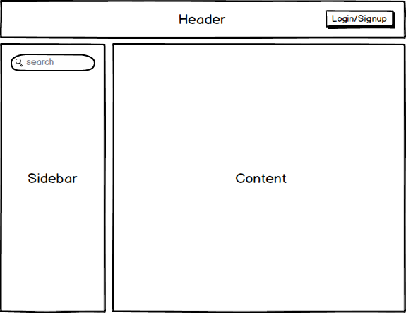
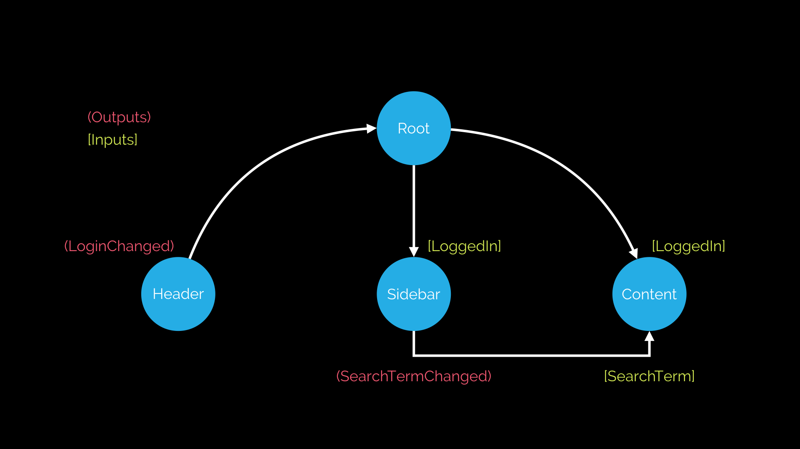

:toc:
= Architecting with Components

== Learning Objectives

* Know how to _architect_ an angular Application.

== Process
When building a new Angular application, we start by:

. Breaking down an applications into seperate Components.
. For each component we describe its _resonsibilities_.
. Once we've desribed the responsibilites we then describe its _inputs & outputs_, its public facing interface.

Take for instance this simple example.

We have a basic application with a Header, Sidebar and Content area, we would implement each of these as their own Component. The next stage is for each component to list out the responsibilities, inputs and outputs, like so:

HeaderComponent::
  Responsibilities::: All aspects of authentication. Letting the user login/signup and logout.
    Inputs::: None
    Outputs:::
      * `LoginChanged` - An output event that is fired when the users login state changes.

SidebarComponent::
  Responsibilities::: Performing searches
    Inputs::: None
    Outputs:::
      * `SearchTermChanged` - An output event that is fired when a user performs a search, `$event` contains the search term.

ContentComponent::
  Responsibilities::: Showing the search results.
    Inputs:::
      * `SearchTerm` the search term that we want to filter the results by.
    Outputs::: None

TIP: Listing the inputs and outputs and what area this Component is responsible for helps to ensure the Components are architected correctly. The goal is for each Component to have a well defined _boundary_.

== Data Flow

When we link up the Components above with our applications root Component the flow of data between all the inputs and outputs might look something like this:

The actual binding of inputs and outputs happens in HTML, in the templates of Components. The template for our root Component might end up looking like so:

[source,html]
----
<header (loginChanged)="loggedIn = $event"></header>
<sidebar (searchTermChanged)="searchTerm = $event"></sidebar>
<content [searchTerm]="searchTerm"></content>
----

Data flow describes how we *glue* Components together through their inputs and outputs.

Closely looking at the diagram above an interesting fact occurs; with one-way data binding, _inputs go down_ the tree, _outputs go up_ the tree. With one-way data binding reasoning about your application becomes a lot simpler, we can trace through the flow of events in our application easily.

== Summary

Architecting an Angular application means understanding that it's just a tree of Components, each Component has some inputs and outputs and should have a clear responsibility with respect to the rest of the application.

Components are _composable_, so we might go a step further and include a `LoginButtonComponent` in our `HeaderComponent`. But only if we would want to re-use the `LoginButtonComponent` independently of the `HeaderComponent`.
