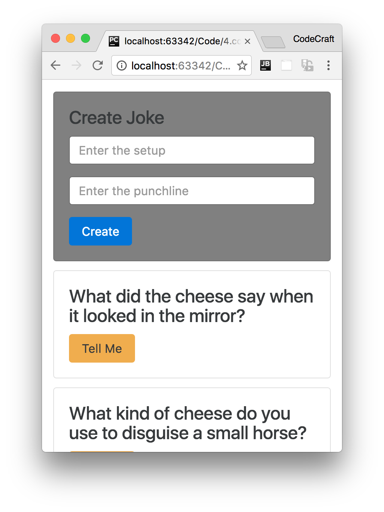
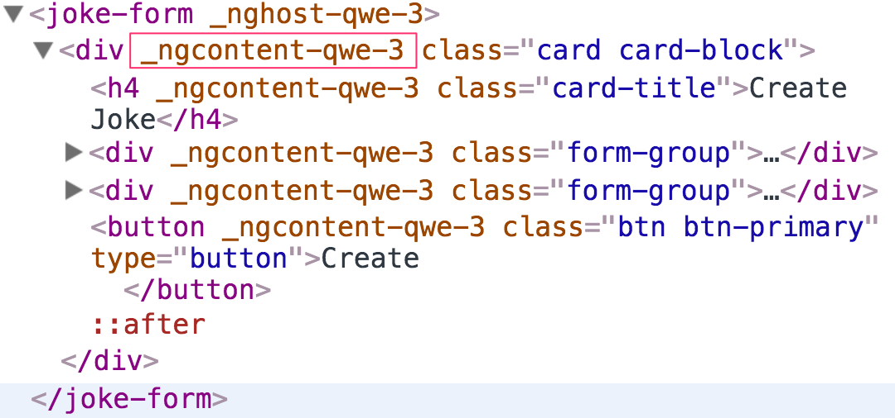
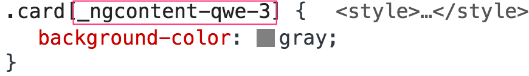
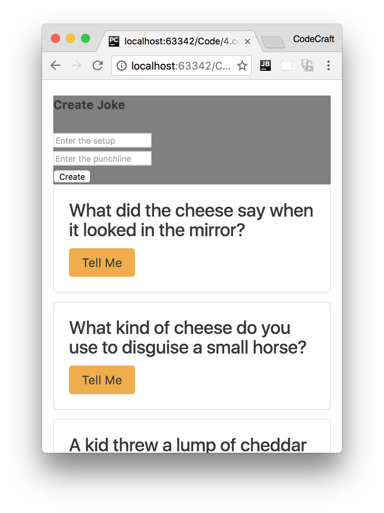
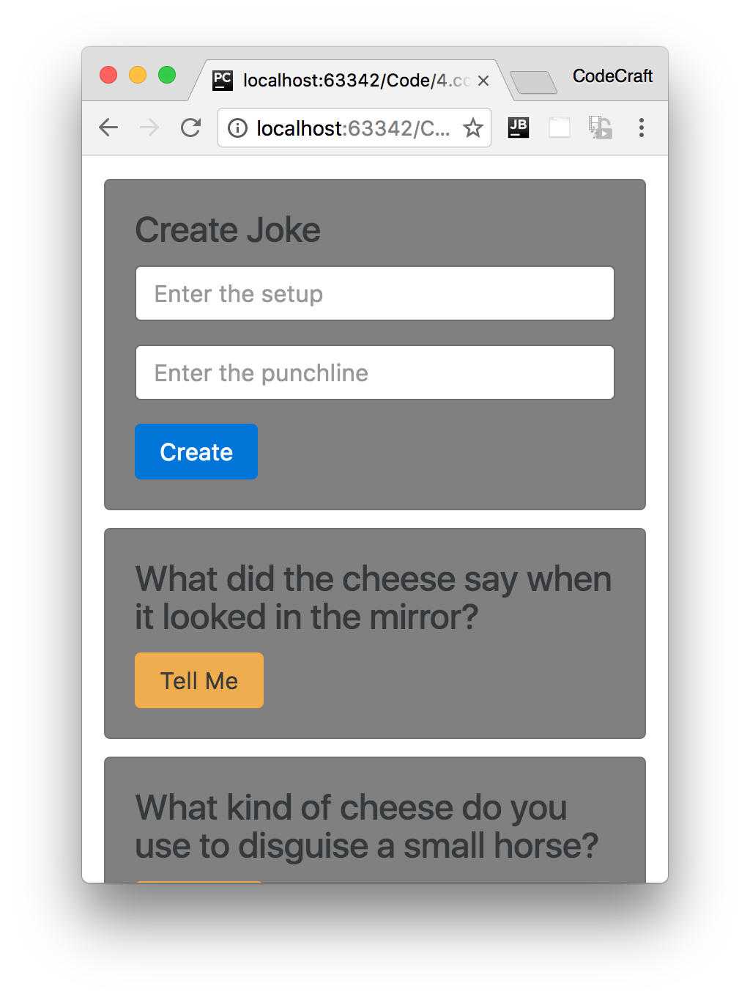

:sourcedir: {docdir}/content/{filedir}/code
:toc:
= Templates, Styles & View Encapsulation

== Learning Objectives

We've covered the basics of the `@Component` decorator in the quickstart. We explained how decorators work and both the `template` and `selector` configuration properties of the `@Component` decorator.

In this lecture we will go through a number of other configuration properties including `templateUrl`, `styles`, `styleUrls` and `encapsulation`.

In the section on Dependency Injection we will cover two other ways of configuring Components with the `providers` and `viewProviders` properties.

== Template URL

We don't have to write our template code inline with our component code. We can store our HTML template files separately and just refer to them in our component by using the `templateUrl` property.

Using the joke application we built in the quickstart, let's move the template for the `JokeFormComponent` to a file called `joke-form-component.html`, like so:

[source,typescript]
----
@Component({
  selector: 'joke-form',
  templateUrl: 'joke-form-component.html' # <1>
})
class JokeFormComponent {
  @Output() jokeCreated = new EventEmitter<Joke>();

  createJoke(setup: string, punchline: string) {
    this.jokeCreated.emit(new Joke(setup, punchline));
  }
}
----
<1> We point our component to an external template file by using the `templateUrl` property.

== Styles

We can also specify any custom CSS styles for our component with the `styles` property.

`styles` takes an _array of strings_ and just like `template` we can use multi-line strings with back-ticks.

Let's define a style for the `JokeFormComponent` so it gives it a background color of gray.

[source,typescript]
----
@Component({
  selector: 'joke-form',
  template: 'joke-form-component.html',
  styles: [
    `
    .card {
      background-color: gray;
    }
    `
  ],
})
class JokeFormComponent {
  @Output() jokeCreated = new EventEmitter<Joke>();

  createJoke(setup: string, punchline: string) {
    this.jokeCreated.emit(new Joke(setup, punchline));
  }
}
----

IMPORTANT: The `styles` property above takes an *array* of strings, each string can contain any number of CSS declarations.

The form component in our application now turns gray, like so:

== View Encapsulation

Even though we changed the background color of `.card` and we have multiple cards on the page only the form component card was rendered with a gray background.

Normally if we change a CSS class the effect is seen throughout an application, something special is happening here and it's called _View Encapsulation_.

Angular is inspired from Web Components, a core feature of which is the shadow DOM.

The shadow DOM lets us include styles into Web Components without letting them _leak_ outside the component's scope.

Angular also provides this feature for Components and we can control it with the `encapsulation` property.

The valid values for this config property are:

- `ViewEncapsulation.Native`
- `ViewEncapsulation.Emulated`
- `ViewEncapsulation.None`.

The default value is `ViewEncapsulation.Emulated` and that is the behaviour we are currently seeing.

=== ViewEncapsulation.Emulated

Let's inspect the form element with our browsers developer tools to investigate what's going on.

By looking at the DOM for our `JokeFormComponent` we can see that Angular added some _automatically_ generated attributes, like so.

////
[source, html]
----
<joke-form _nghost-qwe-3="">
  

    <h4 +++_ngcontent-qwe-3+++=""
        class="card-title">Create Joke</h4>
    

      <input +++_ngcontent-qwe-3+++=""
             class="form-control"
             placeholder="Enter the setup"
             type="text">
    

    

      <input +++_ngcontent-qwe-3+++=""
             class="form-control"
             placeholder="Enter the punchline"
             type="text">
    

    <button +++_ngcontent-qwe-3+++=""
            class="btn btn-primary"
            type="button">Create
    </button>
  

</joke-form>
----
////

Specifically it added an attribute called `+++_ngcontent-qwe-3+++`.

The other components on the page don't have these automatically generated attributes, only the `JokeFormComponent` which is the only component where we specified some styles.

Again by looking at the styles tab in our developer tools we can see a style is set for `+++_ngcontent-qwe-3+++` like so:

////
[source, css]
----
.card[+++_ngcontent-qwe-3+++] {
    background-color: gray;
}
----
////

NOTE: The CSS selector `.card[+++_ngcontent-qwe-3+++]` targets _only_ the `JokeFormComponent` since that is the only component with a HTML attribute of `+++_ngcontent-qwe-3+++`.

In the `ViewEncapsulation.Emulated` mode Angular changes our generic CSS class selector to one that targets just a single component type by using automatically generated attributes.

This is the reason that _only_ the `JokeFormComponent` is gray despite the fact that we use the same card class for all the other `JokeComponents` as well.

Any styles we define on a component _don't leak out_ to the rest of the application but with `ViewEncapsulation.Emulated` our component still inherits global styles from Twitter Bootstrap.

Our `JokeFormComponent` still gets the global card styles from Twitter Bootstrap and the encapsulated style from the component itself.

=== ViewEncapsulation.Native

If we want Angular to use the _shadow DOM_ we can set the encapsulation parameter to use `ViewEncapsulation.Native` like so:

[source,typescript]
----
@Component({
  selector: 'joke-form',
  templateUrl: 'joke-form-component.html',
  styles: [
    `
    .card {
      background-color: gray;
    }
    `
  ],
  encapsulation: ViewEncapsulation.Native # <!>
})
class JokeFormComponent {
  @Output() jokeCreated = new EventEmitter<Joke>();

  createJoke(setup: string, punchline: string) {
    this.jokeCreated.emit(new Joke(setup, punchline));
  }
}
----

But now if we look at the application although the background color of the `JokeFormComponent` is still gray, we've _lost_ the global Twitter Bootstrap styles.

With `ViewEncapsulation.Native` styles we set on a component _do not leak outside_ of the component's scope. The other cards in our application do not have a gray background despite the fact they all still use the card class.

This is great if we are defining a third-party component which we want people to use in isolation. We can describe the look for our component using CSS styles without any fear that our styles are going to leak out and affect the rest of the application.

However with `ViewEncapsulation.Native` our component is also isolated from the global styles we've defined for our application. So we don't inherit the Twitter Bootstrap styles and have to define all the required styles on our component decorator.

Finally, `ViewEncapsulation.Native` requires a feature called the _shadow DOM_ which is not supported by all browsers.

=== ViewEncapsulation.None

And If we don't want to have any encapsulation at all, we can use `ViewEncapsulation.None`.

The resulting application looks like so:

By doing this all the cards are now gray.

If we investigate with our browser's developer tools we'll see that Angular added the `.card` class as a _global style_ in the head section of our HTML.

image::./images/encapsulated-none-html.png[role="image-padded"]

We are not encapsulating anything, the style we defined in our card form component has leaked out and started affecting the other components.

== Style URLs

Like the `templateUrl` property, with the `styleUrls` property we can externalise the CSS for our component into another file and include it in.

However like the `styles` parameter, the `styleUrls` param takes an _array_ of CSS files, like so:

[source,typescript]
----
@Component({
  selector: 'joke-form',
  templateUrl: 'joke-form-component.html',
  styleUrls: [
  	'joke-form-component.css'
  ]
})
class JokeFormComponent {
  @Output() jokeCreated = new EventEmitter<Joke>();

  createJoke(setup: string, punchline: string) {
    this.jokeCreated.emit(new Joke(setup, punchline));
  }
}
----

== Deprecated Properties

IMPORTANT: If you have seen code that discusses the additional `@Component` properties; `directives`, `pipes`, `inputs` and `outputs` these were in the _beta_ version of Angular and were removed in the final 2.0 release. So the information you've read is unfortunately outdated.

== Summary

We can externalise our HTML template into a separate file and include it in with the `templateUrl` property.

We can also define styles for our component via the `styles` and `styleUrls` property.

By default styles for our components are _encapsulated_, that means that they don't _leak_ out and affect the rest of the application.

We can explicitly set the encapsulation strategy using the `encapsulation` property.

By default, the renderer uses ViewEncapsulation.Emulated if the view has styles, otherwise ViewEncapsulation.None. There is also a ViewEncapsulation.Native method which uses the _shadow DOM_ to encapsulate the view.

== Listing

.index.html
[source,html]
----
include::{sourcedir}/src/index.html[]
----

.main.ts
[source,typescript]
----
include::{sourcedir}/src/main.ts[]
----

.joke-form-component.css
[source,css]
----
include::{sourcedir}/src/joke-form-component.css[]
----

.joke-form-component.html
[source,html]
----
include::{sourcedir}/src/joke-form-component.html[]
----

