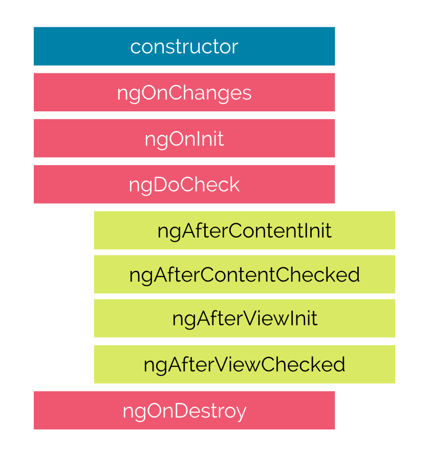
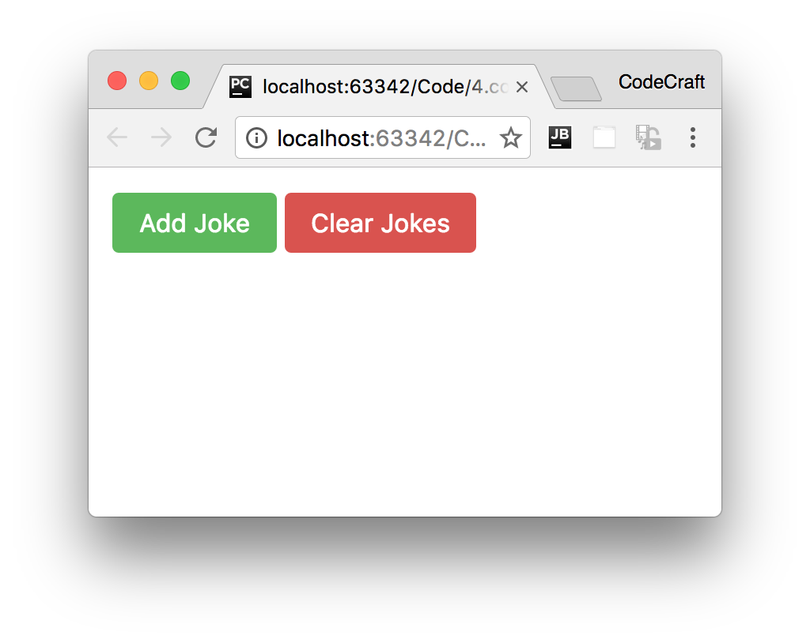

:sourcedir: {docdir}/content/{filedir}/code
:toc:
= Lifecycle Hooks

== Learning Objectives

* Understand the different phases an Angular component goes through from being created to being destroyed.
* Know how to hook into those phases and run your own code.
* Know the order in which the different phases happen and what triggers each phase.

== Phases

A component in Angular has a life-cycle, a number of different phases it goes through from birth to death.

We can hook into those different phases to get some pretty fine grained control of our application.

To do this we add some specific methods to our component class which get called during each of these life-cycle phases, we call those methods _hooks_.

The hooks are executed in this order:

These phases are broadly split up into phases that are linked to the component itself and phases that are linked to the _children_ of that component.

=== Hooks for the Component

constructor:: This is invoked when Angular creates a component or directive by calling `new` on the class.

ngOnChanges:: Invoked *every* time there is a change in one of th _input_ properties of the component.

ngOnInit::
Invoked when given component has been initialized. +
This hook is only called *once* after the first `ngOnChanges`

ngDoCheck::
Invoked when the change detector of the given component is invoked.
It allows us to implement our own change detection algorithm for the given component. +
+
IMPORTANT: `ngDoCheck` and `ngOnChanges` should not be implemented together on the same component.
+
NOTE: We will cover this hook in more detail in the _Advanced Components_ section at the end of this course.

ngOnDestroy::
This method will be invoked just before Angular destroys the component. +
Use this hook to unsubscribe observables and detach event handlers to avoid memory leaks.

=== Hooks for the Component's Children

These hooks are only called for components and not directives.

NOTE: We will cover the difference between Components and Directives in the next section.

ngAfterContentInit::
Invoked _after_ Angular performs any content projection into the component's view (see the previous lecture on _Content Projection_ for more info). +

ngAfterContentChecked:: Invoked each time the content of the given component has been checked by the change detection mechanism of Angular.

ngAfterViewInit:: Invoked when the component's view has been fully initialized.

ngAfterViewChecked:: Invoked each time the view of the given component has been checked by the change detection mechanism of Angular.

NOTE: We'll dig into the children hooks in more detail in the next lecture.

== Adding Hooks

In order to demonstrate how the hooks work we'll adjust the joke application we've been working with so far.

Firstly let's change the `JokeComponent` so it hooks into all the phases.

All we need to do is to add functions to the component class matching the hook names above, like so:

[source,typescript]
----
class JokeComponent {
  @Input('joke') data: Joke;

  constructor() {
    console.log(`new - data is ${this.data}`);
  }

  ngOnChanges() {
    console.log(`ngOnChanges - data is ${this.data}`);
  }

  ngOnInit() {
    console.log(`ngOnInit  - data is ${this.data}`);
  }

  ngDoCheck() {
    console.log("ngDoCheck")
  }

  ngAfterContentInit() {
    console.log("ngAfterContentInit");
  }

  ngAfterContentChecked() {
    console.log("ngAfterContentChecked");
  }

  ngAfterViewInit() {
    console.log("ngAfterViewInit");
  }

  ngAfterViewChecked() {
    console.log("ngAfterViewChecked");
  }

  ngOnDestroy() {
    console.log("ngOnDestroy");
  }
}
----

To easily trigger these hooks let's change the rest of the application. We remove the form and change the parent `JokeListComponent` so it has two buttons. One that adds a joke triggering Angular to create a new `JokeComponent` instance. Another button to clear the list of jokes triggering Angular to delete the `JokeComponents`.

[source,typescript]
----
@Component({
  selector: 'joke-list',
  template: `
<joke *ngFor="let j of jokes" [joke]="j">
  {{ j.setup }} ?
  <h1 class="punchline">{{ j.punchline }}</h1>
</joke>

<button type="button"
        class="btn btn-success"
        (click)="addJoke()">Add Joke
</button>
<button type="button"
        class="btn btn-danger"
        (click)="deleteJoke()">Clear Jokes
</button>
`
})
class JokeListComponent {
  jokes: Joke[] = [];

  addJoke() {
    this.jokes.unshift(new Joke("What did the cheese say when it looked in the mirror", "Hello-me (Halloumi)"));
  }

  deleteJoke() {
    this.jokes = []
  }
}
----

When we run this application we now see two buttons:

If we click "Add Joke" then a joke is added to the list and Angular creates an instance of the `JokeComponent` triggering the lifecycle hooks.

image::./images/lifecycle-hooks-added.png[]

Looking at the console at this time we would see these logs:

[source,console]
----
new - data is undefined
ngOnChanges - data is [object Object]
ngOnInit  - data is [object Object]
ngDoCheck
ngAfterContentInit
ngAfterContentChecked
ngAfterViewInit
ngAfterViewChecked
----

For the first three hooks we are also printing out the value of the component's `joke` input property.

We can see that in the `constructor` the input property is undefined.

However by the time the `ngOnChanges` hook is called we can see that the input property is now set to the joke.

IMPORTANT: The best place to initialise your components is in the `ngOnInit` lifecycle hook and not the constructor because only at this point have any input property bindings been processed.
 +
The reason we use `ngOnInit` and not `ngOnChanges` to initialise a component is that `ngOnInit` is only called _once_ whereas `ngOnChanges` is called for every change to the input properties.

When we press the _Clear Jokes_ button, Angular deletes the `JokeComponent` and calls the `ngOnDestroy` hook which we can see in the logs like so:

[source,console]
----
ngOnDestroy
----

== Detecting What Has Changed

We can actually tap into the exact changes to the input properties by examining the first param to the `ngOnChanges` function, which we typically call `changes`.

The type of `changes` is a map of the input property name to an instance of `SimpleChange`:

[source,typescript]
----
class SimpleChange {
  constructor(previousValue: any, currentValue: any)
  previousValue : any
  currentValue : any
  isFirstChange() : boolean
}
----

Using the above we can find out in our `ngOnChanges` function which input properties changed (if we have more than one) and also what the previous and current values are.

We change our `ngOnChanges` function to take the `changes` argument and loop through it to print out the
`SimpleChange`.`currentValue` and `previousValue`.

[source,typescript]
----
ngOnChanges(changes: SimpleChanges) {
  console.log(`ngOnChanges - data is ${this.data}`);
  for (let key in changes) {
    console.log(`${key} changed.
Current: ${changes[key].currentValue}.
Previous: ${changes[key].previousValue}`);
  }
}
----

This prints out the below to the console:

[source,console]
----
ngOnChanges - data is [object Object]
data changed.
Current: [object Object].
Previous: CD_INIT_VALUE
----

The current value is the joke object that was bound to the `data` input property.

IMPORTANT: When no value has been set for an input property it gets defaulted to the string 'CD_INIT_VALUE' rather than `null` or `undefined`.

== Interfaces

In the sample code so far we are just defining the hook functions directly on the class, but we can take advantage of a feature of TypeScript, interfaces, and be more explicit regarding our intentions.

Each of these lifecycle hooks has an associated TypeScript `interface` of the same name but without the `ng` prefix. So `ngOnChanges` has an interface called `OnChanges`.

Each interface defines just one hook, by making a class implement an interface we are saying we expect the class to have implemented that member function, if it doesn't then TypeScript should throw an error.

Adding the interfaces for our life-cycle hooks to our `JokeComponent` class would look something like so:

[source,typescript]
----
import {
    OnChanges,
    OnInit,
    DoCheck,
    AfterContentInit,
    AfterContentChecked,
    AfterViewInit,
    AfterViewChecked,
    OnDestroy
} from '@angular/core';

class JokeComponent implements
    OnChanges,
    OnInit,
    DoCheck,
    AfterContentInit,
    AfterContentChecked,
    AfterViewInit,
    AfterViewChecked,
    OnDestroy {
  ...
}
----

NOTE: The browser based TypeScript compiler doesn't trigger a compilation error when we don't implement interface functions so we actually can't see the benefit of this in the browser, but doing this using the offline local compiler will throw an error.

== Summary

Using life-cycle hooks we can fine tune the behaviour of our components during creation, update and destruction.

We use the `ngOnInit` hook most often, this is where we place any initialisation logic for our component. It's preferred over initialising via the constructor since in the constructor we don't yet have access to the input properties whereas by the time ngOnInit is called they have been bound to and are available to use.

`ngOnChanges` is the second most common hook, this is where we can find out details about which input properties have changed and how they have changed.

The third most common hook is `ngOnDestroy` which is where we place any cleanup logic for our component.

== Listing

.main.ts
[source,typescript]
----
include::{sourcedir}/src/main.ts[]
----
