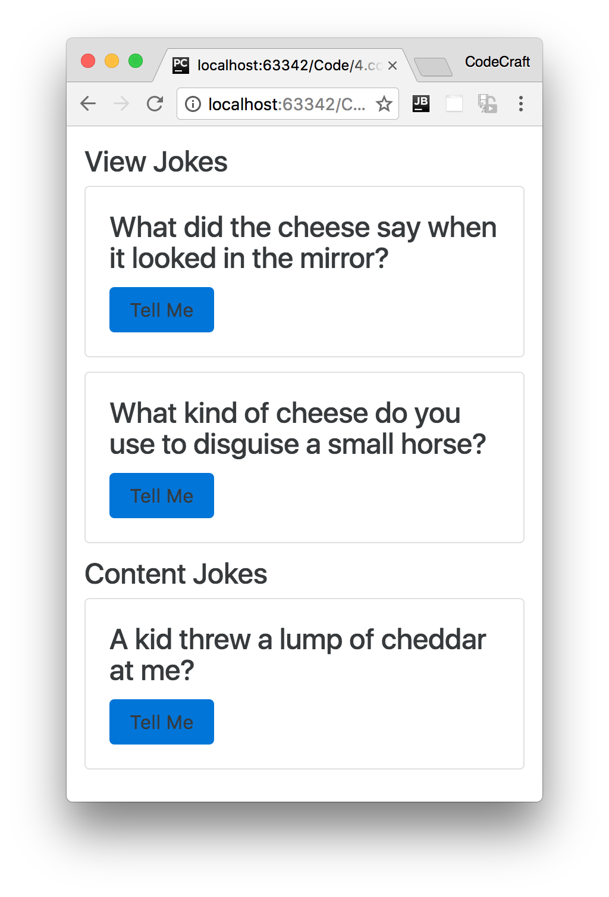

:sourcedir: {docdir}/content/{filedir}/code
:toc:
= ViewChildren & ContentChildren

== Learning Objectives

* Understand the difference between view children and content children of a component.
* Know how to get references to child components in host components.

== Example Application

The view children of a given component are the elements used _within_ its template, its view.

We can get a reference to these view children in our component class by using the `@ViewChild` decorator.

We'll explain how all this works using the joke application we've been working with so far in this course.

We've changed the application so that the `JokeListComponent` shows two jokes in its own view and one joke which is content projected from its host `AppComponent`, like so:

.JokeListComponent
[source,typescript]
----
@Component({
  selector: 'joke-list',
  template: `
<h4>View Jokes</h4>
<joke *ngFor="let j of jokes" [joke]="j"> <1>
  {{ j.setup }}?
  <h1 class="punchline">{{ j.punchline }}</h1>
</joke>

<h4>Content Jokes</h4>
<ng-content></ng-content> <2>
`
})
class JokeListComponent  {
  jokes: Joke[] = [
    new Joke("What did the cheese say when it looked in the mirror", "Hello-me (Halloumi)"),
    new Joke("What kind of cheese do you use to disguise a small horse", "Mask-a-pony (Mascarpone)")
  ];
}
----
<1> The component renders jokes in its _own_ view.
<2> It also projects some content from its host component, in our example the other content is going to be a third joke.

.AppComponent
[source,typescript]
----
@Component({
  selector: 'app',
  template: `
<joke-list>
  <joke [joke]="joke"> <1>
    {{ joke.setup }}?
    <h1 class="punchline">{{ joke.punchline }}</h1>
  </joke>
</joke-list>
`
})
class AppComponent {
  joke: Joke = new Joke("A kid threw a lump of cheddar at me", "I thought ‘That’s not very mature’");
}
----
<1> Use content projection to inject a third joke into the `JokeListComponent`.

When we view this app now we see 3 jokes, two of which are from the JokeListComponent and the third is projected in from the AppComponent.

== ViewChild

In our `JokeListComponent` let's add a reference to the child `JokeComponents` that exists in its view.

We do this by using the `@ViewChild` decorator like so:

[source,typescript]
----
import { ViewChild } from '@angular/core';
.
.
.
@Component({
  selector: 'joke-list',
  template: `
<h4 #header>View Jokes</h4>
<joke *ngFor="let j of jokes" [joke]="j">
  {{ j.setup }}?
  <h1 class="punchline">{{ j.punchline }}</h1>
</joke>
<h4>Content Jokes</h4>
<ng-content></ng-content>
`
})
class JokeListComponent {

  jokes: Joke[] = [
    new Joke("What did the cheese say when it looked in the mirror", "Hello-me (Halloumi)"),
    new Joke("What kind of cheese do you use to disguise a small horse", "Mask-a-pony (Mascarpone)")
  ];

  @ViewChild(JokeComponent) jokeViewChild: JokeComponent; <1>

  constructor() {
    console.log(`new - jokeViewChild is ${this.jokeViewChild}`);
  }
}
----
<1> We are storing a reference to the child `JokeComponent` in a property called `jokeViewChild`.

NOTE: `jokeViewChild` isn't an instance of a `Joke` class, it is the actual instance of the child `JokeComponent` that exists inside _this_ component's view.

We create a new property called `jokeViewChild` and we pre-pend this with a decorator of `@ViewChild`. This decorator tells Angular _how_ to find the child component that we want to bind to this property.

A `@ViewChild` decorator means, search inside this component's template, its view, for this child component.

The parameter we pass as the first argument to `@ViewChild` is the _type_ of the component we want to search for, if it finds more than one it will just give us the first one it finds.

If we try to print out the reference in the constructor, like the code sample above, `undefined` will be printed out.

That's because by the time the constructor is called we haven't rendered the children yet. We render in a _tree down approach_ so when a parent component is getting constructed it means the children are not yet created.

We can however hook into the lifecycle of the component at the point the view children have been created and that's with the `ngAfterViewInit` hook.

To use this we need to make our component implement the interface `AfterViewInit`.

[source,typescript]
----
@Component({
  selector: 'joke-list',
  template: `
<h4 #header>View Jokes</h4>
<joke *ngFor="let j of jokes" [joke]="j">
  {{ j.setup }}?
  <h1 class="punchline">{{ j.punchline }}</h1>
</joke>
<h4>Content Jokes</h4>
<ng-content></ng-content>
`
})
class JokeListComponent implements AfterViewInit {

  jokes: Joke[] = [
    new Joke("What did the cheese say when it looked in the mirror", "Hello-me (Halloumi)"),
    new Joke("What kind of cheese do you use to disguise a small horse", "Mask-a-pony (Mascarpone)")
  ];

  @ViewChild(JokeComponent) jokeViewChild: JokeComponent;

  constructor() {
    console.log(`new - jokeViewChild is ${this.jokeViewChild}`);
  }

  ngAfterViewInit() {
    console.log(`ngAfterViewInit - jokeViewChild is ${this.jokeViewChild}`);
  }
}
----

In the `ngAfterViewInit` function `jokeViewChild` has been initialised and we can see it logged in the console.

== ViewChildren

The above isn't so useful in our case since we have _multiple_ joke children components. We can solve that by using the alternative `@ViewChildren` decorator along side the `QueryList` generic type.

[source,typescript]
----
import { ViewChildren, QueryList } from '@angular/core';
.
.
.
class JokeListComponent implements AfterViewInit {

  jokes: Joke[] = [
    new Joke("What did the cheese say when it looked in the mirror", "Hello-me (Halloumi)"),
    new Joke("What kind of cheese do you use to disguise a small horse", "Mask-a-pony (Mascarpone)")
  ];

  @ViewChild(JokeComponent) jokeViewChild: JokeComponent;
  @ViewChildren(JokeComponent) jokeViewChildren: QueryList<JokeComponent>; # <1>

  ngAfterViewInit() {
    console.log(`ngAfterViewInit - jokeViewChild is ${this.jokeViewChild}`);
    let jokes: JokeComponent[] = this.jokeViewChildren.toArray(); # <2>
    console.log(jokes);
  }
}
----
<1> We use the `@ViewChildren` decorator which matches _all_ `JokeComponent`s and stores them in a `QueryList` called jokeViewChildren.
<2> We can convert our `QueryList` of `JokeComponent`s into an array by calling `toArray()`

When we run the above application we see two `JokeComponents` printed to the console, like so:

----
Array[2]
> 0: JokeComponent
> 1: JokeComponent
----

IMPORTANT: The reason we see two jokes printed out instead of three is because only two of the jokes are _view children_ the other joke is a _content child_. We cover content children in the end of this lecture.

== ViewChild Referencing a Template Local Variable

One practical application of `@ViewChild` is to get access to template local variables in our component class.

In the past we've said that template local variables are just that, _local_ to the template.

But as the first param to the `@ViewChild` decorator we can also pass the name of a template local variable and have Angular store a reference to that variable on our component, like so:

[source,typescript]
----
@Component({
  selector: 'joke-list',
  template: `
<h4 #header>View Jokes</h4>
<joke *ngFor="let j of jokes" [joke]="j">
  {{ j.setup }}?
  <h1 class="punchline">{{ j.punchline }}</h1>
</joke>
<h4>Content Jokes</h4>
<ng-content></ng-content>
`
})
class JokeListComponent implements AfterViewInit {

  jokes: Joke[] = [
    new Joke("What did the cheese say when it looked in the mirror", "Hello-me (Halloumi)"),
    new Joke("What kind of cheese do you use to disguise a small horse", "Mask-a-pony (Mascarpone)")
  ];

  @ViewChild(JokeComponent) jokeViewChild: JokeComponent;
  @ViewChildren(JokeComponent) jokeViewChildren: QueryList<JokeComponent>;
  @ViewChild("header") headerEl: ElementRef; # <1>

  ngAfterViewInit() {
    console.log(`ngAfterViewInit - jokeViewChild is ${this.jokeViewChild}`);

    let jokes: JokeComponent[] = this.jokeViewChildren.toArray();
    console.log(jokes);

    console.log(`ngAfterViewInit - headerEl is ${this.headerEl}`);

    this.headerEl.nativeElement.textContent = "Best Joke Machine"; # <2>
  }
}
----
<1> The type of our template variable is an `ElementRef`, which is a low-level reference to any element in the DOM. We are requesting a reference to the header template variable which points to the first `<h4>` element in the template.
<2> Since `headerEl` is an `ElementRef` we can interact with the DOM directly and change the title of our header to _Best Joke Machine_.

NOTE: It's not recommended to interact with the DOM directly with an `ElementRef` since that results in code that's not very portable.

== ContentChild & ContentChildren

The concept of a _content child_ is similar to that of a _view child_ but the content children of the given component are the child elements that are _projected_ into the component from the host component.

In our example application we are projecting one joke in from the host `AppComponent`.

To get a reference to that child we can use either the `@ContentChild` or the `@ContentChildren` decorators. They work in similar ways to the view child counterparts, `@ContentChild` returns one child and `@ContentChildren` returns a `QueryList`.

Let's use `@ContentChild` to get a reference to the third joke that is projected in, like so:

[source,typescript]
----
import { ContentChildren, ContentChild } from '@angular/core';
.
.
.
class JokeListComponent implements AfterContentInit, AfterViewInit { <1>

  jokes: Joke[] = [
    new Joke("What did the cheese say when it looked in the mirror", "Hello-me (Halloumi)"),
    new Joke("What kind of cheese do you use to disguise a small horse", "Mask-a-pony (Mascarpone)")
  ];

  @ViewChild(JokeComponent) jokeViewChild: JokeComponent;
  @ViewChildren(JokeComponent) jokeViewChildren: QueryList<JokeComponent>;
  @ViewChild("header") headerEl: ElementRef;

  @ContentChild(JokeComponent) jokeContentChild: JokeComponent; <2>

  ngAfterContentInit() { <3>
    console.log(`ngAfterContentInit - jokeContentChild is ${this.jokeContentChild}`);
  }

  ngAfterViewInit() {
    console.log(`ngAfterViewInit - jokeViewChild is ${this.jokeViewChild}`);

    let jokes: JokeComponent[] = this.jokeViewChildren.toArray();
    console.log(jokes);

    console.log(`ngAfterViewInit - headerEl is ${this.headerEl}`);

    this.headerEl.nativeElement.textContent = "Best Joke Machine";
  }
}
----
<1> Just like before we need to tap into one of the component lifecycle hooks, this time it's `AfterContentInit`
<2> We create a `jokeContentChild` property and bind it to the content child by using the `@ContentChild` decorator.
<3> By the time the `ngAfterContentInit` hook is run the `jokeContentChild` property is set to the content child.

TIP: You can implement multiple interfaces just by separating them with a `,`.

If we logged `jokeContentChild` in our constructor it would again log undefined, since it's not actually initialised at that point.

Content children are only visible by the time the `AfterContentInit` lifecycle hook has run.

== Summary

An Angular application is composed of a number of components nested together.

These components can be nested in two ways: as view children, in the template of their component; or as content children, via content projection from a host component.

As developers of our components we can get access to these child components via the `@ViewChild` and `@ContentChild` (or `@ViewChildren` and `@ContentChildren`) decorators.

View children of a component are the components and elements in _this_ component's view.

Content children of a component are the components and elements that are _projected_ into _this_ component's view by a host component.

View children are only initialised by the time the `AfterViewInit` lifecycle phase has been run.

Content children are only initialised by the time the `AfterContentInit` lifecycle phase has been run.

== Listing

.main.ts
[source,typescript]
----
include::{sourcedir}/src/main.ts[]
----
