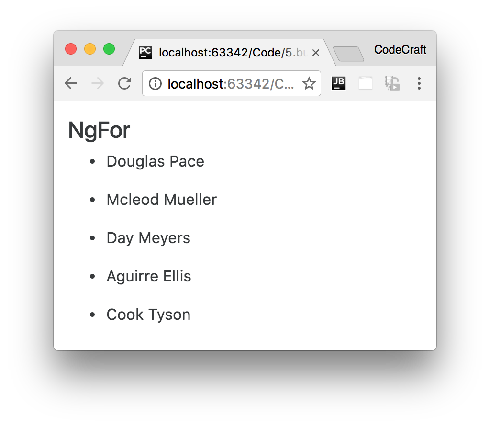
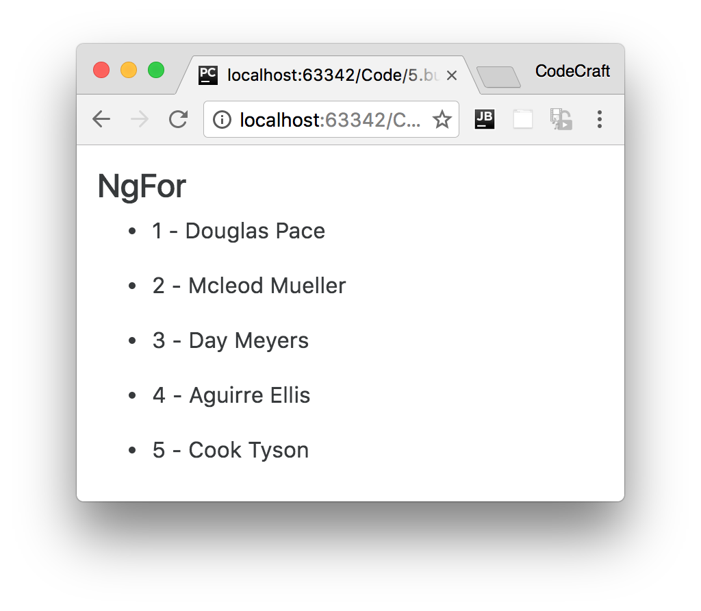
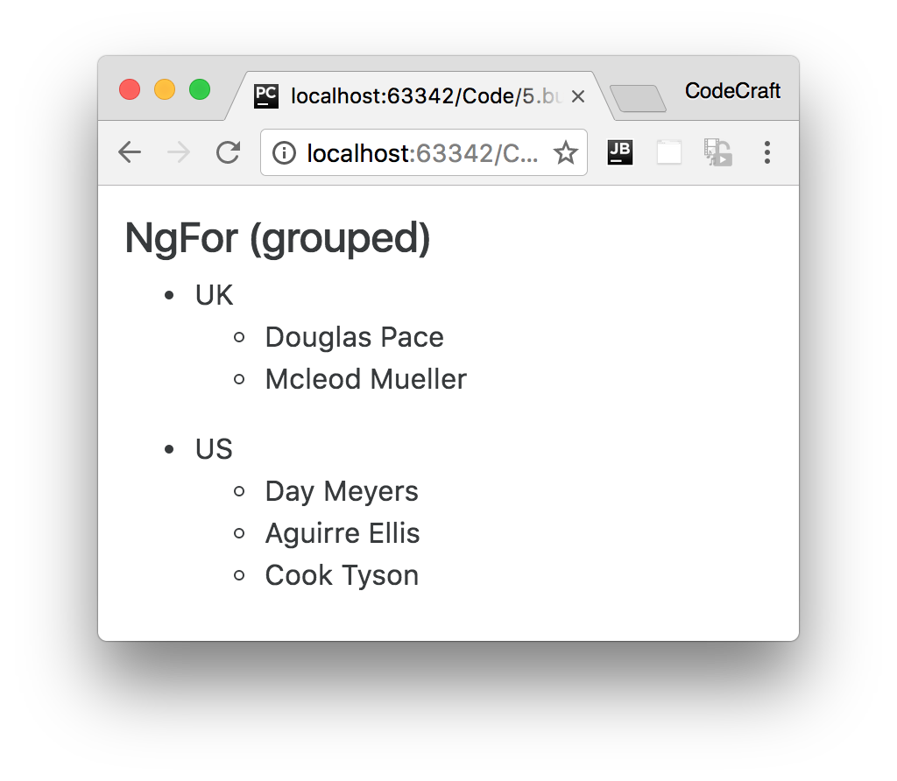

:sourcedir: {docdir}/content/{filedir}/code
:toc:
= NgFor

== Learning Objectives

* Know how to use the `NgFor` directive in your application.
* Know how to get the index in the array of the item you are looping over.
* Know how to nest multiple `NgFor` directives together.

== Basics

We've covered this directive before in the quickstart.

`NgFor` is a structural directive, meaning that it changes the structure of the DOM.

It's point is to repeat a given HTML template once for each value in an array, each time passing it the array value as context for string interpolation or binding.

NOTE: This directive is the successor of Angular 1s `ng-repeat` directive.

Let's take a look at an example:

[source,typescript]
----
@Component({
  selector: 'ngfor-example',
  template: `
 <ul>
  <li *ngFor="let person of people"> # <1>
    {{ person.name }}
  </li>
 </ul>
 `
})
class NgForExampleComponent {
  people: any[] = [
    {
      "name": "Douglas  Pace"
    },
    {
      "name": "Mcleod  Mueller"
    },
    {
      "name": "Day  Meyers"
    },
    {
      "name": "Aguirre  Ellis"
    },
    {
      "name": "Cook  Tyson"
    }
  ];
}
----
<1> We loop over each `person` in the `people` array and print out the persons name.

The syntax is `*ngFor="let <value> of <collection>"`.

_<value>_ is a variable name of your choosing, _<collection>_ is a property on your component which holds a collection, usually an array but anything that can be iterated over in a `for-of` loop.

If we ran the above we would see this:

== Index

Sometimes we also want to get the _index_ of the item in the array we are iterating over.

We can do this by adding another variable to our `ngFor` expression and making it equal to `index`, like so:

[source,html]
----
<ul> <1>
  <li *ngFor="let person of people; let i = index"> # <1>
    {{ i + 1 }} - {{ person.name }} # <2>
  </li>
</ul>
----
<1> We create another variable called `i` and make it equal to the special keyword `index`.
<2> We can use the variable `i` just like we can use the variable `person` in our template.

If we ran the above we would now see this:

NOTE: The index is always zero based, so starts at 0 then 1,2,3,4 etc..

NOTE: In Angular 1 the variable `$index` would automatically be available for us to use in an `ng-repeat` directive. In Angular we now need to provide this variable explicitly.

== Grouping

If our data structure was in fact grouped by country we can use two `ngFor` directives, like so:

[source,typescript]
.script.ts
----
@Component({
  selector: 'ngfor-grouped-example',
  template: `
 <h4>NgFor (grouped)</h4>
 <ul *ngFor="let group of peopleByCountry"> # <1>
   <li>{{ group.country }}</li>
   <ul>
    <li *ngFor="let person of group.people"> # <2>
      {{ person.name }}
    </li>
   </ul>
 </ul>
 `
})
class NgForGroupedExampleComponent {

  peopleByCountry: any[] = [
    {
      'country': 'UK',
      'people': [
        {
          "name": "Douglas  Pace"
        },
        {
          "name": "Mcleod  Mueller"
        },
      ]
    },
    {
      'country': 'US',
      'people': [
        {
          "name": "Day  Meyers"
        },
        {
          "name": "Aguirre  Ellis"
        },
        {
          "name": "Cook  Tyson"
        }
      ]
    }
  ];
}
----
<1> The first `ngFor` loops over the groups, each grop contains a `country` property which we render out on the next line and a `people` array property.
<2> To loop over the `people` array we create a second _nested_ `ngFor` directive.

If we ran the above we would see:

== Summary

We use the `NgFor` directive to loop over an array of items and create multiple elements dynamically from a template element.

The _template_ element is the element the directive is attached to.

We can nest muliple `NgFor` directives together.

We can get the index of the item we are looping over by assigning `index` to a variable in the `NgFor` expression.

== Listing

.main.ts
[source,typescript]
----
include::{sourcedir}/src/main.ts[]
----
