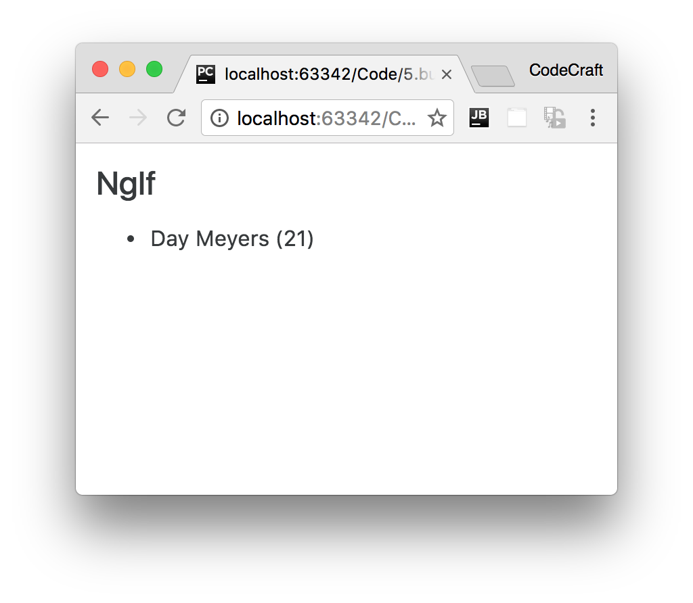
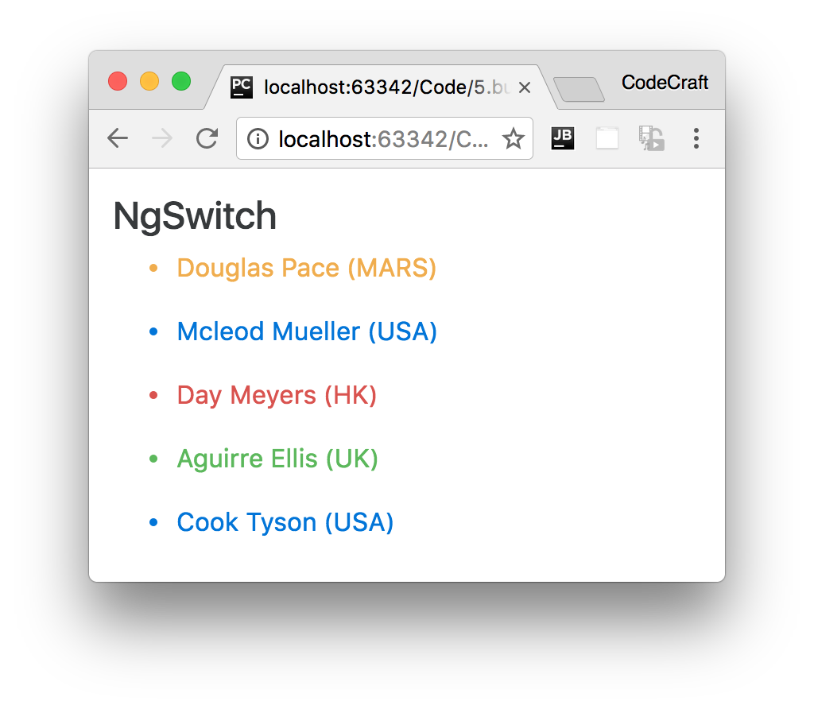

:sourcedir: {docdir}/content/{filedir}/code
:toc:
= NgIf & NgSwitch

== Learning Objectives

* Know how to conditionally add or remove an element from the DOM using the `NgIf` directive.
* Know how to conditionally add or remove elements from the DOM using the `NgSwitch` directive.

== NgIf

The `NgIf` directive is used when you want to display or remove an element based on a condition.

If the condition is `false` the element the directive is _attached to_ will be _removed_ from the DOM.

[IMPORTANT]
====
The difference between `[hidden]='false'` and `*ngIf='false'` is that the first method simply _hides_ the element. The second method with `ngIf` _removes_ the element completely from the DOM.
====

We define the condition by passing an expression to the directive which is evaluated in the context of its host component.

The syntax is: `*ngIf="<condition>"`

Let's use this in an example, we've taken the same code sample as we used for the `NgFor` lecture but changed it slightly. Each person now has an age as well as a name.

Let's add an `NgIf` directive to the template so we only show the element if the age is less than 30, like so:

[source,typescript]
----
@Component({
  selector: 'ngif-example',
  template: `
<h4>NgIf</h4>
<ul *ngFor="let person of people">
  <li *ngIf="person.age < 30"> # <1>
  {{ person.name }} ({{ person.age }})
  </li>
</ul>
`
})
class NgIfExampleComponent {

  people: any[] = [
    {
      "name": "Douglas  Pace",
      "age": 35
    },
    {
      "name": "Mcleod  Mueller",
      "age": 32
    },
    {
      "name": "Day  Meyers",
      "age": 21
    },
    {
      "name": "Aguirre  Ellis",
      "age": 34
    },
    {
      "name": "Cook  Tyson",
      "age": 32
    }
  ];
}
----
<1> The `NgIf` directive _removes_ the `li` element from the DOM if `person.age` is greater than or equal to 30.

If we ran the above we would see:

[IMPORTANT]
====
We _can't_ have two structural directives, directives starting with a *, attached to the _same_ element.

The below code would *not* work:

[source,html]
----
<ul *ngFor="let person of people" *ngIf="person.age < 30">
  <li>{{ person.name }}</li>
</ul>
----
====

NOTE: This is exactly the same as Angular 1's `ng-if` directive however Angular doesn't have a built-in alternative for `ng-show`. To achieve something similar you can bind to the `[hidden]` property or use the `NgStyle` or `NgClass` directives we cover later in this section.

== NgSwitch

Let's imagine we wanted to print peoples names in different colours depending on _where_ they are from. Green for UK, Blue for USA, Red for HK.

With Bootstrap we can change the text color by using the `text-danger`, `text-success`, `text-warning` and `text-primary` classes.

We _could_ solve this by having a series of *ngIf statements, like so:

[source,html]
----
<ul *ngFor="let person of people">
  <li *ngIf="person.country ==='UK'"
      class="text-success">{{ person.name }} ({{ person.country }})
  </li>
  <li *ngIf="person.country === 'USA'"
      class="text-primary">{{ person.name }} ({{ person.country }})
  </li>
  <li *ngIf="person.country === 'HK'"
      class="text-danger">{{ person.name }} ({{ person.country }})
  </li>
  <li *ngIf="person.country !== 'HK' && person.country !== 'UK' && person.country !== 'USA'"
      class="text-warning">{{ person.name }} ({{ person.country }})
  </li>
</ul>
----

This initially seems to make sense until we try to create our _else_ style element. We have to check to see if the person is not from any of the countries we have specified before. Resulting in a pretty long `ngIf` expression and it will only get worse the more countries we add.

Most languages, including JavaScript, have a language construct called a `switch` statement to solve this kind of problem. Angular also provides us with similar functionality via something called the `NgSwitch` directive.

This directive allows us to render different elements depending on a given condition, in fact the `NgSwitch` directive is actually a number of directives working in conjunction, like so:

[source,typescript]
.script.ts
----
@Component({
  selector: 'ngswitch-example',
  template: `<h4>NgSwitch</h4>
<ul *ngFor="let person of people"
    [ngSwitch]="person.country"> <1>

  <li *ngSwitchCase="'UK'" <2>
      class="text-success">{{ person.name }} ({{ person.country }})
  </li>
  <li *ngSwitchCase="'USA'"
      class="text-primary">{{ person.name }} ({{ person.country }})
  </li>
  <li *ngSwitchCase="'HK'"
      class="text-danger">{{ person.name }} ({{ person.country }})
  </li>
  <li *ngSwitchDefault <3>
      class="text-warning">{{ person.name }} ({{ person.country }})
  </li>
</ul>`
})
class NgSwitchExampleComponent {

  people: any[] = [
    {
      "name": "Douglas  Pace",
      "age": 35,
      "country": 'MARS'
    },
    {
      "name": "Mcleod  Mueller",
      "age": 32,
      "country": 'USA'
    },
    {
      "name": "Day  Meyers",
      "age": 21,
      "country": 'HK'
    },
    {
      "name": "Aguirre  Ellis",
      "age": 34,
      "country": 'UK'
    },
    {
      "name": "Cook  Tyson",
      "age": 32,
      "country": 'USA'
    }
  ];
}
----
1. We bind an expression to the `ngSwitch` directive.
2. The `ngSwitchCase` directive lets us define a condition which if it matches the expression in (1) will render the element it's attached to.
3. If no conditions are met in the switch statement it will check to see if there is an ngSwitchDefault directive, if there is it will render the element that's attached to, however it is optional - if it's not present it simply won't display anything if no matching ngSwitchCase directive is found.

The key difference between the `ngIf` solution is that by using `NgSwitch` we evaluate the expression only once and then choose the element to display based on the result.

If we ran the above we would see:

NOTE: The use of `NgSwitch` here is just for example and isn't an efficient way of solving this problem. We would use either the `NgStyle` or `NgClass` directives which we'll cover in the next lecture.

== Summary

With `NgIf` we can conditionally add or remove an element from the DOM.

If we are faced with multiple conditions a cleaner alternative to multiple nested `NgIf` statements is the `NgSwitch` series of directives.

== Listing

.main.ts
[source,typescript]
----
include::{sourcedir}/src/main.ts[]
----
