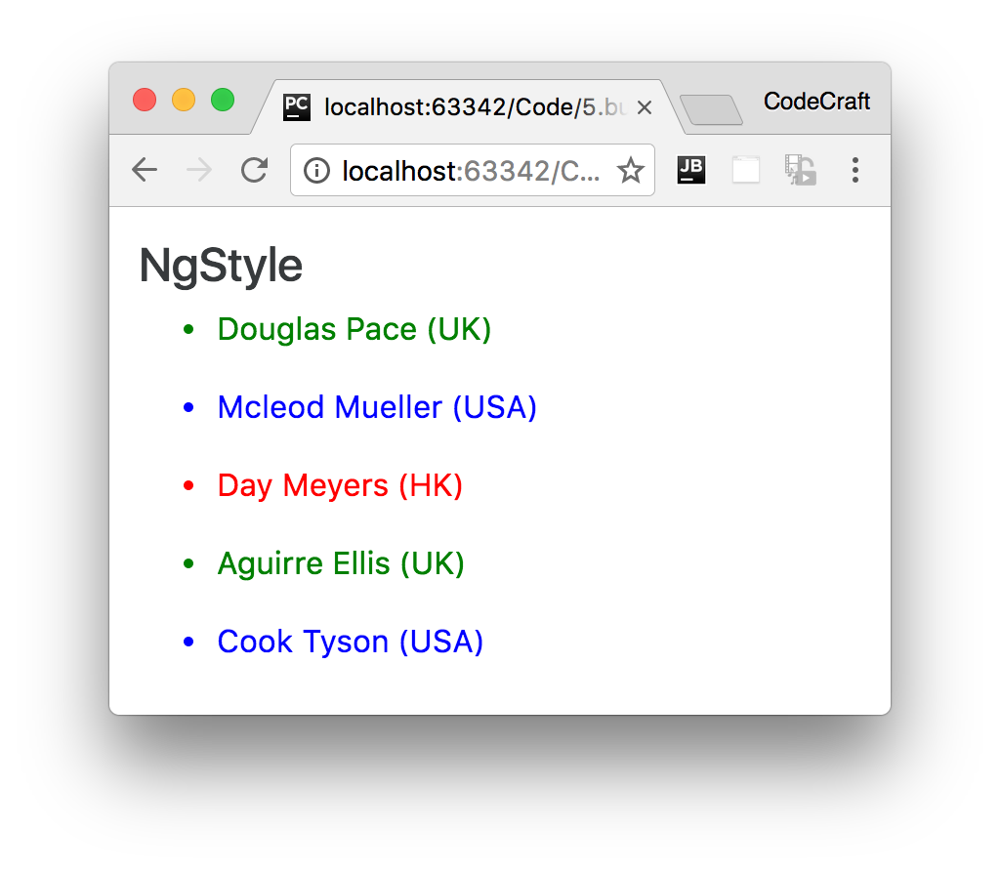
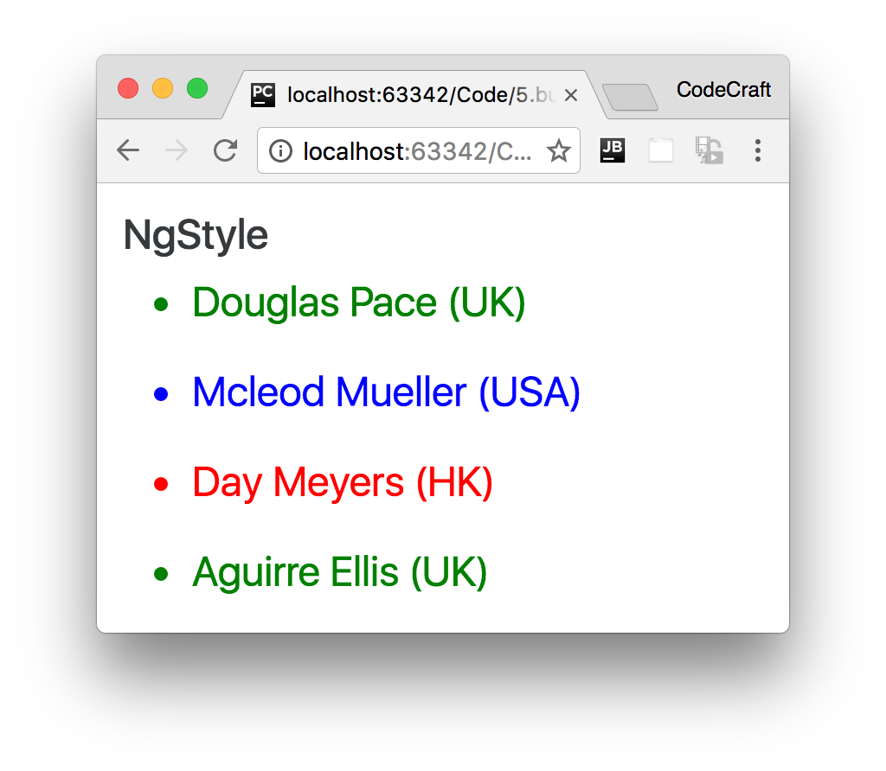
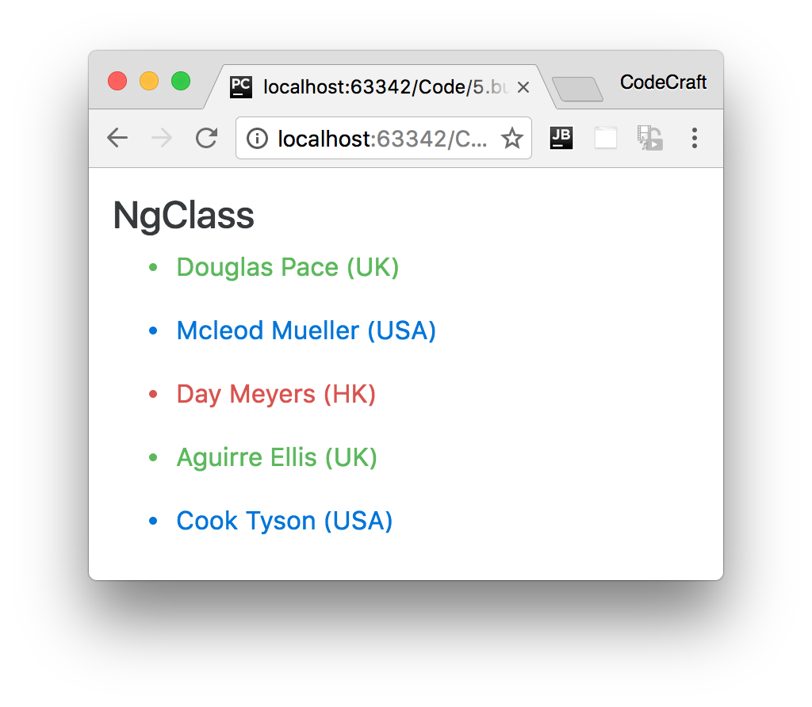

:sourcedir: {docdir}/content/{filedir}/code
:toc:
= NgStyle & NgClass

== Learning Objectives

* Understand when and how to use the `NgStyle` directive to set an elements style.
* Understand when and how to use the `NgClass` directive to set an elements classes.

== NgStyle

The `NgStyle` directive lets you set a given DOM elements style properties.

One way to set styles is by using the `NgStyle` directive and assigning it an _object literal_, like so:

[source,html]
----

</

----

This sets the background color of the `div` to green.

`ngStyle` becomes much more useful when the value is _dynamic_. The _values_ in the object literal that we assign to `ngStyle` can be JavaScript expressions which are evaluated and the result of that expression is used as the value of the CSS property, like this:

[source,html]
----

</

----

The above code uses the ternary operator to set the background color to green if the persons country is the UK else red.

But the expression doesn't have to be _inline_, we can call a function on the component instead.

To demonstrate this let's flesh out a full example. Similar to the ones we've created before let's loop through an array of people and print out there names in different colors depending on the country they are from.

[source,typescript]
----
@Component({
  selector: 'ngstyle-example',
  template: `<h4>NgStyle</h4>
<ul *ngFor="let person of people">
  <li [ngStyle]="{'color':getColor(person.country)}"> {{ person.name }} ({{ person.country }}) <1>
  </li>
</ul>
 `
})
class NgStyleExampleComponent {

  getColor(country) { <2>
    switch (country) {
      case 'UK':
        return 'green';
      case 'USA':
        return 'blue';
      case 'HK':
        return 'red';
    }
  }

  people: any[] = [
    {
      "name": "Douglas  Pace",
      "country": 'UK'
    },
    {
      "name": "Mcleod  Mueller",
      "country": 'USA'
    },
    {
      "name": "Day  Meyers",
      "country": 'HK'
    },
    {
      "name": "Aguirre  Ellis",
      "country": 'UK'
    },
    {
      "name": "Cook  Tyson",
      "country": 'USA'
    }
  ];
}
----
<1> We set the color of the text according to the value that's returned from the `getColor` function.
<2> Our `getColor` function returns different colors depending on the country passed in.

If we ran the above code we would see:

=== Alternative Syntax

As well as using the `ngStyle` directive we can also set individual style properties using the `[style.<property>]` syntax, for example `[style.color]="getColor(person.country)"`

[source,html]
----
<ul *ngFor="let person of people">
  <li [style.color]="getColor(person.country)">{{ person.name }} ({{ person.country }})
  </li>
</ul>
----

=== Points and Pixels

Let's imagine we wanted to set the font size to 24, we could use:

[source,html]
----
[ngStyle]="{'font-size':24}"
----

But this wouldn't work, it isn’t valid CSS to just set the font size to 24. We also have to specify a _unit_ such as _px_ or _em_.

Angular comes to the rescue with a special syntax, `<property>.<unit>`. So for the above if we wanted the size to be 24 pixels we would write `[ngStyle]="{'font-size.px':24}"`

NOTE: The property name is `font-size.*px*` and not just `font-size`

The `.px` suffix says that we are setting the font-size in pixels. You could `.em` to express the font size in ems or even in percentage using `.%`

This is also applicable with the alternative syntax, e.g:-

`[style.font-size.*px*]="24"`

Let's change our demo application to display the names in a font size of 24 pixels, like so:

[source,html]
----
<ul *ngFor="let person of people">
  <li [ngStyle]="{'font-size.px':24}"
      [style.color]="getColor(person.country)">{{ person.name }} ({{ person.country }})
  </li>
</ul>
----

Running the above would display:

== NgClass

The `NgClass` directive allows you to set the CSS class dynamically for a DOM element.

TIP: The `NgClass` directive will feel very similar to what `ngClass` used to do in Angular 1.

There are two ways to use this directive, the first is by passing an object literal to the directive, like so:

[source,html]
----
[ngClass]="{'text-success':true}"
----

When using an object literal, the keys are the classes which are added to the element if the value of the key evaluates to true.

So in the above example, since the value is `true` this will set the class `text-success` onto the element the directive is attached to.

The value can also be an _expression_, so we can re-write the above to be.

[source,html]
----
[ngClass]="{'text-success':person.country === 'UK'}"
----

Let's implement the colored names demo app using `ngClass` instead of `ngStyle`.

[source,html]
----
<h4>NgClass</h4>
<ul *ngFor="let person of people">
  <li [ngClass]="{
    'text-success':person.country === 'UK',
    'text-primary':person.country === 'USA',
    'text-danger':person.country === 'HK'
  }">{{ person.name }} ({{ person.country }})
  </li>
</ul>
----

Since the object literal can contain many keys we can also set many class names.

We can now color our text with different colors for each country with one statement.

If we ran the above code we would see:

=== Alternative Syntax

We can also set a class on an element by binding to the input property binding called `class`, like so `[class]="'text-success'"`

NOTE: The `'text-success'` is wrapped with single quotes so when it's evaluated as JavaScript it doesn't try to treat `text-success` as a variable.

IMPORTANT: The above syntax removes *all* the existing classes for that element and replaces them with just 'text-success'.

If we want to just add `text-success` to the list of classes already set on the element we can use the extended syntax `[class.<class-name>]='truthy expression'`

So for instance to add text-success to the list of classes for an element we can use:

[source,html]
----
[class.text-success]="true"
----

Or just like before we can use an expression as the value, like so:

[source,html]
----
[class.card-success]="person.country === 'UK'"
----

And we can actually specify multiple values at one time, like so:

[source,html]
----
<ul *ngFor="let person of people">
  <li [class.text-success]="person.country === 'UK'"
      [class.text-primary]="person.country === 'USA'"
      [class.text-danger]="person.country === 'HK'">{{ person.name }} ({{ person.country }})
  </li>
</ul>
----

== Summary

Both the `NgStyle` and `NgClass` directives can be used to conditionally set the look and feel of your application.

`NgStyle` gives you fine grained control on individual properties. But if you want to make changes to multiple properties at once, creating a class which bundles those properties and adding the class with `NgClass` makes more sense.

TIP: The object literal syntax is better for when you want to set multiple classes or styles in one statement. The shortcut syntax, `[style|class.<property>]`, is better for setting a single class or style.

== Listing

.main.ts
[source,typescript]
----
include::{sourcedir}/src/main.ts[]
----
