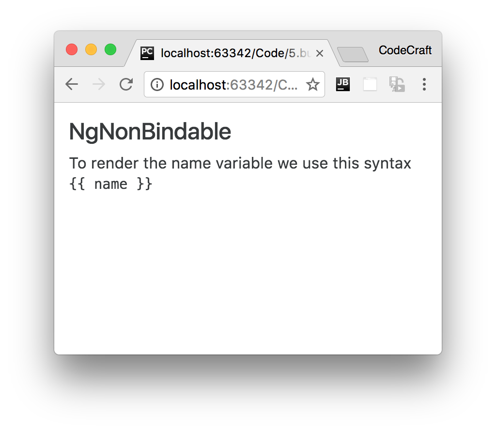

:sourcedir: {docdir}/content/{filedir}/code
:toc:
= NgNonBindable

== Learning Objectives

* Understand when and how to use the `NgNonBindable` directive.

== Description

We use `ngNonBindable` when we want tell Angular not to compile, or bind, a particular section of our page.

The most common example of this is if we wanted to write out some Angular code on the page, for example if we wanted to render out the text `{{ name }}` on our page, like so:

[source,html]
----

  To render the name variable we use this syntax <pre>{{ name }}</pre>

----

Normally Angular will try to find a variable called `name` on the component and print out the value of the `name` variable instead of just printing out `{{ name }}`.

To make angular ignore an element we simply add the `ngNonBindable` directive to the element, like so:

[source,html]
----

  To render the name variable we use this syntax <pre ngNonBindable>{{ name }}</pre>

----

If we run this in the browser we would see:

== Summary

We use `NgNonBindable` when we want to tell Angular not to perform any binding for an element.

== Listing

.main.ts
[source,typescript]
----
include::{sourcedir}/src/main.ts[]
----
