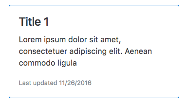
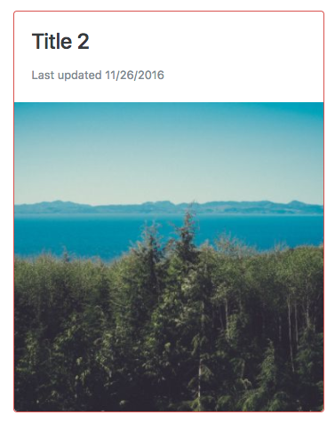

= Activity

Create a component which shows the articles from a list. If the article is a text article show a component like this:

TIP: To get the blue border use the class `card-outline-primary`

If the article is an image article show a component like this:

TIP: To get the red border use the class `card-outline-danger`

TIP: Use the `shortDate` date format string to get the date formatted as we want.

== Steps

Fork this blitz:

https://stackblitz.com/github/codecraft-tv/angular-course/tree/current/{chapter_num}.{chapter_slug}/{lecture_num}.{lecture_slug}/code/@activity[https://stackblitz.com/github/codecraft-tv/angular-course/tree/current/{chapter_num}.{chapter_slug}/{lecture_num}.{lecture_slug}/code/@activity, window="_blank"]

Use the built-in directives you've just learned to finish off the `RecentArticlesComponent`.

== Solution

When you are ready compare your answer to the solution in this blitz:

https://stackblitz.com/github/codecraft-tv/angular-course/tree/current/{chapter_num}.{chapter_slug}/{lecture_num}.{lecture_slug}/code/@solution[https://stackblitz.com/github/codecraft-tv/angular-course/tree/current/{chapter_num}.{chapter_slug}/{lecture_num}.{lecture_slug}/code/@solution, window="_blank"]
