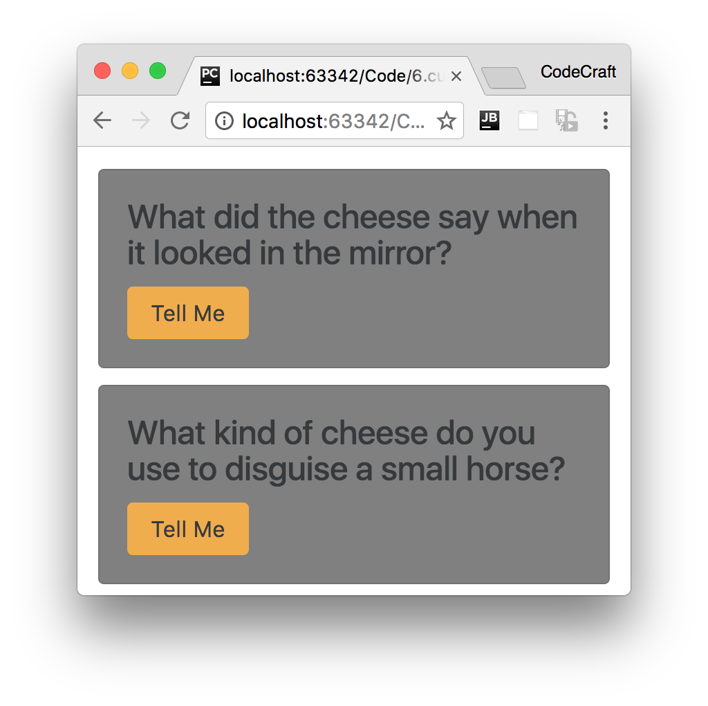

:sourcedir: {docdir}/content/{filedir}/code
:toc:
= Creating a Custom Directive

In this lecture we are going to create our very own custom directive.

== Learning Objectives

* Know how to create a basic directive using the `@Directive` decorator.
* Know how to use selectors to associate an element with a directive based on an _attribute_.
* Know how to interact with the raw DOM element of the associated element from the directive.

== Directive Decorator

We'll call our directive `ccCardHover` and we'll attach it to the card block like so:

[source,html]
----

...

----

TIP: The Angular team recommends using directives as attributes, prefixed with a namespace. We've prefixed our directive with the namespace 'cc'.

We create directives by annotating a class with the `@Directive` decorator.

Let's create a class called `CardHoverDirective` and use the `@Directive` dectorator to associate this class with our attribute `ccCardHover`, like so:

[source,typescript]
----
import { Directive } from '@angular/core';
.
.
.
@Directive({
  selector:"[ccCardHover]"
})
class CardHoverDirective { }
----

== Attribute Selector

The above code is very similar to what we would write if this was a component, the first striking difference is that _the selector is wrapped with `[]`_.

To understand why we do this we first need to understand that the selector attribute uses _CSS matching rules_ to match a component/directive to a HTML element.

In CSS to match to a specific element we would just type in the name of the element, so `input {...}`or `p {...}`.

This is why previously when we defined the selector in the `@Component` directive we just wrote the _name_ of the element, which matches onto an element of the same name.

If we wrote the selector as `.ccCardHover`, like so:

[source,typescript]
----
import { Directive } from '@angular/core';
.
.
.
@Directive({
  selector:".ccCardHover"
})
class CardHoverDirective { }
----

Then this would associate the directive with any element that has a _class_ of ccCardHover, like so:

[source,html]
----

...

----

We want to associate the directive to an element which has a certain attribute.

To do that in CSS we wrap the name of the attribute with `[]`, and this is why the selector is called `[ccCardHover]`.

== Directive Constructor

The next thing we do is add a constructor to our directive, like so:

[source,typescript]
----
import { ElementRef } from '@angular/core';
.
.
.
class CardHoverDirective {
  constructor(private el: ElementRef) {
  }
}
----

// ADD TO NG-MODULE

When the directive gets created Angular can inject an instance of something called `ElementRef` into its constructor.

NOTE: How this works is called _Dependency Injection_, it's a really important aspect of Angular and we discuss this in detail in a later section.

The `ElementRef` gives the directive _direct access_ to the DOM element upon which it's attached.

Let's use it to change the background color of our card to gray.

`ElementRef` itself is a wrapper for the actual DOM element which we can access via the property `nativeElement`, like so:

[source,typescript]
----
el.nativeElement.style.backgroundColor = "gray";
----

This however assumes that our application will always be running in the environment of a browser.

Angular has been built from the ground up to work in a number of different environments, including server side via node and on a native mobile device. So the Angular team has provided a _platform independent_ way of setting properties on our elements via something called a `Renderer`.

[source,typescript]
.script.ts
----
import { Renderer } from '@angular/core';
.
.
.
class CardHoverDirective {
  constructor(private el: ElementRef,
              private renderer: Renderer) { <1>
    renderer.setElementStyle(el.nativeElement, 'backgroundColor', 'gray'); <2>
  }
}
----
<1> We use _Dependency Injection_ (DI) to inject the `renderer` into our directives constructor.
<2> Instead of setting the background color directly via the DOM element we do it by going through the `renderer`.

IMPORTANT: In the future if we wanted to render our application on a platform other than a web browser then the `Renderer` calls the appropriate functions to change the background color on that platform. We are not limited to only being run in a web browser with a DOM.

Running the application now show this:

== Summary

We create a directive by decorating a class with the `@Directive` decorator.

The convention is to associate a directive to an element via an _attribute selector_, that is the name of the attribute wrapped in `[]`.

We can inject a reference to the element the directive is associated with to the constructor of the directive. Then via a `renderer` we can interact with and change certain properties of that element.

The above is a very basic example of a custom directive, in the next lecture we'll show you how you can detect when the user hovers over the card and a _better_ way of interacting with the host element.

== Listing

.main.ts
[source,typescript]
----
include::{sourcedir}/src/main.ts[]
----
