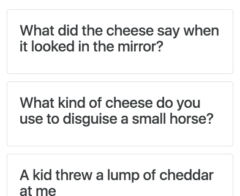
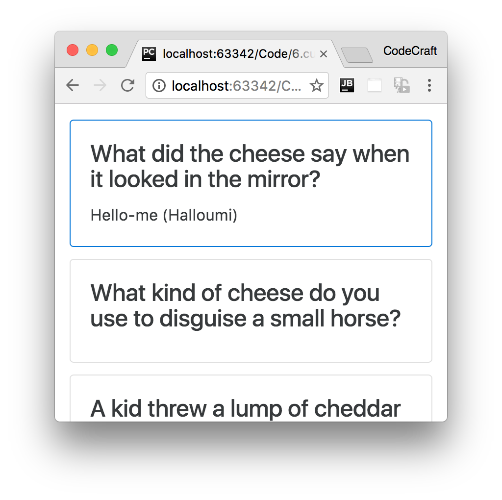

:sourcedir: {docdir}/content/{filedir}/code
:toc:
= HostListener & HostBinding

== Learning Objectives

* How to respond to output events that occur on the host element the directive is attached to.
* How to manipulate the host element by binding to its input properties.

== HostListener

In the previous lecture we created our first directive, `ccCardHover`, which simply turned the background color gray for every element it's attached to.

But as the name of the directive implies we need a way of _detecting_ if the user is hovering over the host element.

Angular makes this easy with the `@HostListener` decorator.

This is a _function_ decorator that accepts an _event name_ as an argument. When that event gets fired on the _host_ element it calls the associated function.

So if we add this function to our directive class:

[source,typescript]
----
@HostListener('mouseover') onHover() {
  window.alert("hover");
}
----

Hovering over the host element would trigger an alert popup.

Let's change our directive to take advantage of the `@HostListener`.

[source,typescript]
----
import { HostListener } from '@angular/core'
.
.
.
class CardHoverDirective {
  constructor(private el: ElementRef,
              private renderer: Renderer) {
    # <1>
    // renderer.setElementStyle(el.nativeElement, 'backgroundColor', 'gray');
  }

  @HostListener('mouseover') onMouseOver() { <2>
    let part = this.el.nativeElement.querySelector('.card-text') <3>
    this.renderer.setElementStyle(part, 'display', 'block'); <4>
  }
}
----
<1> We've removed the code to render the background color to gray.
<2> We decorate a class method with `@HostListener` configuring it to call the function on every `mouseover` events.
<3> We get a reference to the DOM element that holds the jokes punchline.
<4> We set the display to block so that element is shown.

For the above to work we need to change our `JokeComponent` template so the joke is hidden using the display style property, like so:

[source,html]
----

  <h4 class="card-title">{{data.setup}}</h4>
  
{{data.punchline}}
 # <1>
  # <2>

----
<1> We change the `p` element so it's hidden via a style of `display: none`, this is so we can _show_ the element by setting the style to `display: block`.
<2> We've also removed the button, so the only way to show the punchline is via hovering over the card.

As well as showing the punchline on a `mouseover` event we also want to _hide_ the punchline on a `mouse*out*` event, like so:

[source,typescript]
----
class CardHoverDirective {
  constructor(private el: ElementRef,
              private renderer: Renderer) {
    // renderer.setElementStyle(el.nativeElement, 'backgroundColor', 'gray');
  }

  @HostListener('mouseover') onMouseOver() {
    let part = this.el.nativeElement.querySelector('.card-text');
    this.renderer.setElementStyle(part, 'display', 'block');
  }

  @HostListener('mouseout') onMouseOut() {
    let part = this.el.nativeElement.querySelector('.card-text');
    this.renderer.setElementStyle(part, 'display', 'none');
  }
}
----

Now when we hover over the card we show the joke and when we move out of the card the punchline is hidden again.

ifndef::ebook[]

endif::ebook[]

== HostBinding

As well as listening to output events from the host element a directive can also bind to _input properties_ in the host element with `@HostBinding`.

This directive can _change_ the properties of the host element, such as the list of classes that are set on the host element as well as a number of other properties.

Using the `@HostBinding` decorator a directive can link an internal property to an input property on the host element. So if the internal property changed the input property on the host element would also change.

We first need something, a property on our directive which we can use as a source for binding.

We'll create a boolean called `ishovering` and in our `onMouseOver()` and `onMouseOut()` functions we'll set this to true and false accordingly, like so:

[source,typescript]
----
class CardHoverDirective {
  private ishovering: boolean; <1>

  constructor(private el: ElementRef,
              private renderer: Renderer) {
  }

  @HostListener('mouseover') onMouseOver() {
    let part = this.el.nativeElement.querySelector('.card-text');
    this.renderer.setElementStyle(part, 'display', 'block');
    this.ishovering = true; <2>
  }

  @HostListener('mouseout') onMouseOut() {
    let part = this.el.nativeElement.querySelector('.card-text');
    this.renderer.setElementStyle(part, 'display', 'none');
    this.ishovering = false; <2>
  }
}
----
<1> We've created a boolean called `ishovering`.
<2> We set our boolean to `true` when we are being hovered over and `false` when we are not.

Now we need to _link_ this source property to an input property on the host element, we do this by decorating our `ishovering` boolean with the `@HostBinding` decorator.

The `@HostBinding` decorator takes one parameter, the name of the property on the host element which we want to bind to.

If you remember we can use the alternative `ngClass` syntax by binding to the `[class.<class-name>]` property. Let's add the `card-outline-primary` class to our host element when the `ishovering` boolean is `true`.

[source,typescript]
.script.ts
----
import { HostBinding } from '@angular/core'
.
.
.
class CardHoverDirective {
  @HostBinding('class.card-outline-primary') private ishovering: boolean; <1>

  constructor(private el: ElementRef,
              private renderer: Renderer) {
    // renderer.setElementStyle(el.nativeElement, 'backgroundColor', 'gray');
  }

  @HostListener('mouseover') onMouseOver() {
    let part = this.el.nativeElement.querySelector('.card-text');
    this.renderer.setElementStyle(part, 'display', 'block');
    this.ishovering = true;
  }

  @HostListener('mouseout') onMouseOut() {
    let part = this.el.nativeElement.querySelector('.card-text');
    this.renderer.setElementStyle(part, 'display', 'none');
    this.ishovering = false;
  }
}
----
<1> We've added the `@HostBinding` decorator to the `ishovering` property.

Now when we hover over a card as well as the punchline showing we adding a blue border to the card, like so:

== Summary

By using the `@HostListener` and `@HostBinding` decorators we can both listen to output events from our host element and also bind to input properties on our host element as well.

In the next lecture we will cover how to provide inputs and configuration to our directives so they can be easily re-used.

== Listing

.main.ts
[source,typescript]
----
include::{sourcedir}/src/main.ts[]
----
