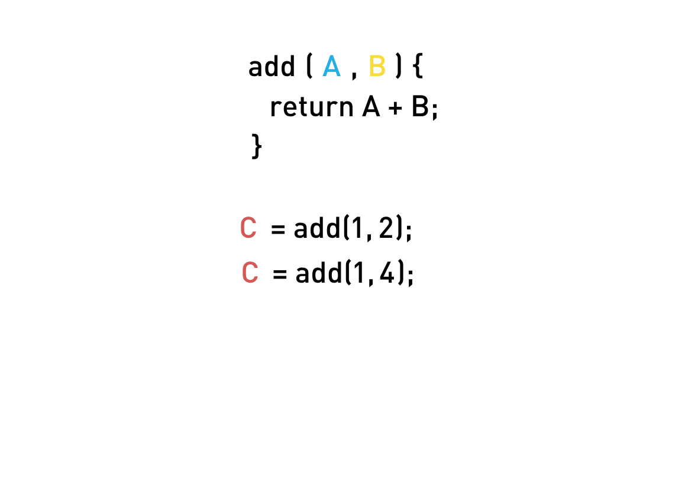
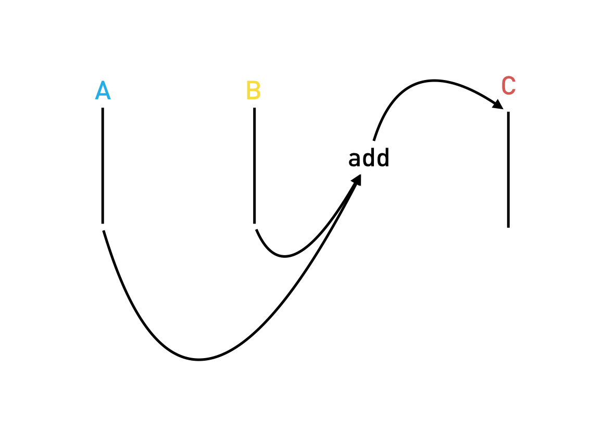
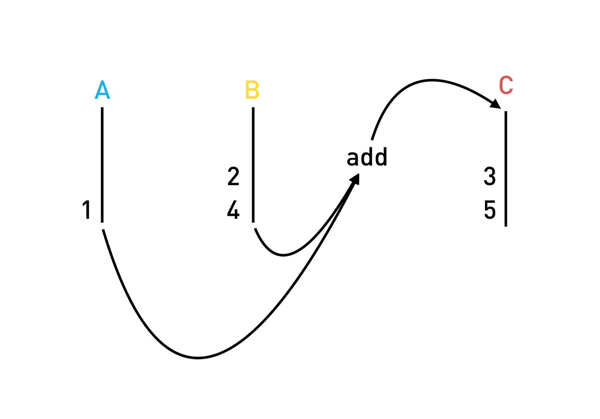
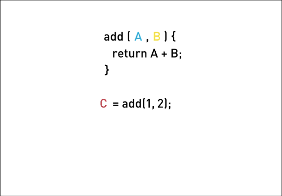

:toc:
= Streams & Reactive Programming

== Learning Objectives

* Know what streams are and how to think about things that happen in an application as streams.
* Know what reactive programming is and how to start transforming your way of thinking from imperative to reactive.

== What Are Streams?

Streams are a _sequence of values over time_, that's it.

For example a number that goes up by 1 every second might have a _stream_ that looks like

`[0,1,2,3,4]`

Another stream might be a sequence of x and y positions of mouse click events, like so:

`[(12,34), (345,22), (1,993)]`

We could even have a stream to represent a user filling in a form on a website.

We could have a stream to represent each keypress, like so:

[source,json]
----
[
  "A",
  "s",
  "i",
  "m"
]
----

Or we could have a stream which contains a json representation of the whole form as the user enters data, like so:

[source,json]
----
[
  { "name": "A" },
  { "name": "As" },
  { "name": "Asi" },
  { "name": "Asim" }
]
----

We could have a stream for:

* The x,y position of the mouse as it moves around the screen in a HTML5 game.
* The data returned from a real-time websockets connection.
* The chat windows opened by this user in a browser.

The more you think about it the more _everything_ we do with a web application can be thought of as a stream.

== What Is Reactive Programming?

Reactive programming is the idea that you can create your entire program just by defining the different streams and the _operations_ that are performed on those streams.

As a concept that is easy to write, but how can we actually _train_ our mind to program _reactively_?

To explain this let's convert a simple imperative function into a reactive one.

NOTE: Imperative programming is a programming paradigm that you probably have been using so far in your career, it's by far the most common and it involves executing statements that change a program's state, i.e. call functions that change the values of variables.
 +
 +
To get a good overview of the different programming paradigms read this https://en.wikipedia.org/wiki/Comparison_of_programming_paradigms[article]

We have a function called `add` and some state variables, `A`, `B` and `C`.

To add `A` and `B` together and _change the state_ of `C` to be the sum we call the function `add`.

Later on the value of `B` changes to 4.

1. First we need a way of simply _knowing_ that `B` has changed, that's hard enough to figure out by itself.
2. Secondly we need to know that because `B` has changed we need to recalculate `C`.

In a web application our inputs are constantly changing over time, via things like network events or a user interacting with a mouse.

Most of the logic we end up writing is just to figure out _what_ functions need to be called for each of these changes to our inputs.

[NOTE]
====
Applications can be thought of as just a huge pile of _variables_ (which we call application state) as well _logic_ to decide which _functions_ to call, and in what order, when any of those variables change.
 +
 +
Calling those functions then also changes the values of variables, for which we need additional logic to figure out what _other_ functions to call... it's endless!
====

With reactive programming we _stop_ thinking about variables, instead we think in terms of _streams_ and how those streams are _connected_ together.

Going back to our example, we convert the variables `A`, `B` and `C` into _streams_.

`A` is now _not_ an individual value at one point in time, it’s a _stream_ of values over time.

The function `add` we think of an _operation_ we perform which connects the output of streams `A` and `B` to the input of stream `C`, a visual representation would be something like the below:

Now if we push some numbers onto stream `A` and `B`, the `add` operation is _automatically_ called, calculating the sum of 4 and pushing it onto stream `C`.

If stream `C` was connected to another stream via another operation, that operation would then be called automatically as well.

TIP: An analogy which works for me is to think about reactive programming as _plumbing_. We decide which _pipes_ we need in our application, we decide _how_ those pipes are connected together and then we _turn on_ the water and sit back.

With reactive programming _we don't call functions_, we just define how our application is plumbed together and start pushing values onto streams and let the plumbing and operations handle the rest.

So if later on the value of `B` changes, we simply push the new value onto the stream `B` and then let the plumbing handle the rest, like so:

ifndef::ebook[]
If the above still isn't clear check out this animation:

endif::ebook[]

== Summary

Streams are just a _sequence of values_ over time.

Reactive programming is the idea we can define an application as a series of different streams with operations that connect the different streams together and which are automatically called when new values are pushed onto those streams.

In this this lecture we just covered the idea, the concept of reactive programming, in the next lecture we'll cover how to actually program reactively using observables and the RxJS library.
