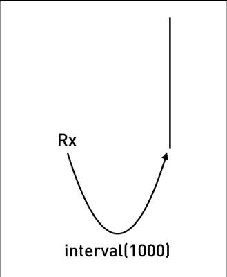
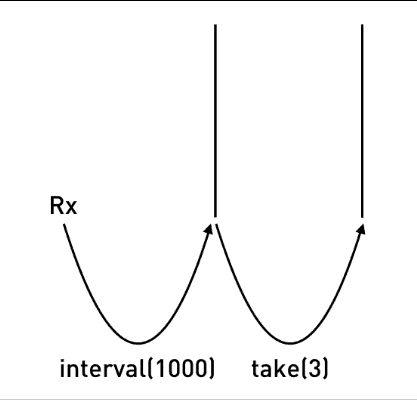
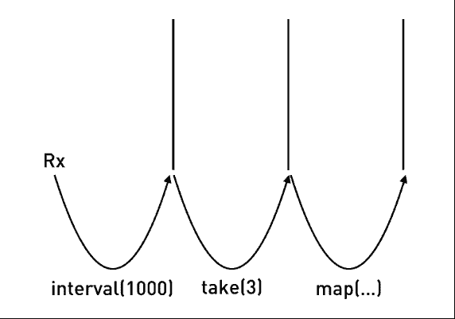
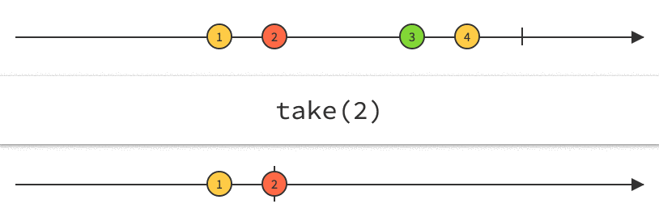
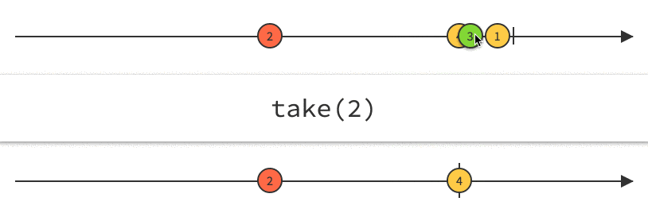

:sourcedir: {docdir}/content/{filedir}/code
:toc:
= Observables & RxJS

== Learning Objectives

* Know what _Observables_ are.
* Know what _RxJS_ is and how it relates to _Observables_.
* Know what _operators_ are, how to find out about the list of operators and how to understand an operators function by using marble diagrams.
* Know how to build a simple application using _RxJS_.

== Observables

Streams so far are just a _concept_, an idea.

We link streams together using operators, so in in our previous example the `add` function is an operation, specifically it's an operation which combines two streams to create a third.

_Observables_ is a new primitive type which acts as a _blueprint_ for how we want to create streams, subscribe to them, react to new values, and combine streams together to build new ones.

It's currently in discussion whether or not Observables make it into the _ES7_ version of JavaScript.

We are still trying to roll out ES6 so even if it makes it, it will be many years before ES7 becomes something we can code with natively.

Until then we need to use a library that gives us the _Observable_ primitive and that's where _RxJS_ comes in.

== RxJS

_RxJS_ stands for *R*eactive E*x*tensions for *J*ava*S*cript, and its a library that gives us an implementation of Observables for JavaScript.

NOTE: Observables might become a core part of the JavaScript language in the future, so we can think of RxJS as a placeholder for when that arrives.

RxJS is the JavaScript _implementation_ of the ReactiveX API, which can be found http://reactivex.io/[here].

The API has _multiple_ implementations in _different languages_, so if you learn RxJS you'll know how to write RxJAVA, Rx.NET, RxPY etc...

=== Library

Let's explain RxJS by working through a simple example.

To reduce file size the RxJS library is broken up into many different parts, one main one and one for each operation you want to use.

For our example we'll add the `rx.all.js` library which contains _all_ the operators.

We create a simple index.html file and add the `rx.all.js` library in via a `script` tag.

NOTE: In Angular since we are using modules we'll be adding in RxJS using `import` statements. We are using script tags here just for simplicity of setup.

[source,html]
----
<!DOCTYPE html>
<html>
<head>
  
  
</head>
<body>
</body>
</html>
----

We also create a `main.js` where we will start adding our RxJS code.

=== interval

The first thing we need to to is get an instance of an RxJS Observable, we do this like so:

[source,javascript]
----
let obs = Rx.Observable;
----

An observable *isn't* a stream. An observable is a _blueprint_ which describes a _set_ of streams and how they are connected together with `operations`.

I want our observable to create a _single_ stream and push onto that stream a number every second, incremented by 1.

With RxJS to define an observable to achieve the above we would use the operator `interval`, like so:

[source,javascript]
----
let obs = Rx.Observable
    .interval(1000);
----

The operation `interval` takes as the first param the number of milliseconds between each _push_ of the number onto the stream.

ifndef::ebook[]

endif::ebook[]

[TIP]
====
In RxJS operators act on an observable and return an observable with the operator applied, so we can `chain` operators together creating an _Observable Chain_, like so:

[source,javascript]
----
let obs = Rx.Observable
    .operator1();
    .operator2();
    .operator3();
    .operator4();
    .operator5();
----
====

=== subscribe

NOTE: In RxJS land no one can hear you _stream_, unless you subscribe.

This observable is _cold_, that means it's not currently pushing out numbers.

The observable will become _hot_ and start pushing numbers onto it's first stream, when it gets it's first _subscriber_, like so:

[source,javascript]
----
let obs = Rx.Observable
    .interval(1000);

obs.subscribe(value => console.log("Subscriber: " + value));
----

By calling `subscribe` onto an observable it:

1. Turns the observable _hot_ so it starts producing.
2. Lets us pass in a callback function so we react when anything is pushed onto the _final stream_ in the observable chain.

Our application now starts printing out:

----
Subscriber: 0
Subscriber: 1
Subscriber: 2
Subscriber: 3
Subscriber: 4
Subscriber: 5
Subscriber: 6
Subscriber: 7
Subscriber: 8
Subscriber: 9
Subscriber: 10
----

=== take

But it just keeps on printing, forever, we just want the first 3 items so we use another operator called `take`.

We pass to that operator the _number of items_ we want to take from the first stream. It creates a second stream and only pushes onto it the number of items we've requested, like so:

ifndef::ebook[]

endif::ebook[]

[source,javascript]
----
let obs = Rx.Observable
    .interval(1000)
    .take(3);

obs.subscribe(value => console.log("Subscriber: " + value));
----

This now prints out the below, and then stops:

----
Subscriber: 0
Subscriber: 1
Subscriber: 2
----

=== map

Finally I want to add another operator called `map`, this takes as input the output stream from `take`, convert each value to a date and pushes that out onto a third stream like so:

ifndef::ebook[]

endif::ebook[]

[source,javascript]
----
let obs = Rx.Observable
    .interval(1000)
    .take(3)
    .map((v) => Date.now());

obs.subscribe(value => console.log("Subscriber: " + value));
----

This now prints out the time in milliseconds, every second, like so:

----
Subscriber: 1475506794287
Subscriber: 1475506795286
Subscriber: 1475506796285
----

== Other operators

The above example showed a very very small subset of the total number of operators available to you when using RxJS.

The hardest part of _learning_ RxJS is understanding each of these operators and how to use them.

In that regard even though you are writing in JavaScript learning RxJS is closer to learning another language altogether.

You can find a list of the operators by looking at the official documentation http://reactivex.io/rxjs/manual/overview.html#operators[here].

The documentation for the operators we just used above is:

* http://reactivex.io/rxjs/class/es6/Observable.js~Observable.html#static-method-interval[Interval]
* http://reactivex.io/rxjs/class/es6/Observable.js~Observable.html#instance-method-take[Take]
* http://reactivex.io/rxjs/class/es6/Observable.js~Observable.html#instance-method-map[Map]

=== Marble Diagrams

Trying to understand an operator by just reading some words is pretty difficult.

This is why in this lecture I've tried to use animations as much as possible.

The Rx team use something called a _marble_ diagram to visually describe an operators function.

This is the official marble diagram for the `map` operator:

image::./images/map-marble.png[Map Marble]

* The line at the top represents _time_ and the _marbles_ with numbers 1, 2 and 3 represent the _input_ stream over time.
* The line at the bottom represents the _output_ stream after each of the marbles has been processed through the operator.
* The bit in the middle is the operator, in this example the operator is a `map` function which multiplies each _marble_ in the input stream by 10 and pushes them to the output stream.

So in the above the value 1 gets pushed out onto the output stream as 10.

These diagrams are actually _interactive_.

To understand how an operator works we move the marbles around in the input stream and see how this affects the output stream, like so:

ifndef::ebook[]

endif::ebook[]

ifdef::ebook[]

endif::ebook[]

_Marbles_ for the above operators are http://reactivex.io/documentation/operators/take.html[Take] and
http://reactivex.io/documentation/operators/map.html[Map]

== Summary

_Observables_ are a blueprint for creating streams and _plumbing_ them together with _operators_ to create _observable chains_.

RxJS is a library that lets us create and work with observables.

We can _subscribe_ to an observable chain and get a callback every time something is pushed onto the _last_ stream.

By default observables are _cold_ and only become _hot_ when they get their first subscriber.

Learning RxJS involves understanding all the operators that are available and how to use them together.

We use marble diagrams to help explain how an operator works.

In this lecture we used RxJS in isolation, in the next lecture we will look at how to use RxJS in Angular.

== Listing

.main.ts
[source,typescript]
----
include::{sourcedir}/src/main.ts[]
----
