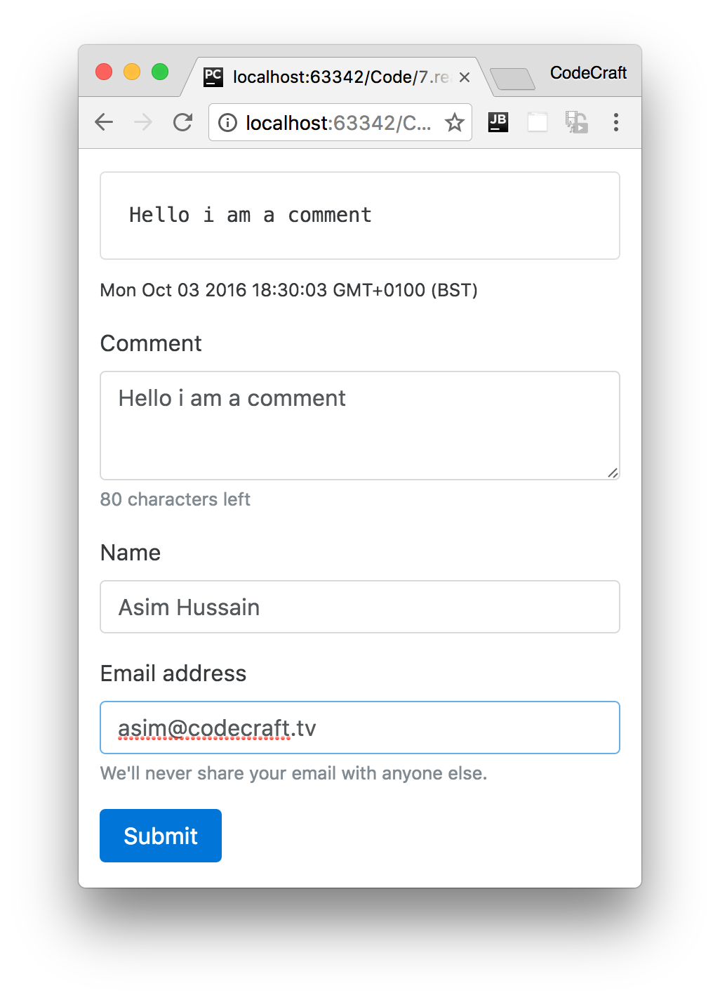

:sourcedir: {docdir}/content/{filedir}/code
:toc:
= RxJS & Angular

== Learning Objectives

* Know which parts of Angular expose observables.
* Know how to _practically_ use RxJS with Angular Forms.
* Know how to chain common RxJS operators together.
* Know that you don't need to use observables in Angular and how to implement the same solution without an observable chain.

== Angular Observables

There are a few places in Angular where reactive programming and observables are in use.

EventEmitter:: Under the hood this works via Observables.
HTTP:: We've not covered this yet but HTTP requests in Angular are all handled via Observables.
Forms:: Reactive forms in Angular expose an observable, a stream of all the input fields in the form combined.

In this lecture we'll use Forms as an example of how to do Reactive Programming in Angular.

[IMPORTANT]
====
In order to teach you a practical example of RxJS in Angular I have to jump ahead and use something we have not covered yet, _Forms_ and specifically the _Reactive Forms_ module.

This is not the only way to implement forms in Angular. This is the reactive _model_ approach, there is also the template approach. We'll go through both in the course.

We'll cover forms in _much_ more detail later on in this course so for now I'm going to _gloss_ over a lot of the details and focus _only_ on the code that deals with RxJS.
====

== Reactive Form Example

In our example we have a `FormAppComponent` which renders a form like so:

We have a comment input area, a name and email input field and also a submit button.

We won't go through the listing for the template HTML, since it's complex and won't make sense until we cover forms later on, but we will go through the code for the component class, like so:

[source,typescript]
.form-app-component.ts
----
import 'rxjs/Rx'; # <1>
.
.
.
class FormAppComponent {
  form: FormGroup; # <2>
  comment = new FormControl("", Validators.required); # <3>
  name = new FormControl("", Validators.required); # <3>
  email = new FormControl("", [ # <3>
    Validators.required,
    Validators.pattern("[^ @]*@[^ @]*")
  ]);

  constructor(fb: FormBuilder) {
    this.form = fb.group({ # <4>
      "comment": this.comment,
      "name": this.name,
      "email": this.email
    });
  }

  onSubmit() {
    console.log("Form submitted!");
  }
}
----
<1> We import the _full_ RxJS library into our application (this import includes _all_ the operators).
<2> We create a `form` property which will hold a representation of our form so we can interact with it from code.
<3> We create individual instances of controls and rules for when user input is valid or invalid.
<4> We then link our `form` with the controls we created in the constructor using something called a `FormBuilder`

We create a `form` instance on our component, this instance exposes an observable, a stream of all the input fields combined into a object, via it's `valueChanges` property.

We can subscribe to that observable and print our the current value of the form, like so:

[source,typescript]
----
  constructor(fb: FormBuilder) {
    this.form = fb.group({
      "comment": this.comment,
      "name": this.name,
      "email": this.email
    });
    this.form.valueChanges
        .subscribe( data => console.log(JSON.stringify(data)));
  }
----

Then as I type into the form, this below gets printed to the console.

[source,json]
----
{"comment":"f","name":"","email":""}
{"comment":"fo","name":"","email":""}
{"comment":"foo","name":"","email":""}
{"comment":"foo","name":"a","email":""}
{"comment":"foo","name":"as","email":""}
{"comment":"foo","name":"asi","email":""}
{"comment":"foo","name":"asim","email":""}
{"comment":"foo","name":"asim","email":"a"}
{"comment":"foo","name":"asim","email":"as"}
{"comment":"foo","name":"asim","email":"asi"}
{"comment":"foo","name":"asim","email":"asim"}
{"comment":"foo","name":"asim","email":"asim@"}
----

=== Processing Only Valid Form Values

Looking at the stream above we can see that _most_ of the stream items are for invalid forms; comment, name and email are required so any form without a value for those is invalid. Also we have some special validation logic for the email field, it's only valid if it contains an _@_ character.

In fact the only valid stream item is the last one `{"comment":"foo","name":"asim","email":"asim@"}`.

That's a common issue when dealing with forms, we only want to _bother_ processing the results of a _valid_ form, there really isn't any point processing invalid form entries.

We can solve this by using another RxJS operator called `filter`. `filter` accepts a function and passes to it each item in the stream, if the function returns true `filter` publishes the input item to the output stream.

[source,typescript]
----
  constructor(fb: FormBuilder) {
    this.form = fb.group({
      "comment": this.comment,
      "name": this.name,
      "email": this.email
    });
    this.form.valueChanges
        .filter(data => this.form.valid)
        .subscribe( data => console.log(JSON.stringify(data)));
  }
----

`this.form.valid` is true when the whole form is valid.
So while the form is _invalid_ `.filter(data => this.form.valid)` _doesn't_ push items to the output stream, when the form is _valid_ it does start pushing items to the output stream.

The end result of the above is that when we type into the form the same data as before, the only item that gets published in our subscribe callback is:

[source,json]
----
{"comment":"foo","name":"Asim","email":"asim@"}
----

=== Cleaning Form Data

A comment input box is a dangerous place, hackers try to input things like `<script>` tags and if we are not careful we open ourselves to the possibility of hackers gaming our applications.

So one common safety measure for comment forms is to strip out HTML tags from the message before we post it anywhere.

We can solve that again via a simple `map` operator on our form processing stream.

[source,typescript]
----
  constructor(fb: FormBuilder) {
    this.form = fb.group({
      "comment": this.comment,
      "name": this.name,
      "email": this.email
    });
    this.form.valueChanges
        .filter(data => this.form.valid)
        .map(data => {
          data.comment = data.comment.replace(/<(?:.|\n)*?>/gm, '');
          return data
        })
        .subscribe( data => console.log(JSON.stringify(data)));
  }
----

We add another operator to our stream, specifically we added a `map` operator.

We added this _after_ the `filter` operator, so this `map` operator only gets called when the previous `filter` operator publishes to its output stream. To put it another way, this map operator only gets called on _valid_ form values.

[source,typescript]
----
.map(data => { # <1>
  data.comment = data.comment.replace(/<(?:.|\n)*?>/gm, ''); # <2>
  return data # <3>
})
----
<1> The `map` operator gets passed the form object as a parameter called `data`.
<2> We apply a regular expression on the comment property to replace everything that could be a HTML tag with an empty string.
<3> What we return from the map function is what gets pushed to the `map` operators output stream.

Now when we type into our form a comment of `<script>` this is what gets printed out:

[source,json]
----
{"comment":"<","name":"Asim","email":"asim@"}
{"comment":"<s","name":"Asim","email":"asim@"}
{"comment":"<sc","name":"Asim","email":"asim@"}
{"comment":"<scr","name":"Asim","email":"asim@"}
{"comment":"<scri","name":"Asim","email":"asim@"}
{"comment":"<scrip","name":"Asim","email":"asim@"}
{"comment":"<script","name":"Asim","email":"asim@"}
{"comment":"","name":"Asim","email":"asim@"}
----

Focusing on the last line `{"comment":"","name":"Asim","email":"asim@"}` we can see that the `<script>` tag the user typed in, is stripped from the comment property.

=== Adding Form Values

A useful feature would be if we could let the user know the last time the form was updated.

We can solve this again by adding another map operator to our observable chain, this time we just add the current time to another property to our data object called `lastUpdateTS`, like so:

[source,typescript]
----
  constructor(fb: FormBuilder) {
    this.form = fb.group({
      "comment": this.comment,
      "name": this.name,
      "email": this.email
    });
    this.form.valueChanges
        .filter(data => this.form.valid)
        .map(data => {
          data.comment = data.comment.replace(/<(?:.|\n)*?>/gm, '');
          return data
        })
        .map(data => {
          data.lastUpdateTS = new Date();
          return data
        })
        .subscribe( data => console.log(JSON.stringify(data)));
  }
----

This second map operator simply adds a property to our data object and then pushes the data object onto its output stream.

If we now ran our application we would see this printed out:

[source,json]
----
{"comment":"f","name":"Asim","email":"asim@","lastUpdateTS":"2016-10-03T20:33:45.980Z"}
{"comment":"fo","name":"Asim","email":"asim@","lastUpdateTS":"2016-10-03T20:33:46.187Z"}
{"comment":"foo","name":"Asim","email":"asim@","lastUpdateTS":"2016-10-03T20:33:46.364Z"}
----

== Not Using Observables

In Angular we don't _need_ to use observables, and therefore reactive programming, if we don't want to.

Instead of adding operators to the observable chain we can choose to _just_ subscribe and do the processing in the callback, like so:

[source,typescript]
----
  constructor(fb: FormBuilder) {
    this.form = fb.group({
      "comment": this.comment,
      "name": this.name,
      "email": this.email
    });
    this.form.valueChanges
        .subscribe( data => {
          if (this.form.valid) {
            data.comment = data.comment.replace(/<(?:.|\n)*?>/gm, '');
            data.lastUpdateTS = new Date();
            console.log(JSON.stringify(data))
          }
        });
  }
----

[IMPORTANT]
====
In the above example there doesn't seem to be much advantage to reactive programming via an observable chain vs. just coding up as you are used to in the subscribe callback.

The advantage of RxJS and Observables come to play when we start using more of the complex operators like `debounce` and `distinctUntilChanged`. Implementing the same functionality as those operators via standard imperative coding techniques would take many more lines of code than the equivalent RxJS solution.
====
////
We can also convert our observable into a promise by using the `toPromise()` function, like so:

[source,typescript]
----
  constructor(fb: FormBuilder) {
    this.form = fb.group({
      "comment": this.comment,
      "name": this.name,
      "email": this.email
    });
    this.form.valueChanges
        .toPromise() # <1>
        .then( data => { # <2>
          if (this.form.valid) {
            data.comment = data.comment.replace(/<(?:.|\n)*?>/gm, '');
            data.lastUpdateTS = new Date();
            console.log(JSON.stringify(data))
          }
        });
  }
----
1. Call `toPromise` to convert the observable into a promise, which we can return from our function and pass around if we wanted to.
2. We add a callback via the `then` function which gets called _every time_ there is a value change in our form.
////

== Summary

Angular exposes RxJS observables in a small but important number of places in Angular. The EventEmitter, HTTP and Reactive Forms.

We use `operators` to add to the observable chain and then subscribe to the output and perform _actual_ real life actions in our application, either change the state of variables or call functions.

We can choose to take advantage of that and code reactively, or we can just subscribe to the observable and code imperatively.

== Listing

.main.ts
[source,typescript]
----
include::{sourcedir}/src/main.ts[]
----
