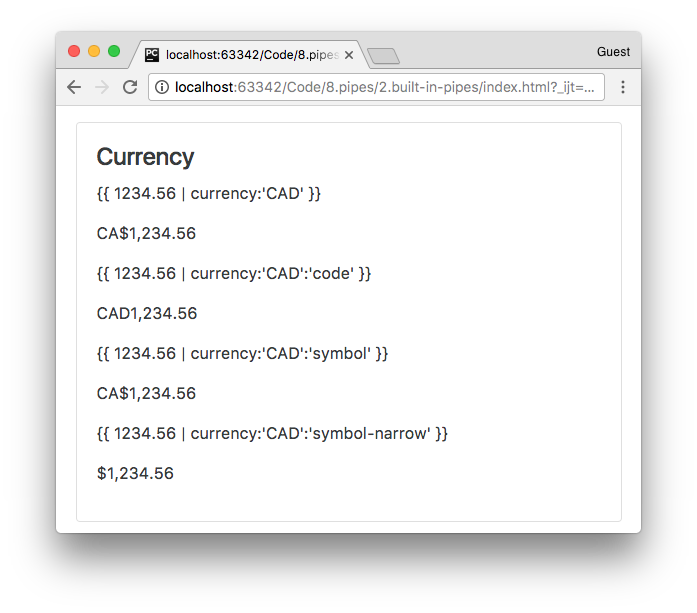
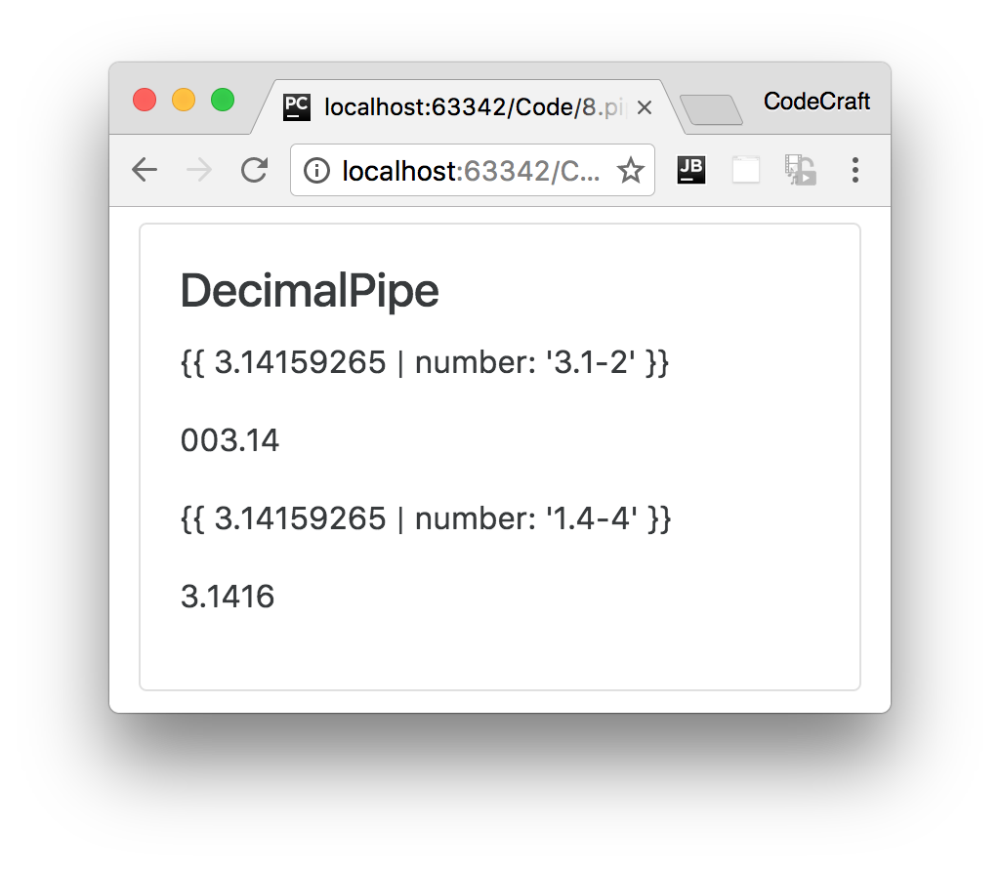
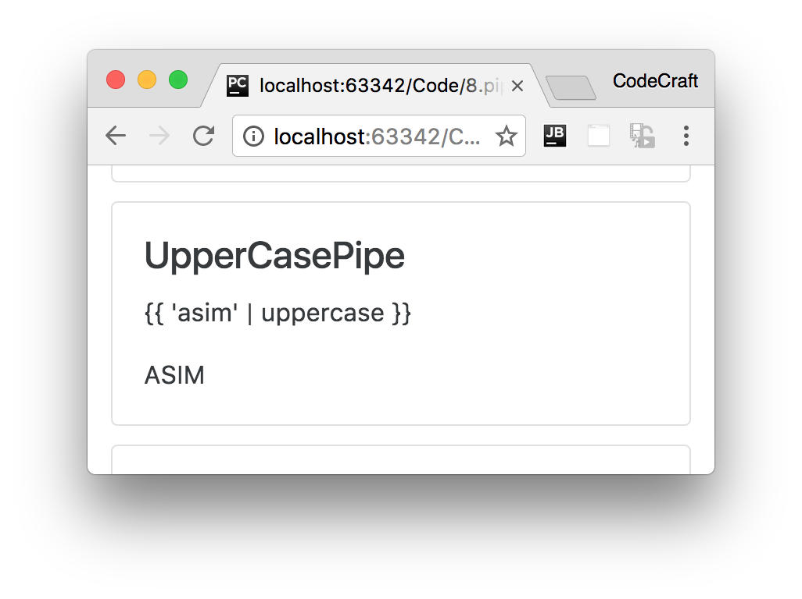

:sourcedir: {docdir}/content/{filedir}/code
:toc:

= Built-In Pipes

In this lecture we will cover all of the built-in pipes provided by Angular apart from the _async pipe_ which we will cover in detail in a later lecture.

== Learning Objectives

* Know the different built-in pipes provided by Angular and how to use them.

== Pipes Provided by Angular

Angular provides the following set of built-in pipes.

=== CurrencyPipe

This pipe is used for formatting currencies. Its first argument is an abbreviation of the currency type (e.g. "EUR", "USD", and so on), like so:

----
{{ 1234.56 | currency:'CAD' }}
----

The above prints out `CA$1,234.56`.

If instead of the abbreviation of `CA$` we want the currency symbol to be printed out we pass as a second parameter the string `symbol-narrow`, like so:

----
{{ 1234.56 | currency:"CAD":"symbol-narrow" }}
----

The above prints out `$1,234.56`.

[source,html]
----

  <h4 class="card-title">Currency</h4>
  

    
{{ 1234.56 | currency:'CAD' }}

    
{{ 1234.56 | currency:"CAD" }}

    
{{ 1234.56 | currency:'CAD':'code' }}

    
{{ 1234.56 | currency:'CAD':'code'}}

    
{{ 1234.56 | currency:'CAD':'symbol' }}

    
{{ 1234.56 | currency:'CAD':'symbol'}}

    
{{ 1234.56 | currency:'CAD':'symbol-narrow' }}

    
{{ 1234.56 | currency:'CAD':'symbol-narrow'}}

  

----

=== DatePipe

This pipe is used for the transformation of dates. The first argument is a format string, like so:

image::./images/date-pipe.png[]

[source,html]
----

  <h4 class="card-title">Date</h4>
  

    
{{ dateVal | date: 'shortTime' }}
 # <1>
    
{{ dateVal | date: 'shortTime' }}

    
{{ dateVal | date:'fullDate' }}

    
{{ dateVal | date: 'fullDate' }}

    
{{ dateVal | date: 'd/M/y' }}

    
{{ dateVal | date: 'd/M/y' }}

  

----
<1> `dateVal` is an instance of `new Date()`.

=== DecimalPipe

This pipe is used for transformation of decimal numbers.

The first argument is a format string of the form "{minIntegerDigits}. {minFractionDigits}-{maxFractionDigits}", like so:

[source,html]
----

  

    <h4 class="card-title">DecimalPipe</h4>
    
{{ 3.14159265 | number: '3.1-2' }}

    
{{ 3.14159265 | number: '3.1-2' }}

    
{{ 3.14159265 | number: '1.4-4' }}

    
{{ 3.14159265 | number: '1.4-4' }}

  

----

=== JsonPipe

This transforms a JavaScript object into a JSON string, like so:

image::./images/json-pipe.png[]

[source,html]
----

  <h4 class="card-title">JsonPipe</h4>
  

    
{{ jsonVal }}
 # <1>
    
{{ jsonVal }}

    
{{ jsonVal | json }}

    
{{ jsonVal | json }}

  

----
<1> `jsonVal` is an object declared as `{ moo: 'foo', goo: { too: 'new' }}`.

=== LowerCasePipe

This transforms a string to lowercase, like so:

image::./images/lowercase-pipe.png[]

[source,html]
----

  <h4 class="card-title">LowerCasePipe</h4>
  

    
{{ 'ASIM' | lowercase }}

    
{{ 'ASIM' | lowercase }}

  

----

=== UpperCasePipe

This transforms a string to uppercase, like so:

[source,html]
----

  <h4 class="card-title">UpperCasePipe</h4>
  

    
{{ 'asim' | uppercase }}

    
{{ 'asim' | uppercase }}

  

----

=== PercentPipe

Formats a number as a percent, like so:

image::./images/percent-pipe.png[]

[source,html]
----

  <h4 class="card-title">PercentPipe</h4>
  

    
{{ 0.123456 | percent }}

    
{{ 0.123456 | percent }}

    
{{ 0.123456 | percent: '2.1-2' }}
 # <1>
    
{{ 0.123456 | percent: '2.1-2' }}

    
{{ 42 | percent: '10.4-4' }}

    
{{ 0.123456 | percent : "10.4-4" }}

  

----
<1> Percent can be passed a format string similar to the format passed to the `DecimalPipe`.

=== SlicePipe

This returns a _slice_ of an array. The first argument is the start index of the slice and the second argument is the end index.

If either indexes are not provided it assumes the start or the end of the array and we can use negative indexes to indicate an offset from the end, like so:

image::./images/slice-pipe.png[]

[source,html]
----

  <h4 class="card-title">SlicePipe</h4>
  

    
{{ [1,2,3,4,5,6] | slice:1:3 }}
 # <1>
    
{{ [1,2,3,4,5,6] | slice:1:3 }}

    
{{ [1,2,3,4,5,6] | slice:2 }}
 # <2>
    
{{ [1,2,3,4,5,6] | slice:2 }}

    
{{ [1,2,3,4,5,6] | slice:2:-1 }}
 # <3>
    
{{ [1,2,3,4,5,6] | slice:2:-1 }}

    <pre ngNonBindable>
&lt;ul&gt;
  &lt;li *ngFor=&quot;let v of [1,2,3,4,5,6] | slice:2:-1&quot;&gt;
    {{v}}
  &lt;/li&gt;
&lt;/ul&gt;
    </pre>

    <ul>
      <li *ngFor="let v of [1,2,3,4,5,6] | slice:2:-1"> # <4>
        {{v}}
      </li>
    </ul>
  

----
<1> `slice:1:3` means return the items from the 1st to the 3rd index inclusive (indexes start at 0).
<2> `slice:2` means return the items from the 2nd index to the end of the array.
<3> `slice:2:-1` means return the items from the 2nd index to one from the end of the array.
<4> We can use slice inside for loops to only loop over a subset of the array items.

=== AsyncPipe

This pipe accepts an observable or a promise and lets us render the output of an observable or promise without having to  call `then` or `subscribe`.

We are going to take a much deeper look at this pipe at the end of this section.

== Summary

Pipes enables you to easily transform data for display purposes in templates.

Angular comes with a very useful set of pre-built pipes to handle most of the common transformations.

One of the more complex pipes to understand in Angular is the async pipe that's what we'll cover next.

== Listing

.main.ts
[source,typescript]
----
include::{sourcedir}/src/main.ts[]
----
