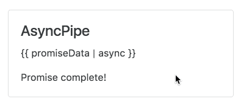

:sourcedir: {docdir}/content/{filedir}/code
:toc:
= Async Pipe

== Learning Objectives

* When to use the _async_ pipe.
* How to use async pipe with Promises and also Observables.

== Overview

Normally to render the result of a promise or an observable we have to:

1. Wait for a _callback_.
2. Store the result of the callback in a _variable_.
3. _Bind_ to that variable in the template.

With `AsyncPipe` we can use promises and observables directly in our template, without having to store the result on an intermediate property or variable.

`AsyncPipe` accepts as argument an observable or a promise, calls `subcribe` or attaches a `then` handler, then waits for the asynchronous result before passing it through to the caller.

=== AsyncPipe with Promises

Let's first create a component with a promise as a property.

[source,typescript]
----
@Component({
  selector: 'async-pipe',
  template: `
 

  <h4 class="card-title">AsyncPipe</h4>
  
{{ promiseData }}
 # <1>
  
{{ promiseData }}
 # <2>
 

  `
})
class AsyncPipeComponent {
  promiseData: string;
  constructor() {
		this.getPromise().then(v => this.promiseData = v); # <3>
  }

  getPromise() {  # <4>
     return new Promise((resolve, reject) => {
       setTimeout(() => resolve("Promise complete!"), 3000);
     });
  }
}
----
<1> We use `ngNonBindable` so we can render out `{{ promiseData }}` as is without trying to bind to to the property `promiseData`
<2> We bind to the property `promiseData`
<3> When the promise resolves we store the data onto the `promiseData` property
<4> `getPromise` returns a promise which 3 seconds later resolves with the value `"Promise complete!"`

In the constructor we wait for the promise to resolve and store the result on a property called `promiseData` on our component and then bind to that property in the template.

ifndef::ebook[]
Visually we see something like this:

endif::ebook[]

To save time we can use the `async` pipe in the template and bind to the promise _directly_, like so:

[source,typescript]
----
@Component({
  selector: 'async-pipe',
  template: `
 

  <h4 class="card-title">AsyncPipe</h4>
  
{{ promise }}

  
{{ promise | async }}
 # <1>
 

  `
})
class AsyncPipeComponent {
  promise: Promise<string>;
  constructor() {
		this.promise = this.getPromise(); # <2>
  }

  getPromise() {
     return new Promise((resolve, reject) => {
       setTimeout(() => resolve("Promise complete!"), 3000);
     });
  }
}
----
<1> We pipe the output of our `promise` to the `async` pipe.
<2> The property `promise` is the actual unresolved _promise_ that gets returned from `getPromise` without `then` being called on it.

The above results in the same behaviour as before, we just saved ourselves from writing a `then` callback and storing intermediate data on the component.

=== AsyncPipe with Observables

To demonstrate how this works with _observables_ we first need to setup our component with a simple _observable_, like so:

[source,typescript]
----
import { Observable } from 'rxjs/Rx';
.
.
.
@Component({
  selector: 'async-pipe',
  template: `
 

  <h4 class="card-title">AsyncPipe</h4>
  
{{ observableData }}
  
{{ observableData }}
 # <1>
 

`
})
class AsyncPipeComponent {
  observableData: number;
  subscription: Object = null;

  constructor() {
    this.subscribeObservable();
  }

  getObservable() { # <2>
    return Observable
        .interval(1000)
        .take(10)
        .map((v) => v * v);
  }

  subscribeObservable() { # <3>
    this.subscription = this.getObservable()
        .subscribe( v => this.observableData = v);
  }

  ngOnDestroy() { # <4>
    if (this.subscription) {
      this.subscription.unsubscribe();
    }
  }

}
----
<1> We render the value of `observableData` in our template.
<2> We create an observable which publishes out a number which increments by one every second then squares that number.
<3> We subscribe to the output of this observable chain and store the number on the property `observableData`. We also store a reference to the subscription so we can unsubscribe to it later.
<4> On destruction of the component we unsubscribe from the observable to avoid memory leaks.

IMPORTANT: We should also be destroying the subscription when the component is destroyed. Otherwise we will start leaking data as the old observable, which isn't used any more, will still be producing results.

ifndef::ebook[]
Visually we see something like this:

endif::ebook[]

Again by using `AsyncPipe` we don't need to perform the `subscribe` and store any intermediate data on our component, like so:

[source,typescript]
----
@Component({
  selector: 'async-pipe',
  template: `
 

  <h4 class="card-title">AsyncPipe</h4>
  
{{ observable | async }}
  
{{ observable | async }}
 # <1>
 

`
})
class AsyncPipeComponent {
  observable: Observable<number>;

  constructor() {
    this.observable = this.getObservable();
  }

  getObservable() {
    return Observable
      .interval(1000)
      .take(10)
      .map((v) => v*v)
  }
}
----
<1> We pipe our `observable` directly to the `async` pipe, it performs a subscription for us and then returns whatever gets passed to it.

By using `AsyncPipe` we:
1. Don't need to call `subscribe` on our observable and store the intermediate data on our component.
2. Don't need to remember to `unsubscribe` from the observable when the component is destroyed.

== Summary

`AsyncPipe` is a convenience function which makes rendering data from observables and promises much easier.

For promises it automatically adds a `then` callback and renders the response.

For Observables it automatically `subscribes` to the observable, renders the output and then also `unsubscribes` when the component is destroyed so we don't need to handle the clean up logic ourselves.

That's it for the built-in pipes, next up we will look at creating out own custom pipes.

== Listing

.main.ts
[source,typescript]
----
include::{sourcedir}/src/main.ts[]
----
