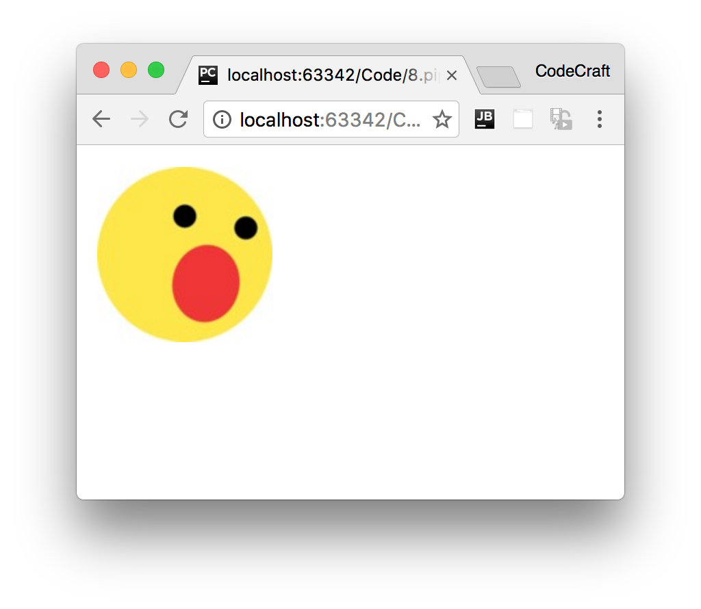

:sourcedir: {docdir}/content/{filedir}/code
:toc:
= Custom Pipes

== Learning Objectives

* Know how to use the `@Pipe` decorator to create pipes.
* Know how to pass in parameters to custom pipes.

== Pipe Decorator

One pipe I really find useful when building web applications is a _default_ pipe, which I use for things like avatar images.

I use this pipe in an image field, like so:

[source,html]
----
'"/>
----

The pipe is called `default` and we pass to it a default image to use if the `imageUrl` variable is blank.

To create a pipe we use the `@Pipe` decorator and annotate a class like so:

[source,typescript]
----
import { Pipe } from '@angular/core';
.
.
.
@Pipe({
  name:"default"
})
class DefaultPipe { }
----

The name parameter for the `Pipe` decorator is how the pipe will be called in templates.

== Transform Function

The actual logic for the pipe is put in a function called `transform` on the class, like so:

[source,typescript]
----
class DefaultPipe {
  transform(value: string, fallback: string): string {
    let image = "";
    if (value) {
      image = value;
    } else {
      image = fallback;
    }
     return image;
  }
}
----

The first argument to the transform function is the _value_ that is passed _into_ the pipe, i.e. the thing that goes _before_ the `|` in the expression.

The second parameter to the transform function is the first param we pass into our pipe, i.e. the thing that goes after the `:` in the expression.

Specifically with this example:

[source,html]
----
@Component({
  selector: 'app',
  template: `
  
 `
})
class AppComponent {
  imageUrl: string = "";
}
----
* `value` gets passed `imageUrl` which is blank.
* `fallback` gets passed 'http://s3.amazonaws.com/uifaces/faces/twitter/sillyleo/128.jpg'

When we run the above, since `imageUrl` is blank the `default` pipe uses the default image which is passed in, like so:

== Multiple Parameters

Finally, we want to support an _optional_ third parameter to our pipe called `forceHttps`, if the image selected doesn't use _HTTPS_ the pipe will convert the URL to one that does use _HTTPS_.

To support additional parameters in pipes we just add more parameters to our _transform_ function.

Because this one is optional and we are using TypeScript we can define the new param and also give it a default value of `false`.

[source,typescript]
----
class DefaultPipe {
  transform(value: string, fallback: string, forceHttps: boolean = false): string {
    let image = "";
    if (value) {
      image = value;
    } else {
      image = fallback;
    }
    if (forceHttps) {
      if (image.indexOf("https") == -1) {
        image = image.replace("http", "https");
      }
    }
    return image;
  }
}
----

And to use this optional param we just extend the pipe syntax in our template with another `:`, like so:-

[source,html]
----
 # <1>
----
<1> Notice the last `:true` at the end of the pipe expression.

Now we force the image URL to use the HTTPS protocol.

== Summary

Creating a pipe is very simple in Angular. We just decorate a class with the `@Pipe` decorator, provide a name and a transform function and we are done.

== Listing

.main.ts
[source,typescript]
----
include::{sourcedir}/src/main.ts[]
----
