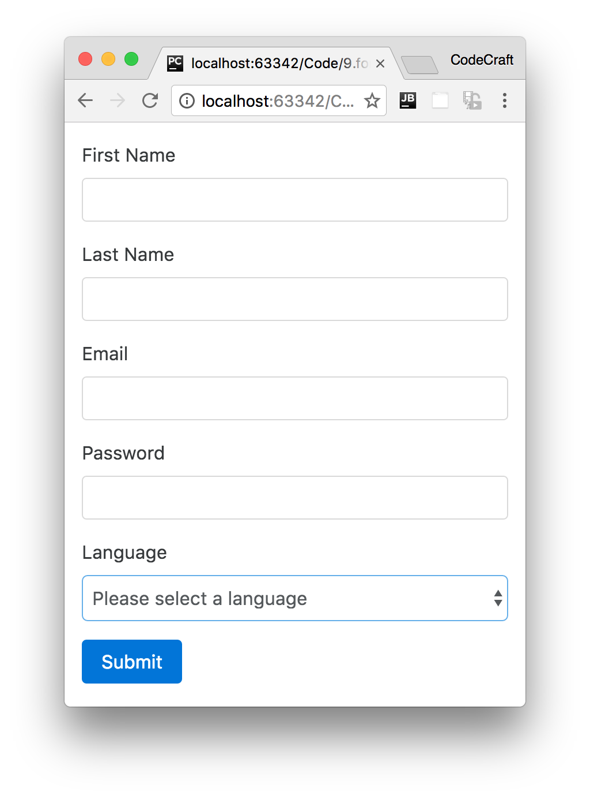

:sourcedir: {docdir}/content/{filedir}/code
:toc:
= Model-Driven Forms

== Learning Objectives

* How to create a HTML form with a _dynamic_ select box control.
* How to define a form _model_ on your component and link it to existing HTML form controls.

== Form Setup

Whether we are template-driven or model-driven we need some basic form HTML to begin with.

[IMPORTANT]
====
In model-driven forms, contrary to what you might think, the HTML for our form isn't automatically created for us.

We _still_ need to write the HTML that represents our form and then explicitly link the HTML form elements to code on our component.
====

We create a simple Bootstrap form with a first name, last name, email, password and language select box controls.

[source,html]
----
<form novalidate>
  <fieldset>
    

      <label>First Name</label>
      <input type="text"
             class="form-control">
    

    

      <label>Last Name</label>
      <input type="text"
             class="form-control">
    

  </fieldset>

  

    <label>Email</label>
    <input type="email"
           class="form-control">
  

  

    <label>Password</label>
    <input type="password"
           class="form-control">
  

  

    <label>Language</label>
    <select class="form-control">
      <option value="">Please select a language</option>
    </select>
  

</form>
----

We've added the `novalidate` attribute to the `form` element, by default browsers perform their own validation and show their own error popups. Since we want to handle the form validation ourselves we can switch off this behaviour by adding novalidate to the form element.

NOTE: We are using the markup and styles from the Twitter Bootstrap UI framework to structure our form.

=== Dynamic Select Controls

We want the select box to have a list of languages for the user to select.

We could hard code the languages in the HTML with `<option>` tags but we want to make the list _dynamic_ so we can easily add more languages later on. so we:

. Add an array of languages to our component.
+
[source,typescript]
----
langs: string[] = [
  'English',
  'French',
  'German',
]
----

. Use an `NgFor` loop to render these as options in the template.
+
[source,html]
----
<select class="form-control">
  <option value="">Please select a language</option>
  <option *ngFor="let lang of langs"
          [value]="lang"> # <1>
          {{lang}} # <2>
  </option>
</select>
----

[start=1]
. The options _value_
. The options _label_

An option has a _label_ and a _value_. The label is the text the user sees in the select box and the _value_ is the data that's stored for that label.

If we ask a select box what option has been selected it returns us the _value_, not the _label_.

To set the value of our select box we just bind to the input property of our option using the `[value]` syntax.

== Form Model

We represent the form as a _model_ composed of instances of `FormGroups` and `FormControls`.

Let's create the model for our form on our component, like so:

[source,typescript]
----
import { FormGroup, FormControl } from '@angular/forms';
.
.
.
class ModelFormComponent implements OnInit {
  myform: FormGroup; # <1>

  ngOnInit() {
    myform = new FormGroup({
        name: new FormGroup({ # <2>
            firstName: new FormControl(), # <3>
            lastName: new FormControl(),
        }),
        email: new FormControl(),
        password: new FormControl(),
        language: new FormControl()
    });
  }
}
----
<1> `myform` is an instance of `FormGroup` and represents the form itself.
<2> `FormGroups` can nest inside other `FormGroups`.
<3> We create a `FormControl` for each template form control.

The `myform` property is an instance of a `FormGroup` class and this represents our form itself.

Each _form control_ in the template is represented by an instance of `FormControl`. This encapsulates the state of the control, such as if it's valid or invalid and even its current value.

These instances of `FormControls` nest inside our top-level `myform: FormGroup`, but what's interesting is that we can _nest_ `FormGroups` inside other `FormGroups`.

In our model we've grouped the `firstName` and `lastName` controls under a `FormGroup` called `name` which itself is nested under our top-level `myform: FormGroup`.

Like the `FormControl` instance, `FormGroup` instances encapsulates the state of all of its inner controls, for example an instance of a `FormGroup` is valid only if _all_ of its inner controls are also valid.

== Linking the Form Model to the Form Template

We have the HTML template for our form and the form model on our component, next up we need to link the two together.

We do this using a number of directives which are found in the `ReactiveFormsModule`, so let's import that and add it to the imports on our `NgModule`.

[source,typescript]
----
import { ReactiveFormsModule } from '@angular/forms';
----

=== `formGroup`

Firstly we bind the `<form>` element to our top-level `myform` property using the `formGroup` directive, like so:

[source,html]
----
<form [formGroup]="myform"> ... </form>
----

Now we've linked the `myform` model to the form template we have access to our `myform` model _in_ our template.

The value property of the `myform` model returns the values of _all_ of the controls as an object. We can use that with the `json` pipe to output some useful debug information about our form, like so:

[source,html]
----
<pre>{{myform.value | json}}</pre>
----

Running our application now prints out the below in the debug `pre` tag:

[source,json]
----
{
  "name": {
    "firstName": null,
    "lastName": null
  },
  "email": null,
  "password": null,
  "language": null
}
----

Initially this seems quite exciting but as we enter values into each of the input fields in our form we would see that the model _isn't_ getting updated, the values remain null.

That's because although we've linked the `form` element to the `myform` model this doesn't automatically link each form control in the model with each form control in the template, we need to do this explicitly with the `formControlName` and `formGroupName` directives.

=== `formGroupName` & `formControlName`

We use the `formControlName` directive to map each form control in the template with a named form control in the model, like so:

[source,html]
----

  <label>Email</label>
  <input type="email"
         class="form-control"
         formControlName="email" # <1>
         required>

----
<1> This looks for a model form control called email in the top level of our `myform` model and links the element to that.

We can also associate a group of template form controls to an instance of a form group on our model using `formGroupName` directive.

Since our `firstName` and `lastName` controls are grouped under a form group called `name` we'll do just that.

IMPORTANT: The only caveat is that in our template the controls we want to group must be surrounded by another element, we've surrounded our controls with a fieldset element but it doesn't need to be called fieldset, could for example be a div.

We then associate the `fieldset` element with the form group called `name` in our model like so:

[source,html]
----
<fieldset formGroupName="name"> ... </fieldset>
----

Then inside our fieldset element we again use the `formControlName` directive to map individual form controls in the template to form controls under the form group `name` in our model.

In the end the template should look like this:

[source,html]
----

<form [formGroup]="myform"> # <1>

	<fieldset formGroupName="name">  # <2>
		

			<label>First Name</label>
			<input type="text"
			       class="form-control"
			       formControlName="firstName" # <3>
			       required>
		

		

			<label>Last Name</label>
			<input type="text"
			       class="form-control"
			       formControlName="lastName" # <3>
			       required>
		

	</fieldset>

	

		<label>Email</label>
		<input type="email"
		       class="form-control"
		       formControlName="email" # <4>
		       required>
	

	

		<label>Password</label>
		<input type="password"
		       class="form-control"
		       formControlName="password" # <4>
		       required>
	

	

		<label>Language</label>
		<select class="form-control"
		        formControlName="language" # <4>
			<option value="">Please select a language</option>
			<option *ngFor="let lang of langs"
			        [value]="lang">{{lang}}
			</option>
		</select>
	

	<pre>{{myform.value | json}}</pre>
</form>
----
<1> Use `formGroup` to bind the form to an instance of `FormGroup` on our component.
<2> Use `formGroupName` to map to a _child_ `FormGroup` of `myform`.
<3> Use `formControlName` to bind to an instance of a `FormControl`, since these form controls are under a `formGroupName` of `name`, Angular will try and find the control in under `myform['name']`.
<4> Use `formControlName` to bind to an instance of a `FormControl` directly under `myform`.

Now each form control in the template is mapped to form controls in our model and so as we type into the input elements `myform.value` updates and our debug section at the bottom prints out the current value of the form.

////
== Form Builder

Now we've added validators to our model we can start giving visual feedback to the end user to the validity of the form and give helpful error messages hinting at them on how to fix them.

But before that let's try to make the code that builds our model less verbose, we can use a higher level API called `FormBuilder` which saves us from writing `new FormGroup` and `new FormControl` multiple times.

We import `FormBuilder` and then _inject_ it into our constructor which stores it on a property of our component so we can use it in other functions.

IMPORTANT: What is _injection_? This is something called dependency injection and we cover it in much more detail in the next section. For now just know it's a way of getting passed an instance of something, we ask Angular to give us something called a `FormBuilder` and it does.

Let's re-write our model to use `FormBuilder` instead, but since we need to use the injected instance of FormBuilder we need to do it in the constructor or preferably on the `ngOnInit` lifecycle hook, like so:

[source,typescript]
----
import { FormBuilder } from '@angular/forms';
.
.
.
class ModelFormComponent implements OnInit {
  myform: FormGroup;

  constructor(private fb:FormBuilder) { } # <1>

  ngOnInit() {
    this.myform = this.fb.group({ # <2>
      name: this.fb.group({
        firstName: ['', Validators.required],
        lastName: ['', Validators.required],
      }),
      email: ['', [
        Validators.required,
        Validators.pattern("[^ @]*@[^ @]*")
      ]],
      password: ['', [
        Validators.minLength(8),
        Validators.required
      ]],
      language: []
    });
  }
}
----
1. We inject `FormBuilder` into our constructor and then store it on a property called `fb`.
2. We use the `fb` instance to build our form from a configuration object we pass in. Note we don't need to explicitly create instances of `FormControls`

The above results in exactly the same form model as the previous version were we explicitly created the form controls ourselves. This method is just considered a convenient shortcut.

////

== Summary

In this lecture we created a simple HTML form. We created a form _model_ on our component using the `FormGroup` and `FormControl` classes.

Then by using directives such as `formGroup`, `formControlName` and `formGroupName` we linked our HTML form to our form _model_.

In the next lecture we will learn how to add validators to our forms to give visual feedback when the data entered is invalid.

== Listing

.main.ts
[source,typescript]
----
include::{sourcedir}/src/main.ts[]
----
