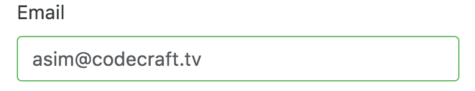
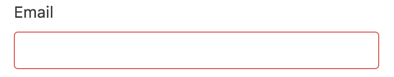
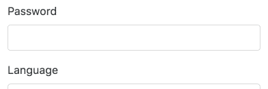

:sourcedir: {docdir}/content/{filedir}/code
:toc:
= Model-Driven Form Validation

== Learning Objectives

* How to add validation checks to our form via the form _model_.
* How to _style_ our form in order to give visual feedback to the user so they know when the fields don't pass the validation checks.
* How to add validation error messages to the form to give hints to the user about why the field isn't passing a validation check.

== Validators

Carrying on from the model-driven form we started in the previous lecture.

Our form is valid _all_ the time, regardless of what input the user types into the controls.

_Validators_ are rules which an input control has to follow. If the input doesn't match the rule then the control is said to be invalid.

Since it's a signup form most of the fields should be _required_ and I would want to specify some more complex validators on the password field to make sure the user is entering a good strong password.

We can apply validators either by adding attributes to the template or by defining them on our `FormControls` in our model.

To stick to the theme of being _model-driven_ we are going to add _validators_ to the form model directly.

Angular comes with a small set of pre-built validators to match the ones we can define via standard HTML5 attributes, namely `required`, `minlegth`, `maxlength` and `pattern` which we can access from the `Validators` module.

The first parameter of a `FormControl` constructor is the initial value of the control, we'll leave that as empty string. The second parameter contains either a single validator if we only want to apply one, or a list of validators if we want to apply multiple validators to a single control.

Our model then looks something like this:

[source,typescript]
----
import { FormGroup, FormControl, Validators } from '@angular/forms';
.
.
.
class ModelFormComponent implements OnInit {
  myform: FormGroup;

  ngOnInit() {
    myform = new FormGroup({
        name: new FormGroup({
            firstName: new FormControl('', Validators.required), # <1>
            lastName: new FormControl('', Validators.required),
        }),
        email: new FormControl('', [ # <2>
            Validators.required,
            Validators.pattern("[^ @]*@[^ @]*") # <3>
        ]),
        password: new FormControl('', [
            Validators.minLength(8), # <4>
            Validators.required
        ]),
        language: new FormControl() # <5>
    });
  }
}
----
<1> We add a single `required` validator to mark this control as required.
<2> We can also provide an array of validators.
<3> We specify a pattern validator which checks whether the email contains a `@` character.
<4> The `minlength` validator checks to see if the password is a minimum of 8 characters long.
<5> We don't add any validators to the language select box.

== Form Control State

The form control instance on our model encapsulates state about the control itself, such as if it is currently valid or if it's been touched.

=== Dirty & Pristine

We can get a reference to these form control instances in our template through the `controls` property of our `myform` model, for example we can print out the the dirty state of the email field like so:

[source,html]
----
<pre>Dirty? {{ myform.controls.email.dirty }}</pre>
----

`dirty` is `true` if the user has _changed_ the value of the control.

The opposite of `dirty` is `pristine` so if we wrote:

[source,html]
----
<pre>Pristine? {{ myform.controls.email.pristine }}</pre>
----

This would be `true` if the user hasn't changed the value, and `false` if the user has.

=== Touched & Untouched

A controls is said to be _touched_ if the the user focused on the control and then focused on something else. For example by clicking into the control and then pressing _tab_ or clicking on another control in the form.

The difference between `touched` and `dirty` is that with touched the user doesn't need to actually change the value of the input control.

[source,html]
----
<pre>Touched? {{ myform.controls.email.touched }}</pre>
----

`touched` is `true` of the field has been touched by the user, otherwise it's false.

The opposite of `touched` is the property `untouched`.

=== Valid & Invalid

We can also check the `valid` state of the control with:

[source,html]
----
<pre>Valid? {{ myform.controls.email.valid }}</pre>
----

`valid` is `true` of the field doesn't have any validators or if _all_ the validators are passing.

Again the opposite of `valid` is `invalid`, so we could write:

[source,html]
----
<pre>Invalid? {{ myform.controls.email.invalid }}</pre>
----

This would be `true` if the control was invalid and `false` if it was valid.

== Validation Styling

Bootstrap has classes for showing visual feedback for form controls when they are invalid.

For instance if we add the `has-danger` class to the parent `div` of the input control with the class of `form-group` it adds a _red_ border.

Conversely if we add the `has-success` class it adds a _green_ border.

.Valid Form Control

.Invalid Form Control

We can combine Bootstrap classes with `dirty` and `invalid` `FormControl` properties and the `ngClass` directive to give the user some nice visual feedback, like so:

[source,html]
----

  'has-success': myform.controls.email.valid && myform.controls.email.dirty # <2>
}">
----
<1> If the email is invalid and it's been touched by the user then we add the `has-danger` class giving the control a red border.
<2> If the email is valid and it's been touched by the user then we add the `has-success` class giving the control a green border.

TIP: The reason we check for the `dirty` property being true is so we don't show the user visual feedback when the form is first displayed. Instead we only show the user feedback when they have had a chance to edit the field.

Now the input control shows the _green_ border when it's `valid` and `dirty` and _red_ if it's `invalid` and `dirty`.

=== Writing Shorter Validation Expressions

The above can quickly become cumbersome to use in our templates, especially for things like the nested `firstName` and `lastName` controls.

Since the `firstName` and `lastName` `FormControls` exist _under_ the `name` `FormGroup` to access those from the template we need to use syntax like this:

[source,html]
----

----

The length of the expression quickly becomes _unwieldy_.

We can help ourselves here by creating local properties on our component to reflect the individual `FormControls` and binding directly to them in our template, like so:

[source,typescript]
.script.ts
----
class ModelFormComponent implements OnInit {
  langs: string[] = [
    'English',
    'French',
    'German',
  ];
  myform: FormGroup;
  firstName: FormControl; # <1>
  lastName: FormControl;
  email: FormControl;
  password: FormControl;
  language: FormControl;

  ngOnInit() {
    this.createFormControls();
    this.createForm();
  }

  createFormControls() { # <2>
    this.firstName = new FormControl('', Validators.required);
    this.lastName = new FormControl('', Validators.required);
    this.email = new FormControl('', [
      Validators.required,
      Validators.pattern("[^ @]*@[^ @]*")
    ]);
    this.password = new FormControl('', [
      Validators.required,
      Validators.minLength(8)
    ]);
    this.language = new FormControl('', Validators.required);
  }

  createForm() { # <3>
    this.myform = new FormGroup({
      name: new FormGroup({
        firstName: this.firstName,
        lastName: this.lastName,
      }),
      email: this.email,
      password: this.password,
      language: this.language
    });
  }
}
----
<1> We declare the `FormControls` as properties of our component. So we can _bind_ to them directly in our tempalte without having to go through the top-level _myform_ model.
<2> We first create the `FormControls`.
<3> We then construct the _myform_ model from the form controls we created previously and stored as properties on our component.

Now we can bind directly to our individual form controls in our template without having to traverse the tree from the _myform_ instance.

We can therefore re-write the _wordy_ firstName `ngClass` expression to something much more succinct, like so:

[source,html]
----

----

== Validation Messages

As well as styling a form when it's invalid it's also useful to show the user error messages with helpful hints about how they can make the form valid again.

Taking what we have learnt about form validation styling we can apply the same method to conditionally show or hide an error message.

Bootstrap conveniently has some markup and classes for form controls which we can use to show these error messages, let's add them to our password form control, like so:

[source,html]
----

  <label>Password</label>
  <input type="password"
         class="form-control"
         formControlName="password">
  

       *ngIf="password.invalid && password.dirty"> # <2>
    Field is invalid
  

----
1. The class `form-control-feedback` shows a message in red if the parent `form-group` div also has the `has-danger` class, i.e. when the field is invalid any text under this div will show as red.
2. We only show the message when the password field is both `invalid` and `dirty`.

Now when the input control is both `dirty` and `invalid` we show the validation error message `"Field is invalid"`.

However this field has two validators associated with it, the required validator and the minlength validator but with the above solution we only show one _generic_ validation error message. We can't tell the user what they need to do in order to make the field valid.

How to do we show a separate validation error message for each of the validators?

We can do that by checking another property on our form control called `errors`.

This is an object which has one entry per validator, the key is the name of the validator and if the value is _not_ null then the validator is _failing_.

[source,html]
----

  
Password is required

  
Password must be 8 characters long

----

NOTE: If the `errors` object has a key of `required` it means the control is failing because it's `required` and the user hasn't entered any value into the input field.

Digging a bit deeper into the `errors` property. The value can contain useful bits of information which we can show the user, for example the `minlength` validator gives us the `requiredLength` and `actualLength` properties.

[source,json]
----
{
  "minlength": {
    "requiredLength": 8,
    "actualLength": 1
  }
}
----

We can use this in our validation error message to give the user a bit more help in resolving the issue, like so:

[source,html]
----

  
Password is required

  
Password must be 8 characters long, we need another {{password.errors.minlength.requiredLength - password.errors.minlength.actualLength}} characters 

----

.Form Validation Messages

== Summary

We can add validators to our model form which check each field for validity.

Can render the controls with styling to show the user when fields are invalid.

Finally, we can add validation error messages so the user knows how to make the form valid again.

Next up we'll look at how to submit and reset a model-driven form.

== Listing

.main.ts
[source,typescript]
----
include::{sourcedir}/src/main.ts[]
----
