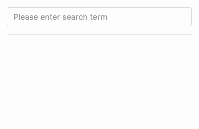
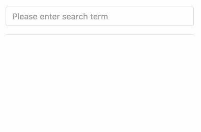

:sourcedir: {docdir}/content/{filedir}/code
:toc:
= Reactive Model Form

== Learning Objectives

* How to use the `formControl` directive.
* How to subscribe to a `FormGroup` or `FormControl` observable.
* Learn how to use the `debounceTime` and `distinctUntilChanged` RxJS operators.

== Setting Up a Reactive Form

Both `FormControls` and `FormGroups` expose an _observable_ called `valuesChanged`. By subscribing to this observable we can _react_ in real-time to changing values of an individual form control, or a group of form controls.

One use case could be implementing a search field in an application, as the user types into the search field we may want to call an API.

Since calling an API is relatively expensive we want to limit the number of API calls to only when absolutely necessary.

Our component might have a template like so:

[source,html]
----
<input type="search"
       class="form-control"
       placeholder="Please enter search term">

<ul>
  <li *ngFor="let search of searches">{{ search }}</li>
</ul>
----

Just a single search input field and then underneath that we render out a list of search terms from an array called `searches`.

The initial component class for the above template looks like so:

[source,typescript]
----
class ReactiveModelFormComponent implements OnInit {

  searchField: FormControl; # <1>
  searches: string[] = []; # <2>

  ngOnInit() {
    this.searchField = new FormControl();
  }
}
----
<1> We declare a `searchField` property which is a `FormControl`, we initialise this later in our `ngOnInit` function.
<2> We declare an array of `searches`, as we perform searches we'll push the individual search terms onto this array so we can see them printed out on the page.

To link our `searchField` `FormControl` to our template form control we use another directive called `formControl`, like so:

[source,html]
----
<input type="search"
       class="form-control"
       placeholder="Please enter search term"
       [formControl]="searchField"> # <1>

<ul>
  <li *ngFor="let search of searches">{{ search }}</li>
</ul>
----
<1> We use the `formControl` directive to link the `searchField` FormControl to the template form control.

[TIP]
====
Previously we used a top-level `FormGroup` instance to hold our entire form and then used the `formControlName` directive in the template to link individual template controls to controls on our `FormGroup` instance.
 +
But in this example we just have a `FormControl` on its own, this is why we use the `formControl` directive instead of the `formControlName` directive.
====

== React to Changes in Our Form

To react to changes on this form we need to subscribe to the `valueChanges` observable on our `searchField`, like so:

[source,typescript]
----
  ngOnInit() {
    this.searchField = new FormControl();
    this.searchField.valueChanges
        .subscribe(term => {
          this.searches.push(term);
        });
  }
----

As we type into the search control, each search term is pushed onto the searches array and through data binding we see the array printed on the screen, like so:

Looking at the search terms as they get printed to the screen:

----
F
Fo
Foo
Foo2
Foo
Foo2
----

We can see a search term printed for _every_ keypress, if we were making API calls in response to this observable chain we would be making quite a few unnecessary API calls.

Ideally we want to only make a request when the user has stopped typing. This is a common use case with RxJS so there is an operator that implements it called `debounceTime` and we use it like so:

[source,typescript]
----
ngOnInit() {
  this.searchField = new FormControl();
  this.searchField.valueChanges
      .debounceTime(400) # <1>
      .subscribe(term => {
        this.searches.push(term);
      });
}
----
<1> `debounceTime` takes as a first parameter a number of milliseconds, it will then only publish to the output stream if there has been no more input for _that_ number of milliseconds.

Now it will only print to the console if the user has stopped typing for 400ms. If this was connected to an API then we would only be sending in one API request instead of one for every character the user typed into the search field.

Typing in the same characters to the search control we get fewer search terms printed to the screen:

----
Foo
Foo2
Foo2
----

But looking at the above we get `Foo2` printed twice in a row, this would trigger a second unnecessary API request. That's because the user typed `Foo2`, then deleted `2` and added `2` again very quickly to get back to `Foo2`.

Ideally we only want to make the API call if the search term has _changed_. Like before there is an operator with RxJS we can use called `distinctUntilChanged` which only publishes to its output stream if the value being published is _different_ from before. We can use it like so:

[source,typescript]
----
ngOnInit() {
  this.searchField = new FormControl();
  this.searchField.valueChanges
      .debounceTime(400)
      .distinctUntilChanged()
      .subscribe(term => {
        this.searches.push(term);
      });
}
----

Typing in the same characters to the search control we get even fewer search terms printed to the screen:

----
Foo
Foo2
----

Specifically we only get `Foo2` printed once saving another API call.

== Summary

We can process a model-driven form the traditional way by calling a function on submission of the form and then processing the form action there.

But with Angular we also have another option of processing the form by means of an observable chain which we then subscribe to.

By using reactive forms and some RxJS operators we can implement powerful functionality in a few lines of code.

One solution is not better than the other, reactive forms are better when there needs to be some real-time processing of the form as the user types in content. Handling model-driven forms with submit handlers is better when there needs to be a discrete action applied when the user presses a button.

They are not mutually exclusive, you can perform some form processing on the submit function and some processing by subscribing to to the observable.

This brings to a conclusion the model-driven approach of creating and handling forms in Angular. In the next lecture we will refactor our model-driven form into a template-driven form.

== Listing

.main.ts
[source,typescript]
----
include::{sourcedir}/src/main.ts[]
----
