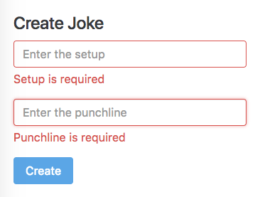

= Activity

Change the simple form we had in our Joke application into a _model-driven_ form with both form validation styling and validation error messages, like so:

== Steps

Fork this blitz:

https://stackblitz.com/github/codecraft-tv/angular-course/tree/current/{chapter_num}.{chapter_slug}/{lecture_num}.{lecture_slug}/code/@activity[https://stackblitz.com/github/codecraft-tv/angular-course/tree/current/{chapter_num}.{chapter_slug}/{lecture_num}.{lecture_slug}/code/@activity, window="_blank"]

Change the `JokeFormComponent` so the form is implemented using model-driven forms.

Read any *TODO* comments in the blitz for hints.

== Solution

When you are ready compare your answer to the solution in this blitz:

https://stackblitz.com/github/codecraft-tv/angular-course/tree/current/{chapter_num}.{chapter_slug}/{lecture_num}.{lecture_slug}/code/@solution[https://stackblitz.com/github/codecraft-tv/angular-course/tree/current/{chapter_num}.{chapter_slug}/{lecture_num}.{lecture_slug}/code/@solution, window="_blank"]
